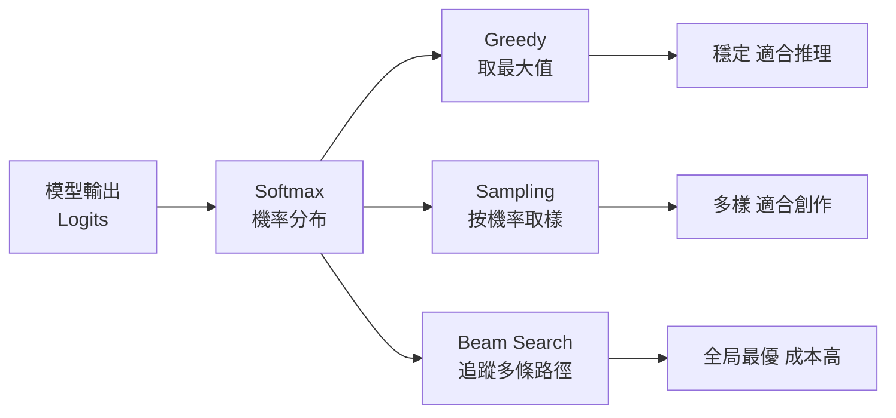

當你的 LLM 應用效果不理想，問題通常出在三個不同的層次：模型在生成每個 token 時的決策方式（decoding）、你把任務拆成幾步來解決（workflow）、或者模型本身是否具備足夠的推理能力（reasoning）。這三個層次經常被混在一起討論，但它們解決的問題不同，最佳化的方向也截然不同。

## TL;DR

- **Decoding**：token 層級，決定模型從機率分布中怎麼取樣。Greedy 最穩，sampling 有創意，beam search 找全局最優。推理任務通常 temperature=0 效果更好。
- **Workflow**：任務層級，決定你如何把問題分解成步驟、工具呼叫、平行或序列執行。Chain-of-thought、ReAct、multi-agent 都屬於這一層。
- **Reasoning**：模型能力層級，決定模型能不能在推論時自我修正、探索多條路徑。CoT、Coconut（連續思維鏈）、inference-time scaling 都在這裡。
- 三層各自最佳化，不要混用工具。

## 是什麼

### Layer 1：Decoding（解碼策略）

Decoding 是模型生成每個 token 時，如何從詞彙表的機率分布中做選擇。這是最底層、最被忽視的優化點。

**Greedy Decoding**：每次選機率最高的 token。速度快，輸出穩定可重現。但容易陷入局部最優——一旦選錯一個詞，後面很難修正。

**Sampling（隨機取樣）**：按機率分布隨機取樣。加上 temperature 控制分布的平滑程度：temperature 低 → 接近 greedy；temperature 高 → 更隨機有創意。適合創意寫作，不適合推理任務。

**Beam Search**：同時追蹤多條候選路徑（beam width），最終選擇整體機率最高的序列。對推理任務有優勢，但計算成本隨 beam width 線性增加。

**Top-k / Top-p（Nucleus Sampling）**：限制取樣範圍到機率最高的前 k 個 token，或機率加總超過 p 的最小集合。平衡品質與多樣性。

2025 年的研究顯示：**對於強化學習後訓練的推理模型，temperature=0（greedy decoding）通常顯著優於 temperature>0**。這跟生成任務的最佳實踐相反。

### Layer 2：Workflow（工作流程設計）

Workflow 是你如何把問題拆成多個步驟、工具呼叫、或 agent 的協作流程。這一層的決策在應用層，跟模型本身的能力無關——即使用一個「笨」一點的模型，好的 workflow 設計也能大幅提升輸出品質。

**Chain-of-Thought (CoT) Prompting**：不直接要求答案，而是要求模型把推理步驟寫出來。這讓模型有機會在「寫下」錯誤後，在後續步驟中發現並修正它。

**ReAct（Reason + Act）**：交替進行推理和工具呼叫。模型思考下一步要做什麼 → 呼叫工具（搜尋、計算、查資料庫）→ 根據工具回應繼續推理。適合需要外部資訊的任務。

**Multi-step / Multi-agent Workflow**：把複雜任務分配給多個專門化的 agent，每個 agent 負責一個子任務，最終彙總。適合需要並行處理或不同領域知識的任務。

**Self-consistency**：同一個問題生成多個答案（用高 temperature），取多數決。通過取樣多樣性來提升推理準確率，代價是推論成本倍增。

### Layer 3：Reasoning（推理能力）

Reasoning 是模型本身的能力層，決定它能不能在推論時自我探索、修正，以及跨越前兩層能達到的上限。

**Inference-time Scaling**：給模型更多「思考時間」（更長的 CoT，或 budget tokens）。OpenAI o1、o3、Gemini Thinking 都是這個方向。研究顯示：在推論時投入更多計算量，可以顯著提升複雜推理任務的表現，且效益比例近似對數線性。

**ES-CoT（Early Stopping Chain-of-Thought）**：當模型的答案在連續幾個推理步驟中保持穩定，就提前停止。實驗顯示可以在保持準確率的前提下，減少約 41% 的 token 消耗。適合有延遲或成本預算約束的場景。

**Coconut（Chain of Continuous Thought）**：不把推理步驟輸出成自然語言 token，而是用模型的最後一層隱藏狀態（continuous thought）直接作為下一步的輸入 embedding。這讓推理在連續的潛在空間中進行，而不受 token 詞彙表的離散約束。理論上可以做廣度優先搜尋（BFS），不必像標準 CoT 那樣每步固定一條路徑。

## 跟常見方案的比較

| 技術 | 層次 | 額外成本 | 最適合 |
|------|------|---------|--------|
| Greedy decoding | Decoding | 無 | 推理任務、需要可重現輸出 |
| Sampling + temperature | Decoding | 無 | 創意生成、多樣性需求 |
| Chain-of-Thought | Workflow | 低（prompt） | 數學/邏輯問題 |
| ReAct | Workflow | 中（工具呼叫） | 需要外部資訊的任務 |
| Self-consistency | Workflow + Decoding | 高（3-10x 推論成本） | 高精確度推理 |
| Inference-time scaling | Reasoning | 高（更長輸出） | 困難推理，成本不敏感 |
| ES-CoT | Reasoning | 負（節省 token） | 成本/延遲敏感場景 |
| Coconut | Reasoning | 需要特殊訓練 | 研究階段，尚未廣泛部署 |

## 小結

工程師在優化 LLM 應用時，最常犯的錯誤是把三個層次的問題混在一起解。推理任務準確率不夠，不一定要換更大的模型——可能只是 decoding strategy 設錯了（temperature 太高）、或者沒有用 CoT workflow。成本太高，不一定要換小模型——可能 ES-CoT 就能省掉大半 token。

先確認問題在哪一層，再選對工具，通常比暴力堆規模更有效率。

## 參考資料

- [Demystifying Long Chain-of-Thought Reasoning in LLMs (arxiv 2502.03373)](https://arxiv.org/abs/2502.03373)
- [Early Stopping Chain-of-thoughts in Large Language Models (arxiv 2509.14004)](https://arxiv.org/html/2509.14004)
- [Training Large Language Models to Reason in a Continuous Latent Space (arxiv 2412.06769)](https://arxiv.org/abs/2412.06769)
- [RL of Thoughts: Navigating LLM Reasoning with Inference-time RL (arxiv)](https://arxiv.org/html/2505.14140)
- [AI 能自我修正嗎？從 decoding、workflow 到 reasoning 的技術發展整理 (YouTube)](https://www.youtube.com/watch?v=m3i2mk5hs8U)
