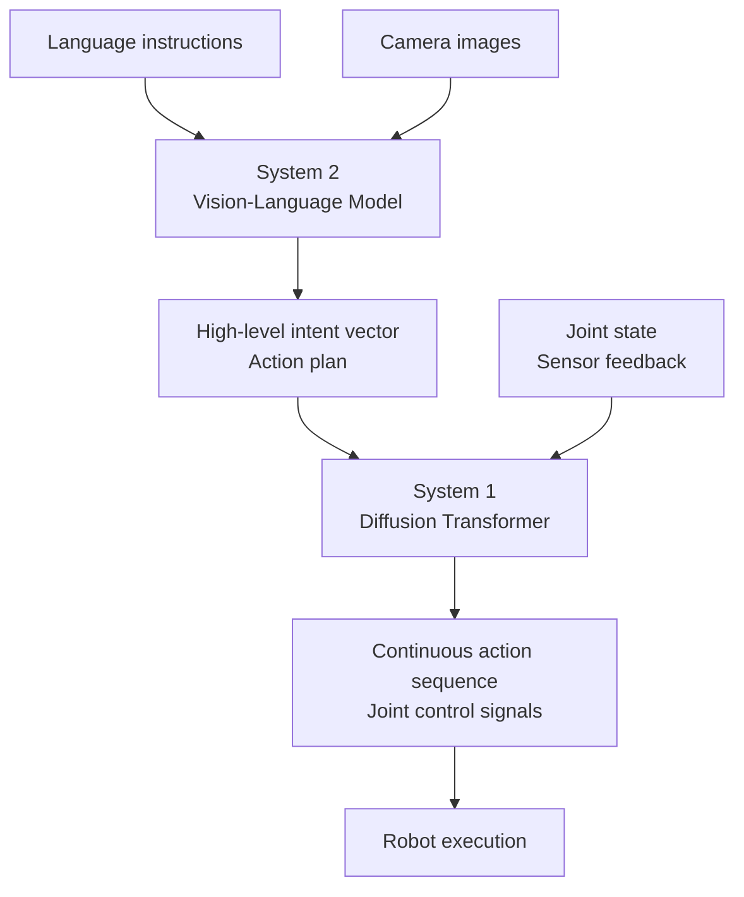

Robot AI has always had a frustrating constraint: a model trained for Robot A doesn't transfer to Robot B without starting over. NVIDIA's Isaac GR00T N1, released at GTC 2025, is the first serious open attempt to break that constraint. Its architecture forced me to reconsider what a general-purpose robot AI should actually look like.

## TL;DR

- GR00T N1 is the world's first open humanoid robot foundation model — open source, commercially licensed
- Architecture: **dual-system** — a Vision-Language Model for high-level reasoning, a Diffusion Transformer for precise action generation
- One model, multiple hardware platforms (Fourier GR-1, 1X Neo, and others) — cross-embodiment generalization is the core design goal
- Training data: real captured motion + Isaac GR00T-Mimic synthetic data + internet video
- GR00T N1.7 is in early commercial access; GR00T N2 (based on DreamZero research) is in development

## Design Philosophy

### Why "General" Is So Hard

Traditional robot AI models are task-specific and hardware-specific. Change the joint count of a robot arm or swap out a sensor configuration and you're retraining from scratch. This makes robot AI development expensive and prevents the kind of knowledge accumulation that gives software its compounding advantages.

GR00T N1's design goal: **one model that, with appropriate fine-tuning, can perform manipulation tasks across different humanoid robot hardware platforms**. This immediately means the architecture has to solve two fundamentally different problems simultaneously:

1. Understanding the environment, language instructions, and task goals (high-level cognition)
2. Precisely controlling tens of joints to produce continuous, dexterous motion (low-level action control)

### The Dual-System Inspiration

GR00T N1's architecture draws from the dual-process theory in cognitive science (Kahneman's System 1 / System 2 framework):

- **System 2 (slow, deliberate)**: a Vision-Language Model that interprets the scene, understands language instructions, and plans action sequences
- **System 1 (fast, automatic)**: a Diffusion Transformer that generates continuous, precise motor control signals

This separation lets each subsystem use the architecture best suited to its problem class.

## Core Architecture

### System 2: The Vision-Language Model

The VLM receives multimodal input: camera images, language instructions, environment state. It answers high-level questions like "what's the next step in this task?":

- Scene understanding: where is this object, how should I grasp it?
- Instruction parsing: "move the red cup to the right side of the table"
- Long-horizon planning: decomposing multi-step tasks into subtasks

The VLM's output is not direct joint angles — it produces a high-level action representation or intent vector.

### System 1: The Diffusion Transformer

The Diffusion Transformer takes the VLM's high-level intent plus current sensor state (joint positions, force feedback, visual input) and generates continuous low-level action sequences.

Using a diffusion model for action generation captures something important: the same task can be accomplished in multiple valid ways. A diffusion model can represent this multimodal distribution of valid actions rather than collapsing to a single deterministic output. This is particularly valuable for dexterous manipulation where there are many valid grasping strategies.

### Cross-Embodiment Generalization

GR00T N1's ability to run on different hardware rests on **abstracting the action representation**. The model doesn't output joint angles specific to one robot's configuration — it produces action representations that can be mapped to different hardware configurations. For a new robot platform, you fine-tune rather than retrain from scratch.

Validated hardware includes: Fourier GR-1, 1X Neo, Agility Robotics Digit, and early testing on Boston Dynamics Atlas.

## Training Data: Solving Robot Data Scarcity

Robot AI's biggest bottleneck is the scarcity of high-quality training data. GR00T N1 uses three sources:

**Real captured data**: human demonstrations recorded via motion capture systems. High quality, but expensive to collect at scale.

**Isaac GR00T-Mimic synthetic data**: NVIDIA's Isaac simulator generates synthetic training data at scale, including edge cases that are difficult to capture in real environments.

**Internet video data**: learning from internet video of humans performing manipulation tasks. Largest volume, but requires handling the absence of action labels and inconsistent viewpoints.

## Comparison

| Dimension | GR00T N1 | Task-specific model | RT-X (Google) |
|-----------|---------|-------------------|--------------|
| Cross-hardware generality | High (design goal) | Low (hardware-bound) | Medium |
| Open access | Open source + commercial | Usually closed | Partially open |
| Action generation | Diffusion Transformer | Various | Similar |
| Data sources | Mixed (synthetic + real + video) | Primarily real | Cross-robot real data |
| Fine-tuning difficulty | Medium | Low (task-specific) | Medium |

## When to Use It (and When Not To)

**Good fit**:
- Research groups or startups needing to deploy quickly across multiple robot platforms
- General manipulation tasks (pick-and-place, assembly) as a research baseline
- Starting from a pretrained model rather than training from scratch

**Not a good fit**:
- Industrial scenarios requiring maximum precision on fixed hardware for specific tasks (a task-specific model will outperform)
- Extremely low-latency real-time control (diffusion model inference latency needs evaluation)
- Non-humanoid robots (designed for humanoid form factor; other configurations are not validated)

## Overall Assessment

GR00T N1's most significant contribution isn't its current benchmark numbers — it's establishing the **robot foundation model paradigm**: a general pretrained model, open to the industry for fine-tuning, accumulating cross-hardware knowledge the same way LLMs accumulated cross-domain language knowledge.

GR00T N2, based on DreamZero research and a new world-action model architecture, reportedly succeeds at new tasks in new environments more than twice as often as existing vision-language-action models. That iteration speed, combined with NVIDIA's compute infrastructure advantages, suggests robot AI may advance faster than most people expect.

## References

- [NVIDIA Isaac GR00T N1 Official Announcement (NVIDIA Newsroom)](https://nvidianews.nvidia.com/news/nvidia-isaac-gr00t-n1-open-humanoid-robot-foundation-model-simulation-frameworks)
- [NVIDIA Isaac GR00T N1: An Open Foundation Model for Humanoid Robots (Research)](https://research.nvidia.com/publication/2025-03_nvidia-isaac-gr00t-n1-open-foundation-model-humanoid-robots)
- [NVIDIA and Global Robotics Leaders Take Physical AI to the Real World](https://nvidianews.nvidia.com/news/nvidia-and-global-robotics-leaders-take-physical-ai-to-the-real-world)
- [NVIDIA GTC 2025 Physical AI Announcements (Hugging Face)](https://huggingface.co/blog/nvidia-physical-ai)
- [NVIDIA's New AI Broke My Brain (YouTube)](https://www.youtube.com/watch?v=Xf_v62TQOx4)
