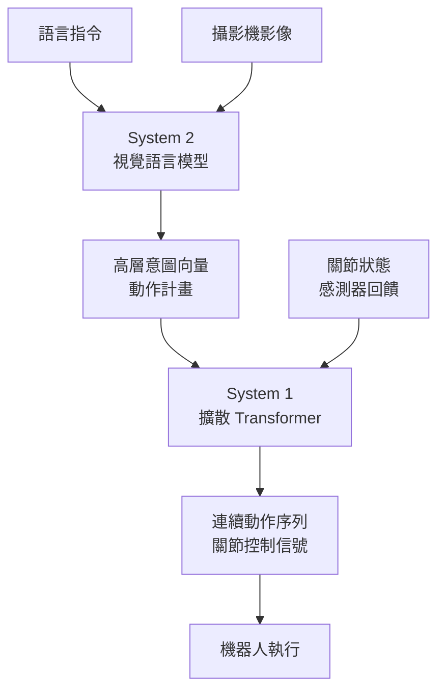

機器人 AI 一直以來有個讓人頭痛的問題：你為 Robot A 訓練的模型，換到 Robot B 身上就要從零開始。NVIDIA 在 2025 年初發布的 Isaac GR00T N1，是第一個認真嘗試解決這個問題的開放基礎模型。它的架構讓我重新想了很多關於「通用機器人 AI 應該長什麼樣子」的問題。

## TL;DR

- GR00T N1 是 NVIDIA 發布的**全球首個人形機器人開放基礎模型**，開源，商業授權可用
- 架構：**雙系統（dual-system）**——視覺語言模型負責高層推理，擴散 Transformer 負責精細動作生成
- 單一模型支援多種不同硬體（Fourier GR-1、1X Neo 等），跨硬體通用性是核心設計目標
- 訓練資料：真實捕捉資料 + Isaac GR00T-Mimic 合成資料 + 網路影片
- GR00T N1.7 已開放早期商業授權；GR00T N2（基於 DreamZero 研究）已在開發中

## 設計哲學

### 為什麼「通用」這麼難

傳統機器人 AI 模型是針對特定任務、特定硬體訓練的。換一個機械手臂的關節數、換一個感測器配置，模型就要重新來過。這讓機器人 AI 的開發成本極高，也讓整個產業無法像軟體那樣積累知識。

GR00T N1 的設計目標是：**一個模型，在適當微調後，可以在不同人形機器人硬體上執行各種操作任務**。這個目標本身就意味著架構設計要同時解決兩個不同層次的問題：

1. 理解環境、語言指令、任務目標（高層認知）
2. 精確控制幾十個關節產生連續、靈活的動作（低層動作控制）

### 雙系統架構的靈感

GR00T N1 的架構借鑑了認知科學中的雙系統理論（Daniel Kahneman 的「系統一/系統二」框架）：

- **System 2（慢思考）**：視覺語言模型（Vision-Language Model），負責看懂場景、理解語言指令、規劃行動序列
- **System 1（快反應）**：擴散 Transformer（Diffusion Transformer），負責生成連續的精細動作控制信號

這個分工讓兩個子系統可以各自用最適合的架構來解決自己擅長的問題。

## 核心概念

### System 2：視覺語言模型

VLM 部分接收多模態輸入：攝影機影像、語言指令、環境狀態。它負責回答「這個任務的下一步是什麼」這類高層問題：

- 場景理解：這個物件在哪裡？怎麼抓？
- 指令理解：「把紅色的杯子放到桌子右邊」
- 長程規劃：多步驟任務的子任務分解

VLM 的輸出不是直接的關節角度，而是「意圖向量」或「動作計畫」——一個高層的動作表示。

### System 1：擴散 Transformer

擴散 Transformer 接收 VLM 的高層意圖，加上當前的感測器狀態（關節角度、力量回饋、視覺輸入），生成連續的低層動作序列。

用擴散模型做動作生成的優勢是：它天然能夠捕捉動作分布的多模態性——同一個任務有多種合理的執行方式，擴散模型可以對這個分布進行建模，而不是強制輸出單一的確定性動作。

### 跨硬體通用性

GR00T N1 能在不同硬體上使用，關鍵在於**動作表示的抽象化**。模型輸出的不是針對特定關節配置的角度，而是可以被映射到不同硬體構型的動作表示。針對新的機器人硬體，只需要微調（fine-tune）而不是從零訓練。

NVIDIA 已驗證的硬體包括：Fourier GR-1、1X Neo、Agility Robotics Digit、Boston Dynamics Atlas（早期測試）。

## 訓練資料：解決機器人資料稀缺問題

機器人 AI 最大的瓶頸之一是訓練資料稀缺。GR00T N1 用三個來源混合：

**真實捕捉資料**：人類示範的操作動作，通過動作捕捉系統記錄。品質高，但採集成本高。

**Isaac GR00T-Mimic 合成資料**：NVIDIA 的 Isaac 模擬器生成的合成訓練資料。可以大量生成，且涵蓋真實採集難以取得的邊緣案例。

**網路影片資料**：從網際網路影片中學習人類的操作動作。這部分資料量最大，但需要處理標籤缺失和視角不一致的問題。

## 跟常見替代方案比較

| 維度 | GR00T N1 | 任務專用模型 | RT-X 系列（Google） |
|------|---------|------------|-------------------|
| 跨硬體通用性 | 高（設計目標） | 低（綁定特定硬體） | 中 |
| 開源程度 | 開源 + 商業授權 | 通常閉源 | 部分開源 |
| 動作生成架構 | 擴散 Transformer | 各種 | 類似 |
| 資料來源 | 混合（合成 + 真實 + 影片） | 主要真實資料 | 跨機器人真實資料 |
| 微調難度 | 中等 | 低（已針對特定任務） | 中等 |

## 適合 / 不適合的情境

**適合**：
- 需要在多種機器人平台上快速部署的研究機構或新創公司
- 通用操作任務（抓取、放置、組裝）的研究基準
- 希望從預訓練模型開始微調，而不是從零開始的場景

**不適合**：
- 對特定任務精確度要求極高且部署在固定硬體上的工業場景（任務專用模型可能更好）
- 需要極低延遲的即時控制（擴散模型的推論延遲需要評估）
- 非人形機器人（設計針對人形，其他構型效果未驗證）

## 整體來說

GR00T N1 最有意思的地方不是它的當前性能，而是它確立的**「機器人基礎模型」範式**：一個通用的預訓練模型，開放給整個產業微調，積累跨硬體的通用知識。這跟 LLM 生態系走過的路高度相似。

GR00T N2 已在開發中，基於 DreamZero 研究（世界動作模型架構），在新任務和新環境中的成功率是現有視覺語言動作模型的兩倍以上。這個迭代速度，加上 NVIDIA 在運算基礎設施上的優勢，讓機器人 AI 的進展可能比大多數人預期的快得多。

## 參考資料

- [NVIDIA Isaac GR00T N1 官方公告 (NVIDIA Newsroom)](https://nvidianews.nvidia.com/news/nvidia-isaac-gr00t-n1-open-humanoid-robot-foundation-model-simulation-frameworks)
- [NVIDIA Isaac GR00T N1: An Open Foundation Model for Humanoid Robots (Research)](https://research.nvidia.com/publication/2025-03_nvidia-isaac-gr00t-n1-open-foundation-model-humanoid-robots)
- [NVIDIA and Global Robotics Leaders Take Physical AI to the Real World](https://nvidianews.nvidia.com/news/nvidia-and-global-robotics-leaders-take-physical-ai-to-the-real-world)
- [NVIDIA GTC 2025 Physical AI Announcement (Hugging Face)](https://huggingface.co/blog/nvidia-physical-ai)
- [NVIDIA's New AI Broke My Brain (YouTube)](https://www.youtube.com/watch?v=Xf_v62TQOx4)
