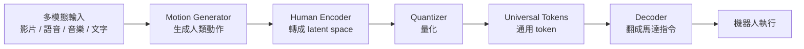

一支示範影片裡，有人假裝在割草、耙落葉，旁邊的人形機器人就跟著把草割了、把葉子耙了。看起來像雜耍，但真正的重點不在那台機器人，而在**控制它的軟體**——一個叫做 Sonic 的通用機器人控制器。

這篇整理以 Two Minute Papers 的介紹影片為事實依據，把它拆成幾個技術重點。

## Sonic 到底做了什麼

先講清楚定位：Sonic 的貢獻是「控制軟體」，不是硬體。

在示範影片裡，有一個人在做各種動作，機器人能夠**理解這些動作，並把它翻譯成一連串 3D 空間中的關節位置**。也就是說，這是一套遙控（teleoperation）控制器——人怎麼動，機器人就怎麼跟著動，而且是全身層級的理解，不是單純複製手臂軌跡。

因為它理解的是「整個身體的動作」，所以你可以叫它爬進你不想進去的狹小空間。這件事本身就很有用：探勘那些人類難以進入、或危險的區域。影片舉的想像應用包括協助救出被瓦礫壓住的人，或未來在不讓人類冒險的前提下探索其他星球。

它甚至能做功夫——前提是「示範的人自己會功夫」。

## 它是一套多模態系統

Sonic 真正誇張的地方，是輸入幾乎可以是任何東西。影片列出的輸入型態包括：

- **人體動作影片**：拍你自己做動作
- **語音**：用講的下指令
- **音樂**：可以讓它跟著音樂跳舞（影片因版權沒放配樂，但確實能做）
- **文字**：對比較簡單的任務（移動、模仿猴子之類），直接打字叫它做就行

而且它的動作很有「表情」。你可以要它「開心地走」「偷偷摸摸地走」或「像受傷的人一樣走」。

這裡有一個容易被低估的成就：**它站得穩、不會跌倒**。影片特別點出，過去就算是模擬世界裡的簡單角色，光是教它「走路不跌倒」都要成千上萬次嘗試；現在能直接做到這種穩定度，是一大跳躍。

## 它是怎麼學會的

Sonic 先看了 **1 億幀（100 million frames）的人類動作**，來理解人類怎麼動、動作之間怎麼銜接。

關鍵在於：它**不需要人工標註的動作標籤**。你不用去解釋「這個動作叫什麼、代表什麼意思」，它就是看原始動作，自己學會如何在不同任務之間**平順地切換，中間不會出現不自然的停頓**。

## 從輸入到馬達指令的 pipeline

整條處理流程可以這樣看：多模態輸入進來，先被轉成「人類動作」的表示，再被編碼、量化成一組**通用 token（universal tokens）**，最後由 decoder 翻成馬達指令。

這裡的「universal tokens」是整個設計的樞紐——不管輸入是影片、聲音還是文字，都會先被壓成同一種抽象的 token 表示，後面才統一解碼成動作。

## 難點：機器人不是人

把「人類動作」對應到「機器人動作」其實非常難，因為**機器人的身體構造跟人類根本不一樣**。

舉個影片裡的例子：你叫它「轉身」，它當然要轉身。但——要轉多快？如果想在瞬間轉 180 度，機器人會把自己甩壞。

為了解決這個問題，研究提出了 **root trajectory spring model**：對使用者那些突然、劇烈的指令做**阻尼（damping）**，避免機器人受傷。（是的，機器人也會「受傷」。）

其中有一個**隨時間變化的指數項**，扮演「物理煞車」的角色：隨著時間增加，這一項會迅速趨近於 0，逼使整個數學式平滑地衰減。它同時達成兩件事：

1. 機器人不會因為指令太猛而弄傷自己
2. 動作會**穩定落在目標位置**，不會在附近來回震盪個沒完

當然，阻尼也不能過頭——阻尼加太重，機器人就變成一隻慢吞吞、什麼都做不了的鼻涕蟲。要拿捏得剛好很不容易。

## 最反直覺的一點：訓練很貴，成品很輕

整套訓練用了 **128 顆 GPU、跑了 3 天**，成本不低。

但重點來了：訓練完成後的**成品極度輕量，只有大約 4200 萬（42 million）參數**。這個規模小到可以輕鬆在手機上跑，幾乎不吃資源。你不需要那種訓練等級的硬體才能使用它。

而且影片裡展示的所有模型，都會**免費、永久地釋出給所有人**——是公開研究，不是封閉的專有技術。

## 誰做的

這個專案由 professor Zhu 與 Jim Fan 主導。Jim Fan 大約在兩年前於 NVIDIA 創立了人形機器人實驗室，此後持續產出突破性的研究。

影片作者也點出一個有意思的類比：這個模型把「一鍋雜亂、五花八門的輸入」壓縮成一種純粹、抽象的 token——就像人在向很多人徵詢意見時，會聽到各種說法甚至互相矛盾的建議，但把它們並排來看，往往能找到底層共通的那個道理。

需要提醒的是，這只是一個新興領域的早期成果，不是終點。但它已經證明了一件事：把龐雜的人類動作知識，壓縮進一個小到人人都能用的 AI 控制器裡，是可行的。

## 參考資料

- [NVIDIA's New AI Broke My Brain (Two Minute Papers, YouTube)](https://www.youtube.com/watch?v=Xf_v62TQOx4)
