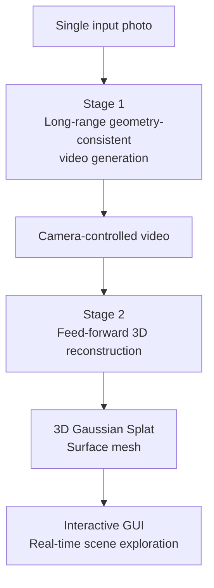

Upload a single photo of a coffee shop. A model turns it into a 3D space you can walk through, turn corners in, and see rooms that weren't visible in the original image. Not a 360-degree panorama — an actual explorable 3D environment that maintains geometric consistency wherever the virtual camera goes. NVIDIA Spatial Intelligence Lab's **Lyra 2.0**, released April 15, 2026 under Apache 2.0, is the current state of the art for this problem.

## TL;DR

- **Lyra 2.0**: generates long-range, geometrically consistent, explorable 3D worlds from a single image
- Core innovation: **geometry-based frame retrieval** solves spatial forgetting without sacrificing generation quality
- Output: **3D Gaussian Splats + surface meshes** — plug directly into real-time rendering engines
- Open source: Apache 2.0, weights on Hugging Face (`nvidia/Lyra-2.0`), code on GitHub
- Paper: arxiv 2604.13036

## The Problems This Solves

### Spatial Forgetting

As a virtual camera moves through a generated scene, early regions gradually fall outside the model's context window. Without a mechanism to remember the geometry of those regions, the model hallucinates a different scene when the camera returns — walls shift position, windows disappear, objects change shape. Lyra 2.0 addresses this with geometry-guided frame retrieval.

### Temporal Drifting

Autoregressive video generation compounds errors across frames. Walk far enough through a generated world and the scene loses its connection to the original photo. Each frame's errors propagate and amplify.

### The Geometry-Quality Trade-off

Previous approaches like GEN3C used **depth-warped conditioning** — hard geometric constraints that force the model to strictly respect 3D geometry at every frame. This produces excellent camera controllability metrics but degrades visual quality because the rigid constraint suppresses the model's generative prior.

Lyra 2.0's answer: **use geometry only for information routing, leave appearance synthesis to the generative prior**.

## Architecture: Two Stages

### Stage 1: Long-Range Video Generation with Geometry Routing

The core mechanism is **geometry-based frame retrieval**:

1. Predict per-pixel depth for each generated frame
2. Build dense correspondences between frames using that depth
3. When generating a new frame, use geometric correspondences to identify the most relevant historical frames
4. Include those historical frames in the model's context
5. Let the generative prior handle appearance — no hard projection constraints

The geometry answers "which past frames are relevant for this viewpoint?" but the model itself decides what the scene looks like. This preserves geometric consistency across long distances without the quality penalty of rigid geometric conditioning.

### Stage 2: Feed-forward 3D Reconstruction

The generated video sequence feeds into a feed-forward reconstruction model that directly outputs:
- **3D Gaussian Splats (3DGS)**: real-time renderable point cloud representation
- **Surface meshes**: for more precise geometric applications

Both formats plug directly into Unreal Engine, Unity, or any 3DGS-compatible real-time renderer.

### Interactive Exploration GUI

Lyra 2.0 ships with an interactive GUI where users:
- Plan camera trajectories through the generated 3D environment
- Watch the model progressively extend the scene as the virtual camera moves forward
- Return to previously seen areas with maintained geometric consistency

## Lyra 2.0 vs. GEN3C

Both are NVIDIA research releases addressing camera-controlled, geometrically consistent generation. The key difference is in how they use geometry:

| Dimension | Lyra 2.0 | GEN3C |
|-----------|---------|-------|
| Geometry usage | Information routing only | Hard depth-warped conditioning |
| Camera controllability | High | Best in class |
| Visual quality (SSIM, subjective) | Better | Lower (rigid constraints hurt quality) |
| Long-range consistency | Strong | Medium |
| Open source | Apache 2.0 | Yes (CVPR 2025 Highlight) |

GEN3C's depth-warped approach has advantages in scenarios requiring precise camera control (virtual production, CG asset generation). Lyra 2.0 wins on long-range exploration and visual quality.

## Use Cases

**Good fit**:
- Game scene concept prototyping (turn a reference photo into an explorable world prototype)
- Film and advertising scene reconstruction and extension
- Architectural visualization (convert building photos into walkable virtual spaces)
- VR/AR content rapid generation
- Research benchmarking for other 3D generation methods

**Not a good fit**:
- Engineering applications requiring precise architectural measurements
- Scenarios requiring strict reconstruction of areas not visible in the original photo (the model will hallucinate)
- On-device real-time inference (current inference speeds require GPU servers)

## Overall Assessment

Lyra 2.0's most interesting design decision is using geometry only for routing rather than as a hard constraint. This contrasts with GEN3C's rigid geometric conditioning and outperforms it on most visual quality metrics. The principle generalizes: in generative AI, overconstrained generation often hurts output quality more than underconstrained generation.

The Apache 2.0 release means this integrates directly into film studio pipelines, game engines, or any 3D generation workflow without API access or NVIDIA account requirements. It's one of the most practically deployable 3D world generation tools available in early 2026.

## References

- [Lyra 2.0: Explorable Generative 3D Worlds (NVIDIA Research)](https://research.nvidia.com/labs/sil/projects/lyra2/)
- [Lyra 2.0 Paper (arxiv 2604.13036)](https://arxiv.org/abs/2604.13036)
- [Lyra 2.0 Model Weights (Hugging Face)](https://huggingface.co/nvidia/Lyra-2.0)
- [Lyra Source Code (GitHub)](https://github.com/nv-tlabs/lyra)
- [GEN3C: 3D-Informed World-Consistent Video Generation (NVIDIA Research)](https://research.nvidia.com/publication/2025-08_gen3c-3d-informed-world-consistent-video-generation-precise-camera-control)
- [NVIDIA's New AI Turns One Photo Into A World That Never Breaks (YouTube)](https://www.youtube.com/watch?v=eCw33snvoNI)
