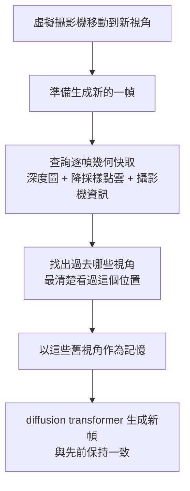

你上傳一張照片，AI 就把它變成一個可以自由走進去探索的 3D 世界——不是死板的 360 全景，而是真的能往前走、轉彎，看到原本照片裡看不到的角落。這件事聽起來太美好、通常也「美好到不真實」，但 Lyra 2.0 給出的答案是：你回頭看之前經過的地方時，世界**不會崩壞**。

這篇整理自 Two Minute Papers（Dr. Károly Zsolnai-Fehér）對 Lyra 2.0 的介紹，重點放在它到底用什麼技巧，讓「從一張照片長出來的世界」能保持長程一致。

## 為什麼「從一張照片生成世界」這麼難

這類技術有個很實際的用途：你甚至可以拿一張 Street View 街景照，把它變成一個電玩世界，然後把機器人丟進去，讓它在裡面安全地訓練、學著當一個乖巧的機器人。一個相關但不同的概念叫 **Cosmos**，它的方向是生成用來訓練機器人與自駕車的模擬資料。模擬資料非常關鍵——即使自駕車只有一部分訓練來自模擬，那一部分往往就是解開難題的鑰匙。

但要生成一個「不會壞掉」的世界並不容易，因為這些世界常常會崩壞。核心的困難是**記憶**：

- 大約一年多前，有一個 AI 號稱看了 **一百萬小時** 的 Minecraft 影片，因此重建出一個很粗糙的 Minecraft。有趣的地方在於：你看著某個東西，把視線移開，再看回來——它就變了。你問它「剛剛那裡有什麼？」，它會回答「我不知道」。它**沒有物體恆存（object permanence）**，記憶非常有限，長程一致性很難達成。
- 接著 DeepMind 的 **Genie 3** 前進了一大步：丟一張圖進去（甚至是一張畫、一張塗鴉都行），就生成可互動的世界，而且能維持「數分鐘」等級的一致性。這在短短一年多內是很驚人的進展。但幾分鐘之後，它還是會忘。

我們真正想要的是**長程一致性（long-term coherence）**：走多遠、走多久，世界都還是原本那個世界。

## Lyra 2.0 的關鍵：逐幀 3D 幾何快取

大多數這類技術「看到」的只是平面螢幕上的 2D 像素——沒有 3D 幾何，只是一堆代表顏色的數字。Lyra 2.0 的核心生成器也是一個 **diffusion transformer**，概念上有點像 OpenAI 的 Sora，這部分並不新。

真正讓它與眾不同的是：它會保留一份**逐幀的 3D 幾何快取（per-frame 3D geometry cache）**。換句話說，它不是把整個世界原封不動地記下來，而是只記住世界的**骨架（scaffolding）**，然後在需要時據此一致地把其餘部分重建出來。所以當你把視線移開再看回來，它不是憑空生一個新場景，而是先想「等等，剛剛這裡是什麼？」，然後把它還原。

這份快取存的不是完整場景，而是：

- 深度圖（depth map）
- 一份降採樣的點雲（downsampled point cloud）
- 攝影機移動資訊

## 為什麼不把整個場景融成一個大 3D 世界

一個直覺的做法是：把所有畫面融合成一個巨大的全域 3D 場景，一次記住全部。但這樣做的問題是**誤差會隨時間累積**。一開始只是很小的錯，但一步步疊上去，場景就越來越糟。這就像影印一份文件，再影印那份影本，再影印影本的影本——每一步品質都往下掉。

Lyra 2.0 的選擇相反：它為**每一個視角各留一份小小的 3D 快照**。之後當攝影機回到某個地方，它會問一個問題——「過去哪些視角把這裡看得最清楚？」——然後拿那些視角當作記憶來還原。

論文用**消融實驗（ablation study）**驗證這個決定的價值：它把每一個新設計拆開來，逐一測試各自的貢獻，而不是全部綁在一起說「你看，能動！」。結果是——如果改用「全域儲存整個場景」的做法，風格一致性會稍微變差，而**攝影機控制會直接崩掉**：畫面開始跑出錯誤的視角。相較之下，完整的逐幀骨架方案就非常接近它應該呈現的樣子。這也正是他們主張「每一幀只記骨架」的原因。

## 目前的限制

即使如此，這個技術也還不完美。影片中點出三個限制：

1. **只能處理靜態場景**：畫面裡不能有會動的東西。
2. **會繼承訓練資料的缺陷**：如果訓練資料本身有光度不一致（不同光照、不同曝光），模型也會學到「光照和曝光可以隨意亂變」，並反映在預測裡。
3. **重建出的 3D 幾何會有瑕疵與浮塊（floaters）**：因為生成的各個視角彼此並非完全一致，把它們重建成 3D 時，這些小小的不一致就會變成漂浮的雜點與噪訊。

這些其實都是這類研究第一、二個版本很典型的問題，而且往往「再一兩篇論文之後」就會被修掉。用作者的話說，這是論文的第一定律：不要只看我們現在在哪裡，要看再兩篇論文之後我們會在哪裡。

## 小結

Lyra 2.0 最漂亮的一手，是把「幾何」當成**記憶的索引**而不是要一次融成的大模型：只記每一幀的骨架，回頭時再挑出「最清楚看過這裡的舊視角」來還原。這讓從單張照片長出來的世界，能在你走遠、回頭時依然不崩壞。而且——模型和程式碼都免費釋出。對於愛動手的人來說，這真是個很棒的禮物。

## 參考資料

- [NVIDIA's New AI Turns One Photo Into A World That Never Breaks（Two Minute Papers, YouTube）](https://www.youtube.com/watch?v=eCw33snvoNI)
- [Lyra 2.0（NVIDIA Research 專案頁）](https://research.nvidia.com/labs/sil/projects/lyra2/)
