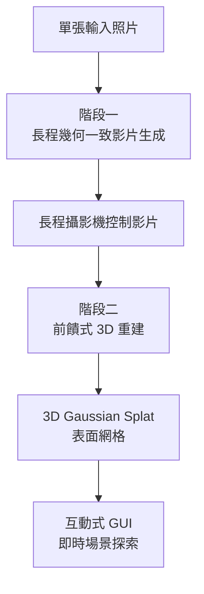

你上傳一張咖啡廳的照片，AI 把它變成一個你可以自由穿梭、走進去探索的 3D 空間——不是死板的 360 全景，而是真正可以走進去轉彎、看到你原本照片裡看不到的角落。這件事聽起來像科幻，但 NVIDIA Spatial Intelligence Lab 在 2026 年 4 月發布的 **Lyra 2.0**，已經把它變成可以在瀏覽器互動界面裡體驗的現實，並且以 Apache 2.0 開源。

## TL;DR

- **Lyra 2.0**：從單張照片生成長程、幾何一致的可探索 3D 世界
- 核心創新：**幾何導引的幀檢索**解決「空間遺忘」；避免硬性幾何約束保留生成品質
- 輸出格式：**3D Gaussian Splat + 表面網格**，可直接插入即時渲染引擎
- 開源：Apache 2.0，模型權重在 Hugging Face（`nvidia/Lyra-2.0`），程式碼在 GitHub
- 論文：arxiv 2604.13036，2026 年 4 月 15 日發布

## 設計哲學

### 這個問題為什麼難

從單張影像生成一個可探索的 3D 世界，需要同時解決幾個困難：

**空間遺忘（Spatial Forgetting）**：當虛擬攝影機移動，早期見過的區域漸漸離開模型的上下文視窗。沒有機制記住這些區域的幾何結構，模型在攝影機回頭看時就會「幻覺」出跟之前不一樣的場景——牆壁位置改變、窗戶消失。

**時序漂移（Temporal Drifting）**：自回歸影片生成的每一步都依賴上一步的輸出。誤差逐幀累積，走到足夠遠的地方，整個場景就失去了跟原始照片的連貫性。

**幾何一致性 vs. 生成品質的 trade-off**：強迫模型嚴格遵守幾何約束（像 GEN3C 的做法），可以提升幾何精確度，但會抑制模型的生成先驗（generative prior），導致視覺品質下降。

Lyra 2.0 的答案是：**把幾何只用於資訊路由（information routing），把外觀生成留給模型的生成先驗**。

## 核心概念

### 系統架構：兩個階段

Lyra 2.0 的流程分為兩個主要階段：

**階段一：長程幾何一致影片生成**

這一階段的核心是：在生成新幀時，如何有效檢索並利用之前見過的幀的資訊。

Lyra 2.0 的解法是**基於幾何的幀檢索（geometry-based frame retrieval）**：

1. 對每一幀預測逐像素深度（per-frame pixel-wise depth）
2. 用這個深度建立跨幀的密集對應關係（dense correspondences）
3. 生成新幀時，根據幾何對應找到「最相關的歷史幀」並包含在上下文中
4. 用模型的生成先驗來合成外觀——不是從幾何約束中硬性投影

關鍵：幾何只決定「我應該看哪些舊幀」，外觀怎麼長仍然由生成模型決定。這樣既保留了幾何一致性，又不犧牲視覺品質。

**階段二：前饋式 3D 重建**

生成的影片序列被輸入一個前饋重建模型，直接輸出：
- **3D Gaussian Splat（3DGS）**：可即時渲染的點雲表示
- **表面網格（Surface Mesh）**：用於更精確的幾何應用

這兩種格式都可以直接插入 Unreal Engine、Unity、或任何支援 3DGS 的即時渲染引擎。

### 互動式探索 GUI

Lyra 2.0 提供了一個內建的互動界面，讓使用者可以：
- 在生成的 3D 環境中規劃攝影機路徑
- 隨著虛擬攝影機前進，模型即時延伸場景
- 回頭看之前的區域時維持幾何一致性

## 跟 GEN3C 的差別

GEN3C 是 NVIDIA 同時期發布的另一個相關研究，也做攝影機控制的 3D 一致性影片生成。兩者的核心差異在於：

| 維度 | Lyra 2.0 | GEN3C |
|------|---------|-------|
| 幾何使用方式 | 只用於資訊路由，外觀由生成先驗決定 | 深度扭曲投影（depth-warped conditioning）硬性約束 |
| 攝影機控制性 | 高 | 最高（評測最佳） |
| 視覺生成品質 | 更高（主觀評分和 SSIM 更好） | 較低（硬性幾何約束抑制生成品質） |
| 長程一致性 | 強（幾何導引檢索） | 中等 |
| 開源 | 是（Apache 2.0） | 是（CVPR 2025 Highlight） |

GEN3C 的深度扭曲方法在需要精確攝影機控制的場景（例如虛擬攝影棚、CG 素材生成）更有優勢；Lyra 2.0 在長程探索和視覺品質上更有優勢。

## 適合 / 不適合的情境

**適合**：
- 遊戲場景概念驗證（把參考照片快速變成可探索的世界原型）
- 影視 / 廣告的場景重建和延伸
- 建築可視化（從建築照片生成可漫遊的虛擬空間）
- VR / AR 內容快速生成
- 研究基準（評測其他 3D 生成方法的比較基準）

**不適合**：
- 需要精確建築測量的工程應用（這不是測量工具）
- 對原始照片中不可見區域有嚴格還原要求的場景（AI 會幻覺生成）
- 需要即時推論的端上應用（目前的推論速度需要 GPU 伺服器）

## 整體來說

Lyra 2.0 在技術上最有意思的決定是「幾何只做路由，外觀靠生成先驗」。這個設計哲學跟 GEN3C 的「強幾何約束」形成對比，並且在大多數評測指標上取得更好的視覺結果。它實際上反映了一個更普遍的原則：在生成 AI 裡，過度約束往往比欠約束更傷害輸出品質。

開源的決定讓這個工具可以直接整合進電影工作室、遊戲引擎、或任何 3D 生成工作流，不需要 API 存取或 NVIDIA 帳號。這是 2026 年目前最具實用潛力的 3D 世界生成工具之一。

## 參考資料

- [Lyra 2.0: Explorable Generative 3D Worlds (NVIDIA Research)](https://research.nvidia.com/labs/sil/projects/lyra2/)
- [Lyra 2.0 論文 (arxiv 2604.13036)](https://arxiv.org/abs/2604.13036)
- [Lyra 2.0 模型 (Hugging Face)](https://huggingface.co/nvidia/Lyra-2.0)
- [Lyra 程式碼 (GitHub)](https://github.com/nv-tlabs/lyra)
- [GEN3C: 3D-Informed World-Consistent Video Generation (NVIDIA Research)](https://research.nvidia.com/publication/2025-08_gen3c-3d-informed-world-consistent-video-generation-precise-camera-control)
- [NVIDIA's New AI Turns One Photo Into A World That Never Breaks (YouTube)](https://www.youtube.com/watch?v=eCw33snvoNI)
