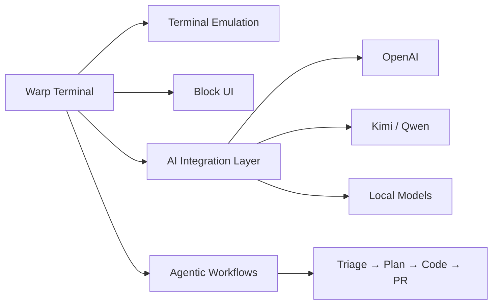

The first week of May 2026 on GitHub told a clear story: AI coding tools are evolving from standalone assistants into a shared agent infrastructure. Warp open-sourcing, Agent Skills standardizing, and Codex CLI shipping together paint a picture of a rapidly consolidating developer workflow.

## TL;DR

- **Warp goes open source**: Rust-written AI terminal releases AGPL-3.0 code, 37K+ stars within days
- **GitHub Copilot Agent Skills**: Cross-tool skill-loading standard now covers Copilot CLI, cloud agent, and VS Code
- **Codex CLI GA**: OpenAI Codex integrated into Copilot Pro+, no separate OpenAI account needed
- **awesome-skills**: Community index of reusable Agent Skills continues to grow

## Warp Goes Open Source

Warp is an AI-native terminal written in Rust. In late April 2026, Anysphere released its client codebase under AGPL-3.0 (with the UI framework under MIT). The project climbed to 37K+ GitHub stars within days, briefly reaching #2 on Trending.

Warp's positioning isn't just "a better terminal" — it calls itself an "agentic development environment." Agents can take over the entire development lifecycle: from issue triage and planning to coding, testing, and opening PRs. Human engineers shift into direction-setting and verification roles.

Technically, the codebase is ~98% Rust and includes:
- Terminal emulation layer
- Block-based UI system
- AI integration layer (GraphQL interface)
- Workspace state persistence

The community quickly forked **OpenWarp**, which lets developers plug in any AI provider — DeepSeek, Ollama, Anthropic, local models — with keys staying local.

## GitHub Copilot Agent Skills

In December 2025, GitHub introduced **Agent Skills** as an open standard for cross-tool skill loading. Agent Skills are folders of instructions, scripts, and resources that AI agents load automatically when relevant to a task.

Supported environments:
- GitHub Copilot CLI (terminal-native agent)
- GitHub Copilot coding agent (cloud agent)
- VS Code Insiders agent mode

The official reference repository is `anthropics/skills`. The community-driven `github/awesome-copilot` index collects skills covering framework conventions, code review rules, API doc summaries, and more. Developers can also write custom `.agent.md` files or use an interactive wizard to build agents with their own tools, MCP servers, and instruction sets.

## Codex CLI Goes GA

GitHub Copilot CLI reached General Availability in February 2026, available to all Copilot subscribers. The CLI is an autonomous terminal-native agent that can:

1. Plan complex multi-step tasks
2. Edit multiple files
3. Run tests
4. Iterate based on test results

OpenAI Codex is now integrated into Copilot Pro+. No separate OpenAI account needed — model calls go through Copilot and standard rate limits apply.

## awesome-skills: A Community Index for Reusable Skills

`gmh5225/awesome-skills` is a curated, growing list of skills for AI agents including Claude Code, Codex, Gemini CLI, and GitHub Copilot. It also links to tools and resources. For teams looking to adopt agent workflows quickly, this is the first place to search for ready-made skills.

## The Bigger Picture

This week's GitHub theme is the **infrastructuring of AI dev tools**: Warp embeds AI into the terminal and opens customization to the community, Agent Skills tries to become the universal skill standard across agents, and Codex CLI brings agentic capability to the command line. All three are answering the same question: how do engineers collaborate with AI agents as a core part of their workflow, not just as an autocomplete add-on?

The answer isn't settled yet — but the tooling is ready for you to find out.

## References

- [Warp is now open-source | Warp Blog](https://www.warp.dev/blog/warp-is-now-open-source)
- [GitHub Copilot now supports Agent Skills | GitHub Changelog](https://github.blog/changelog/2025-12-18-github-copilot-now-supports-agent-skills/)
- [GitHub Copilot CLI is now generally available | GitHub Changelog](https://github.blog/changelog/2026-02-25-github-copilot-cli-is-now-generally-available/)
- [Adding agent skills for GitHub Copilot | GitHub Docs](https://docs.github.com/en/copilot/how-tos/copilot-on-github/customize-copilot/customize-cloud-agent/add-skills)
- [awesome-skills on GitHub](https://github.com/gmh5225/awesome-skills)
- [Original video](https://www.youtube.com/watch?v=jjtfs8lug2s)
