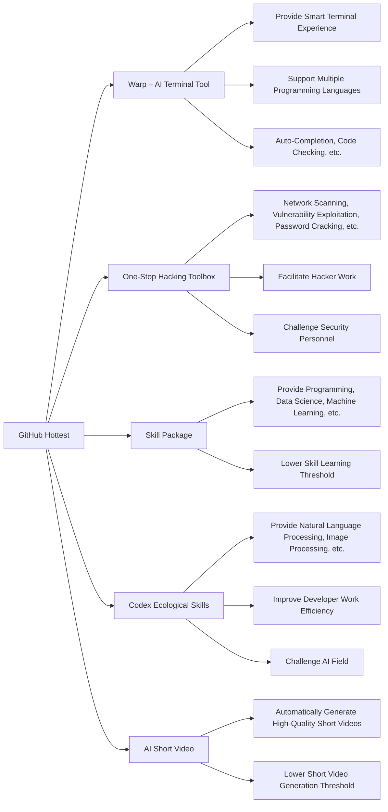

# TL;DR
This article introduces the hottest projects on GitHub for the week, including AI terminal tools, a one-stop hacking toolbox, Skill packages, Codex ecological skills, and AI short videos.

## Warp – AI Terminal Tool
Warp is an AI-based terminal tool designed to provide a smarter and more efficient terminal experience. Warp supports multiple programming languages, including Python, Java, and C++, and offers features like auto-completion and code checking. Warp's arrival will greatly improve the work efficiency of developers.

## One-Stop Hacking Toolbox
This is a comprehensive toolbox that integrates various hacking tools, offering functions such as network scanning, vulnerability exploitation, and password cracking. This toolbox will greatly facilitate the work of hackers, while also posing new challenges for security personnel.

## Skill Package
Skill Package is an AI-based skill learning platform that provides learning resources for various skills, including programming, data science, and machine learning. The emergence of Skill Package will significantly lower the threshold for skill learning, enabling more people to learn and master new skills.

## Codex Ecological Skills
Codex is an AI-based ecological skill platform that provides learning resources for various skills, including natural language processing and image processing. The arrival of Codex will greatly improve the work efficiency of developers, while also posing new challenges for the AI field.

## AI Short Video
AI Short Video is an AI-based short video generation tool that can automatically generate high-quality short videos. The emergence of AI Short Video will significantly lower the threshold for short video generation, enabling more people to create and share their own short videos.

## Summary
This article introduces the hottest projects on GitHub for the week, including AI terminal tools, a one-stop hacking toolbox, Skill packages, Codex ecological skills, and AI short videos. These projects will greatly improve the work efficiency of developers, while also posing new challenges for security personnel, skill learners, and the AI field.

## References
* [Warp – AI Terminal Tool](https://github.com/warp)
* [One-Stop Hacking Toolbox](https://github.com/hacker-toolbox)
* [Skill Package](https://github.com/skill-package)
* [Codex Ecological Skills](https://github.com/codex-skills)
* [AI Short Video](https://github.com/ai-short-video)

## Technical Structure Diagram

