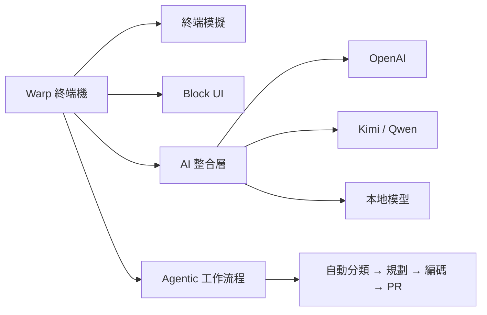

2026 年 5 月第一週，GitHub Trending 的走向非常清楚：AI 編碼工具生態正在從「獨立 AI 助手」演化成「跨工具的 Agent 基礎設施」。Warp 開源、Agent Skills 標準化、Codex CLI 正式上線，三件事放在一起看，是一幅正在成形的全新開發者工作流程圖。

## TL;DR

- **Warp 開源**：Rust 編寫的 AI 終端機釋出 AGPL-3.0 原始碼，數日內累積 37K+ Stars
- **GitHub Copilot Agent Skills**：跨 Copilot CLI、Copilot coding agent、VS Code 的技能載入標準正式推出
- **Codex CLI GA**：OpenAI Codex 現在整合進 Copilot Pro+，不需要另開 OpenAI 帳號
- **awesome-skills 社群庫**：可重用 Agent Skills 的公共索引庫持續成長

## Warp 正式開源

Warp 是一款用 Rust 編寫的 AI 原生終端機，2026 年 4 月底宣布將客戶端程式碼開源，授權採 AGPL-3.0（UI 框架部分為 MIT），數日內在 GitHub 攀升至 37K Stars，一度登上 Trending 第二位。

Warp 不只是「更好的終端機」——它的核心定位是「Agentic 開發環境」。代理可以接管整個開發生命週期：從問題分類、規劃、編碼、測試到送出 PR，人類工程師的角色轉為提供方向和驗證產出。

技術架構上，核心由 Rust 實作（佔比約 98%），包含：
- 終端模擬層
- 以「區塊（Block）」為單位的 UI 系統
- AI 整合層（使用 GraphQL 介面）
- 工作區狀態持久化

開源後社群迅速出現 **OpenWarp** fork，允許插入任意 AI 提供者（DeepSeek、Ollama、Anthropic、本地模型），私鑰不需要離開本地。

## GitHub Copilot Agent Skills

2025 年 12 月，GitHub 推出 **Agent Skills** 作為跨工具的技能載入開放標準，2026 年初持續擴展。Agent Skills 的概念是：一個資料夾，裡面放指令、腳本和資源，當 AI 代理判斷任務需要時會自動載入。

目前支援 Agent Skills 的環境：
- GitHub Copilot CLI（終端機原生代理）
- GitHub Copilot coding agent（雲端代理）
- VS Code Insiders 的 agent mode

官方維護的參考庫是 `anthropics/skills`，社群驅動的索引庫 `github/awesome-copilot` 持續收錄各種實用 Skills，範圍涵蓋框架慣例提醒、程式碼審查規則、API 文件摘要等。

開發者也可以自己撰寫 `.agent.md` 檔案或透過互動式精靈建立 Custom Agent，指定專屬工具、MCP Server 和指令集。

## Codex CLI 正式 GA

GitHub Copilot CLI 於 2026 年 2 月正式 GA（General Availability），面向所有 Copilot 訂閱者開放。CLI 本身是一個在終端機運行的自主代理，能夠：

1. 規劃複雜多步驟任務
2. 編輯多個檔案
3. 執行測試
4. 根據測試結果迭代修改

OpenAI Codex 也整合進 Copilot Pro+ 訂閱方案，不需要另外管理 OpenAI 帳號，模型呼叫由 Copilot 統一處理，速率限制套用標準 Copilot 配額。

## awesome-skills：可重用技能的社群索引

`gmh5225/awesome-skills` 是一個持續成長的策展清單，收錄適用於 Claude Code、Codex、Gemini CLI、GitHub Copilot 等 AI 代理的技能包，同時提供工具和資源連結。對想快速導入 Agent 工作流程的團隊來說，這裡是尋找現成技能的第一站。

## 整體來說

這週 GitHub 的主旋律是 **AI 開發工具的基礎設施化**：Warp 把 AI 嵌進終端機並開放社群定制、Agent Skills 試圖成為跨工具的技能通用標準、Codex CLI 把代理能力帶進命令列。三者都在回答同一個問題：工程師的日常工作流程要怎麼和 AI 代理協作，而不是只是偶爾使用自動完成？

答案目前還沒有定論，但工具已經準備好讓你自己試驗了。

## 參考資料

- [Warp is now open-source | Warp 官方部落格](https://www.warp.dev/blog/warp-is-now-open-source)
- [GitHub Copilot now supports Agent Skills | GitHub Changelog](https://github.blog/changelog/2025-12-18-github-copilot-now-supports-agent-skills/)
- [GitHub Copilot CLI is now generally available | GitHub Changelog](https://github.blog/changelog/2026-02-25-github-copilot-cli-is-now-generally-available/)
- [Adding agent skills for GitHub Copilot | GitHub Docs](https://docs.github.com/en/copilot/how-tos/copilot-on-github/customize-copilot/customize-cloud-agent/add-skills)
- [awesome-skills GitHub 庫](https://github.com/gmh5225/awesome-skills)
- [原始影片](https://www.youtube.com/watch?v=jjtfs8lug2s)
