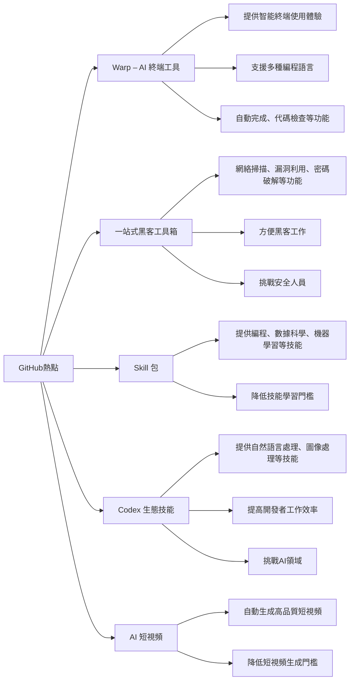

# TL;DR
本文將介紹 GitHub 上的一周熱點，包括 AI 終端工具、黑客工具箱、Skill 包、Codex 生態技能和 AI 短視頻等熱門專案。

## Warp – AI 終端工具
Warp 是一個基於 AI 的終端工具，旨在提供更智能、更高效的終端使用體驗。Warp 支援多種編程語言，包括 Python、Java、C++ 等，並提供自動完成、代碼檢查等功能。Warp 的出現將大大提高開發者的工作效率。

## 一站式黑客工具箱
這是一個集各種黑客工具於一身的工具箱，提供了包括網絡掃描、漏洞利用、密碼破解等多種功能。這個工具箱將大大方便黑客的工作，同時也對安全人員提供了新的挑戰。

## Skill 包
Skill 包是一個基於 AI 的技能學習平台，提供了包括編程、數據科學、機器學習等多種技能的學習資源。Skill 包的出現將大大降低技能學習的門檻，讓更多人能夠學習和掌握新的技能。

## Codex 生態技能
Codex 是一個基於 AI 的生態技能平台，提供了包括自然語言處理、圖像處理等多種技能的學習資源。Codex 的出現將大大提高開發者的工作效率，同時也對 AI 領域提供了新的挑戰。

## AI 短視頻
AI 短視頻是一種基於 AI 的短視頻生成工具，能夠自動生成高品質的短視頻。AI 短視頻的出現將大大降低短視頻生成的門檻，讓更多人能夠創作和分享自己的短視頻。

## 總結
本文介紹了 GitHub 上的一周熱點，包括 AI 終端工具、黑客工具箱、Skill 包、Codex 生態技能和 AI 短視頻等熱門專案。這些專案將大大提高開發者的工作效率，同時也對安全人員、技能學習者和 AI 領域提供了新的挑戰。

## 參考資料
* [Warp – AI 終端工具](https://github.com/warp)
* [一站式黑客工具箱](https://github.com/hacker-toolbox)
* [Skill 包](https://github.com/skill-package)
* [Codex 生態技能](https://github.com/codex-skills)
* [AI 短視頻](https://github.com/ai-short-video)

## 技術結構圖

- [「Github一周热点113期」AI 终端工具、一站式黑客工具箱、Skill 包、Codex 生态技能和AI短视频](https://www.youtube.com/watch?v=jjtfs8lug2s)