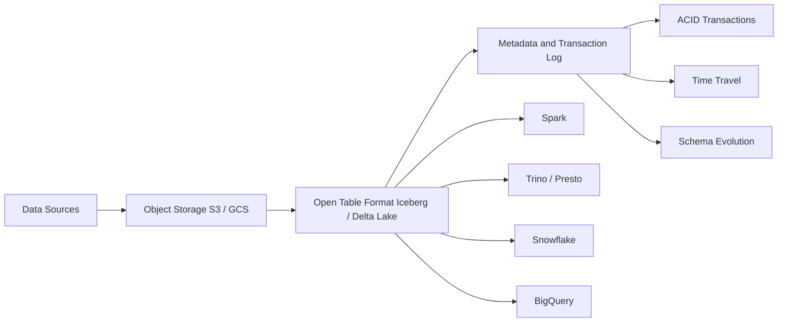

Data infrastructure has taken a winding path over the last decade. Data warehouses dominated, then data lakes emerged as a cheap way to store massive amounts of raw data — only to create years of headaches around governance and query performance. The Data Lakehouse is the architecture pattern trying to end that tug-of-war: the same storage layer delivers both data warehouse reliability and data lake flexibility.

## TL;DR

- **Data Warehouse**: structured, high-performance, high-cost; schema-on-write makes schema changes painful
- **Data Lake**: low cost, flexible; but lacks ACID, hard to govern, slow queries
- **Data Lakehouse**: adds an open table format on top of object storage (S3/GCS), getting the benefits of both
- Main implementations: **Apache Iceberg** (cross-engine interop) and **Delta Lake** (Databricks-ecosystem-first)
- 2025 trend: Delta Lake UniForm enables both formats to be read by the same engine — "write once, read anywhere"

## What Is It

A Data Lakehouse is an architectural pattern, not a specific software product. The core idea:

> **Layer a transactional metadata format on top of open-format object storage.**

The traditional approach runs data lakes and data warehouses in parallel, with ETL pipelines moving data between them — introducing latency and consistency problems. Lakehouse collapses this into a single layer: data lives in Parquet or ORC files on S3/GCS/ADLS, and open table formats like Apache Iceberg or Delta Lake provide ACID semantics, time travel, and schema evolution on top.

## Why It Matters

Data warehouses suffer from cost and flexibility problems: most cloud warehouses couple compute and storage, making scaling expensive; strict schema requirements make ML and AI workloads difficult to accommodate.

Data lakes suffer from reliability problems: no ACID transactions means concurrent writes can corrupt data; no schema validation means data quality is hard to guarantee; small-file proliferation periodically requires manual maintenance to restore query performance.

Lakehouse solves:
- **Cost**: data stays in cheap object storage; compute is on-demand
- **ACID**: table format transaction logs ensure atomicity
- **Multi-engine**: one copy of data can be read simultaneously by Spark, Trino, Snowflake, DuckDB
- **ML/AI-friendly**: unstructured and semi-structured data can coexist with structured data

## How It Works

Taking Apache Iceberg as an example, its metadata layer has three tiers:

1. **Metadata files**: record table schema, partition spec, and snapshot history
2. **Manifest lists**: each snapshot maps to a manifest list recording which data files belong to it
3. **Manifest files**: record the path, row count, and statistics (min/max values) of each Parquet data file

Query engines walk Metadata → Manifest list → Manifest files before scanning, using statistics for partition pruning and file pruning — dramatically reducing the data that needs to be scanned. This design also enables atomic table version switching across engines without a centralized lock manager.

Delta Lake's architecture is similar but more Spark-centric: a `_delta_log/` directory at the table root stores JSON-format transaction records, with Parquet checkpoints generated every 10 versions for faster loading.

## Compared to Data Warehouses and Data Lakes

| Dimension | Data Warehouse | Data Lake | Data Lakehouse |
|-----------|---------------|-----------|----------------|
| Storage format | Proprietary | Open (Parquet/ORC) | Open format |
| Storage cost | High | Low | Low |
| ACID transactions | Yes | No | Yes (via table format) |
| Schema | Strict (write-time) | Flexible (read-time) | Evolvable |
| Multi-engine access | Difficult | Easy | Easy |
| Streaming | Limited | Difficult | Supported (Iceberg v2+) |
| ML/AI workloads | Difficult | Convenient | Convenient |

### Apache Iceberg vs Delta Lake

| | Apache Iceberg | Delta Lake |
|-|---------------|-----------|
| Origin | Netflix → Apache Software Foundation | Databricks → Linux Foundation |
| Design focus | Cross-engine interop, large-scale partitioning | Spark performance, DML simplicity |
| Catalog | Multiple (Hive, Nessie, REST) | Primarily Unity Catalog |
| Engine support | Snowflake, Dremio, BigQuery, Flink | Primarily Databricks, Spark |
| Format interop | Iceberg v3 can read Delta | Delta UniForm publishes Iceberg metadata |

The 2025 convergence trend: Delta Lake's **UniForm** feature lets a Delta table simultaneously expose Iceberg-compatible metadata, so any Iceberg-capable engine can read it as if it were native. Write in Delta, read from Snowflake — "write once, read anywhere."

## Summary

The Data Lakehouse is no longer a concept — it's the default starting point for most data engineering teams designing new systems in 2025. Choosing between table formats:

- Primarily **Databricks** ecosystem → Delta Lake
- Need **multi-engine interop** (Snowflake + Spark + Trino) → Apache Iceberg
- Want both → Delta UniForm or Iceberg with a multi-engine catalog

Regardless of which you pick, the underlying principle is the same: put reliability in the metadata layer, leave flexibility and low cost in object storage.

## References

- [Apache Iceberg vs Delta Lake | Dremio Engineering Blog](https://www.dremio.com/blog/apache-iceberg-vs-delta-lake/)
- [The 2025 & 2026 Ultimate Guide to the Data Lakehouse | DataLakehouseHub](https://datalakehousehub.com/blog/2025-09-2026-guide-to-data-lakehouses/)
- [Exploring the Architecture of Apache Iceberg, Delta Lake, and Apache Hudi | Dremio](https://www.dremio.com/blog/exploring-the-architecture-of-apache-iceberg-delta-lake-and-apache-hudi/)
- [Apache Iceberg vs Delta Lake Feature Comparison | Onehouse](https://www.onehouse.ai/blog/apache-hudi-vs-delta-lake-vs-apache-iceberg-lakehouse-feature-comparison)
- [Original video](https://www.youtube.com/watch?v=taSmwcqdkQk)
