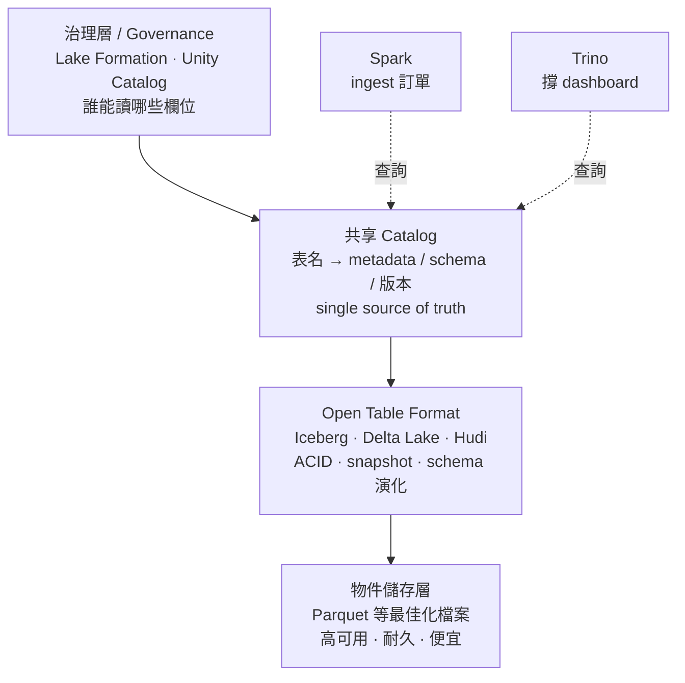

「什麼是 data lakehouse？它跟 data lake 或 data warehouse 有什麼不同？」要回答這個問題，得先看懂 lakehouse 想取代的那兩套系統，以及它們湊在一起時會產生什麼麻煩。

## 先認識要被取代的兩套系統

**Data Warehouse（資料倉儲）** 存放的是經過整理、可直接拿來分析的資料。它通常支援 ACID transaction，並針對快速的 SQL 查詢做最佳化。例如財務團隊會用它來拉出精準的每日營收報表。

**Data Lake（資料湖）** 則是用便宜的物件儲存（object storage），以極大的規模存放原始（raw）、半結構化與非結構化的資料。例如資料科學團隊會把數百萬筆 clickstream log 丟進去，用來訓練機器學習模型。

一個是「乾淨、可靠、可查詢」，一個是「便宜、海量、什麼都能塞」——各有各的定位。

## 問題出在：把兩套系統擺在一起

拿一個忙碌的電商平台當例子。它會產生大量有價值的資訊：raw order events、payment records、support logs。

典型做法是：原始檔案落地到物件儲存，形成 data lake；同時，整理過的分析用資料表放在另一套獨立的 data warehouse 裡。

早期這樣運作沒問題。但隨著平台成長，**每一次 schema 變更都會同時牽動兩條 ingestion 路徑、兩套品質檢查、兩種存取模型**。資料工程師最後花了大把時間，只是在讓這兩套系統彼此同步，而不是在打造新的資料產品。

Data Lakehouse 就是為了解決這件事而生的架構：**維持一個共享的資料層，同時保有資料倉儲的可靠性，以及資料湖的規模。**

## 由下而上，一層一層蓋起來

Lakehouse 不是單一產品，而是把幾個元件疊起來的架構。我們從最底層開始蓋。

### 第一層：單一物件儲存層

一切從單一的儲存層開始。以電商團隊為例，raw order events 和整理後的分析資料表，現在都放在**同一個物件儲存層**上。我們處理原始資料後，把整理好的結果以最佳化的檔案格式（例如 **Parquet**）寫回同一個物件儲存。

這樣做移除了系統之間反覆複製資料的成本。物件儲存高可用、耐久，而且擴充便宜。

但它有個根本限制：**它只是存放原始檔案，並不知道什麼叫「資料庫表格」。** 於是：

- 如果一個寫入工作跑到一半失敗，讀取端可能看到一張不完整或不一致的表。
- 如果有人在別人正在寫入時去讀，可能只讀到更新的一部分。

我們需要一個方法，直接在這些檔案之上，加回類似資料庫的規則。

### 第二層：Open Table Format

要拿回這些規則，就需要一個 **open table format**，例如 **Apache Iceberg、Delta Lake 或 Apache Hudi**。

這些格式不直接把 raw 檔案暴露出去，而是維護一份 table metadata、snapshot 與 commit history。它帶來兩個關鍵保證：

1. **原子性**：每一次寫入不是完全成功、就是完全失敗；即使有並行更新，讀取端永遠看到一致的視圖。
2. **schema 演化**：許多 schema 變更被當成 metadata 操作來處理。例如你要改一個欄位名稱，往往只要更新一下 table definition，而**不需要重寫整批歷史資料所在的巨大目錄**。

到這裡，我們已經有了可靠的資料表。

### 第三層：共享 Catalog

有了可靠的表格，下一個問題是：不同工具要怎麼「找到」這些表？這需要一個**共享的 catalog**。

catalog 把一個表名（例如 `orders`）對應到它的 metadata、schema 與目前版本。任何工具想讀或寫的時候，都先問 catalog：「最新版本在哪？」——這就形成了**單一事實來源（single source of truth）**。

舉例來說，你可能用像 **Apache Spark** 這種重量級引擎去 ingest 數百萬筆新訂單，同時用像 **Trino** 這種快速查詢引擎去撐一個 dashboard。因為兩者都查詢同一個 catalog，**Trino 就能看到 Spark 剛剛 commit 的新紀錄。**

### 第四層：治理（Governance）層

有了共享 metadata 之後，接著是團隊規模下的治理問題。當平台成長，治理要回答幾個關鍵的營運問題：

- 有哪些資料集存在？
- 它們從哪裡來？
- 究竟**誰**可以讀取像 payment 這類敏感欄位？

像 **AWS Lake Formation** 或 **Databricks Unity Catalog** 這類工具，提供一個集中的地方來管理這些規則，並鎖定特定欄位的存取。

如果說 table format 負責確保資料是**正確的**，那治理層就是負責確保資料是**安全的**。為了落實這一點，許多團隊還會用 cloud security 去把底層的物件儲存本身鎖起來。

## 四層架構總覽

由下往上看：物件儲存提供便宜的規模；open table format 加回資料庫級的可靠性；共享 catalog 讓不同引擎看到同一份真相；治理層決定資料是否安全、誰能碰。

## 小結

Data Lakehouse 的核心不是某個神奇的產品，而是一種疊法：**把可靠性收斂到 table format 與 catalog，把海量與低成本留給物件儲存，再用治理層把安全鎖上。**

它真正解掉的痛點，是電商例子裡那個「維護兩套系統同步」的無底洞——當 raw 資料和分析資料表共用同一層儲存、共用同一個 catalog，schema 變更不再需要在兩條路徑上各做一次，工程師才有時間回去打造真正的資料產品。

## 參考資料

- [原始影片：What's a Data Lakehouse?](https://www.youtube.com/watch?v=taSmwcqdkQk)
- [Apache Iceberg 官方文件](https://iceberg.apache.org/)
- [Delta Lake 官方網站](https://delta.io/)
- [Apache Hudi 官方網站](https://hudi.apache.org/)
