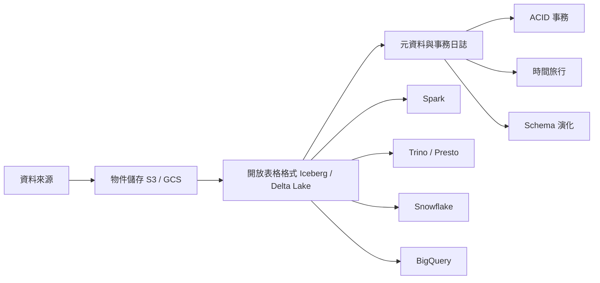

資料基礎設施在過去十年走過了一段彎路：先是資料倉儲（Data Warehouse）主宰一切，接著資料湖（Data Lake）以低成本儲存大量原始資料的姿態崛起，但資料湖在治理和查詢效能上的缺陷讓工程師頭痛多年。Data Lakehouse 是試圖終結這場拉鋸的架構模式——在同一個儲存層上，同時提供資料倉儲的可靠性和資料湖的彈性。

## TL;DR

- **Data Warehouse**：結構化、高效能、高成本；Schema-on-write，改資料很痛苦
- **Data Lake**：低成本、彈性大；但缺 ACID、難治理、查詢慢
- **Data Lakehouse**：在物件儲存（S3/GCS）上加開放表格格式，同時獲得兩者優點
- 主流實作：**Apache Iceberg**（跨引擎互通）和 **Delta Lake**（Databricks 生態系優先）
- 2025 年趨勢：Delta Lake UniForm 讓兩種格式可以互讀，產業走向「寫一次，到處讀」

## 是什麼

Data Lakehouse 不是一個具體的軟體產品，而是一種架構模式。它的核心想法是：

> **把事務性元資料層疊加在開放格式的物件儲存上**

傳統做法通常是資料湖和資料倉儲並存，資料需要做 ETL 搬來搬去，造成延遲和不一致。Lakehouse 把這兩層合并：資料存在 Parquet 或 ORC 等開放格式的 S3/GCS/ADLS 上，由 Apache Iceberg 或 Delta Lake 這樣的開放表格格式（Open Table Format）提供 ACID 語義、時間旅行和 Schema 演化。

## 為什麼重要

資料倉儲的問題在於成本和彈性：大多數雲端資料倉儲的計算和儲存綁定在一起，擴展成本高；而且 Schema 定義嚴格，機器學習和 AI 工作負載需要的非結構化資料很難放進來。

資料湖的問題則是可靠性：沒有 ACID 事務代表並發寫入可能造成資料損毀；沒有 Schema 驗證代表資料品質難以保證；小檔案問題讓查詢效能每隔一段時間就需要人工介入整理。

Lakehouse 解決了：
- **成本**：資料存在便宜的物件儲存，計算按需啟動
- **ACID**：開放表格格式的事務日誌確保原子性
- **多引擎**：同一份資料可被 Spark、Trino、Snowflake、DuckDB 同時讀取
- **ML/AI 親和**：非結構化和半結構化資料可以和結構化資料共存

## 怎麼運作

以 Apache Iceberg 為例，其元資料層有三個層次：

1. **Metadata files**：記錄表格的 Schema、分區規格和快照歷史
2. **Manifest lists**：每個快照（snapshot）對應一個 manifest list，記錄哪些資料檔屬於這個快照
3. **Manifest files**：具體記錄每個 Parquet 資料檔的路徑、行數、統計資訊（最大值/最小值）

查詢引擎在讀取前先走 Metadata → Manifest list → Manifest files，利用統計資訊做 partition pruning 和 file pruning，大幅減少需要掃描的資料量。這個設計也讓 Iceberg 可以在沒有中央 catalog 的情況下做到跨引擎原子切換。

Delta Lake 的架構類似但更 Spark 中心：在資料夾根目錄放一個 `_delta_log/` 目錄，裡面存 JSON 格式的事務紀錄（00000000000000000000.json、00000000000000000001.json……），每隔 10 個版本產生一個 Parquet checkpoint 加速載入。

## 跟資料倉儲和資料湖的差別

| 維度 | 資料倉儲 | 資料湖 | Data Lakehouse |
|------|---------|--------|----------------|
| 儲存格式 | 專有格式 | 開放格式（Parquet/ORC） | 開放格式 |
| 儲存成本 | 高 | 低 | 低 |
| ACID 事務 | 有 | 無 | 有（靠表格格式） |
| Schema | 嚴格（Write） | 彈性（Read） | 可演化 |
| 多引擎存取 | 困難 | 容易 | 容易 |
| 即時串流 | 有限 | 困難 | 支援（Iceberg v2+） |
| ML/AI 工作負載 | 困難 | 方便 | 方便 |

### Apache Iceberg vs Delta Lake

| | Apache Iceberg | Delta Lake |
|-|---------------|-----------|
| 起源 | Netflix → Apache 基金會 | Databricks → Linux 基金會 |
| 設計重點 | 跨引擎互通、大規模分區 | Spark 效能、DML 簡易性 |
| Catalog | 多種（Hive、Nessie、REST） | 主要依賴 Unity Catalog |
| 社群引擎支援 | Snowflake、Dremio、BigQuery、Flink | 主要 Databricks、Spark |
| 格式互通 | Iceberg v3 支援讀 Delta | Delta UniForm 可發布 Iceberg 元資料 |

2025 年的趨勢是兩個格式在融合：Delta Lake 的 **UniForm** 功能讓 Delta 表格同時公開 Iceberg 相容的元資料，任何支援 Iceberg 的引擎都能讀取，實現「寫一次、到處讀」。

## 小結

Data Lakehouse 已經不是概念，而是 2025 年大多數資料工程團隊在設計新系統時的預設起點。如果你的公司正在考慮要選哪個表格格式：

- 主要用 **Databricks** 生態系統 → Delta Lake
- 需要 **多引擎互通**（Snowflake + Spark + Trino）→ Apache Iceberg
- 兩者都要 → Delta UniForm 或 Iceberg 的多引擎 Catalog

不管選哪個，底層原理是相同的：把可靠性放在元資料層，把彈性和低成本留給物件儲存。

## 參考資料

- [Apache Iceberg vs Delta Lake | Dremio 技術部落格](https://www.dremio.com/blog/apache-iceberg-vs-delta-lake/)
- [The 2025 & 2026 Ultimate Guide to the Data Lakehouse | DataLakehouseHub](https://datalakehousehub.com/blog/2025-09-2026-guide-to-data-lakehouses/)
- [Exploring the Architecture of Apache Iceberg, Delta Lake, and Apache Hudi | Dremio](https://www.dremio.com/blog/exploring-the-architecture-of-apache-iceberg-delta-lake-and-apache-hudi/)
- [Apache Iceberg vs Delta Lake Feature Comparison | Onehouse](https://www.onehouse.ai/blog/apache-hudi-vs-delta-lake-vs-apache-iceberg-lakehouse-feature-comparison)
- [原始影片](https://www.youtube.com/watch?v=taSmwcqdkQk)
