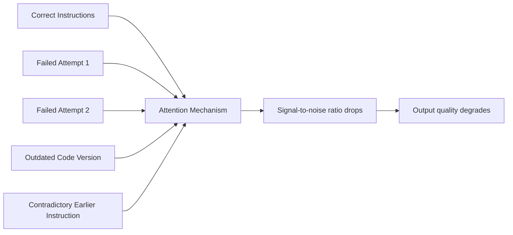
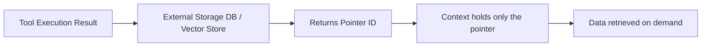

Have you noticed this pattern: an AI agent starts a long task performing well, but by halfway through it's repeating mistakes, undoing fixed code, or getting confused by its own earlier instructions? This isn't the model "getting dumb" — and it's not your prompts getting worse. It has a name: **Context Rot**.

## TL;DR

- **Context Rot**: the gradual degradation in AI agent output quality as the context window fills with accumulated session history
- Root cause: Transformers process all tokens equally — old failures compete with current instructions for attention
- Research finding: below 50% context fill, models lose tokens in the middle; above 50%, they lose the earliest tokens
- Databricks research: correctness drops measurably after 32K tokens; agents start repeating historical actions
- A bigger context window delays the problem but doesn't fix it — the issue is noise accumulation, not size
- Fixes: Memory Pointer Pattern, external memory stores, periodic context compaction, clean context resets

## What Is It

Context Rot is what happens when an AI agent's working memory — its context window — accumulates noise over the course of a task: failed attempts at fixes, outdated versions of code, error messages, contradictory instructions from earlier in the session.

The model doesn't "lose access" to this old content — it's all still in the context. The problem is that it all competes for the model's attention alongside the current, relevant instructions. As noise accumulates, the signal-to-noise ratio drops and output reliability falls.

## Why It Matters

As AI agents move from answering single questions to executing multi-step engineering tasks, Context Rot scales from "occasional wrong answer" to "task failure." A 100-step task where the agent degrades at step 60 means everything after that runs on flawed assumptions — often producing output that's harder to fix than doing the work manually.

## How It Works

### The Transformer Attention Problem

Transformers process context without distinguishing "current instruction" from "record of a failed attempt from 30 turns ago" — both are just tokens in the self-attention calculation. This means:

### Research Findings

**Chroma (2025):** Tested models at different fill levels and found a consistent pattern:
- Context window below 50% full → model tends to lose tokens in the **middle**
- Context window above 50% full → model tends to lose the **earliest** tokens
- In both cases, critical context gets deprioritized before the window is ever full

**Databricks Mosaic:** Model correctness starts dropping after **32K tokens**, with agents increasingly favoring repetitive actions drawn from their growing history rather than novel solutions.

## The Bigger Context Window Fallacy

The intuitive response is "just use a bigger context window." This is a common misconception.

| | Larger Context Window | Active Context Management |
|-|-----------------------|--------------------------|
| Addresses root cause | No | Yes |
| Effect | Delays the problem | Prevents noise accumulation |
| Cost | Higher (token costs scale linearly) | Engineering effort, but lower inference cost |
| Best for | Single-pass long document processing | Multi-turn tasks, long-running agents |

Context Rot can start when the window is only 30% full. More space doesn't stop noise from degrading signal quality.

## Fixes

### 1. The Memory Pointer Pattern

Core idea: **don't push data into context; push only a reference (pointer) to where the data lives externally.**

AWS demonstrated this with a materials science workflow:
- Traditional approach: tool outputs placed directly in context → 20,822,181 tokens consumed → workflow failed
- Memory Pointer approach: tool outputs stored externally, context holds only an index reference → 1,234 tokens → succeeded
- Efficiency gain: **over 16,000×** in this case

### 2. Treat Context Like RAM, Not Disk

The framing from mem0.ai and MindStudio:

> Context Window is RAM: fast, immediately accessible, and structurally unsuited for anything that needs to survive beyond the current task. Treating it as persistent storage is asking RAM to do the job of a database.

Correct mental model:
- **Working memory** (context window): only what this task needs right now
- **Long-term memory** (external database): project conventions, preferences, past decisions
- **Knowledge base** (vector store): technical documentation, API references

### 3. Context Compaction

Similar to OS garbage collection: periodically compress conversation history into a summary, retaining key facts and discarding execution details.

Claude Code's built-in Compaction mechanism and LangChain's `ConversationSummaryMemory` both implement this. The agent loses fine-grained history but retains the signal that matters.

### 4. Clean Context Resets with Persistent Rules Files

StackOne's recommendation: reset context between tasks rather than carrying all history forward. Keep critical conventions and architecture decisions in a permanent `PROJECT_RULES.md` or `ARCHITECTURE.md` — load it fresh at the start of each task rather than inheriting it from conversation history.

## Summary

Context Rot is the most underappreciated failure mode in production AI agents. It doesn't produce error messages or crashes — it just quietly makes outputs worse until you realize you've accumulated a pile of problems to fix manually.

Treating the context window as RAM — a finite resource to be budgeted, compacted, and managed deliberately — is one of the core principles of AI engineering in 2025. The agents that stay sharp in production are the ones where someone thought carefully about what goes in the context and when it gets cleaned out.

## References

- [Context Rot in AI Coding Agents: What It Is and How to Fix It | MindStudio](https://www.mindstudio.ai/blog/context-rot-ai-coding-agents-explained)
- [Context Window Behaves Like RAM, Not Storage | mem0.ai](https://mem0.ai/blog/context-window-is-ram-not-storage-why-most-agent-failures-happen-how-to-fix-them-in-2026)
- [AI Context Window Overflow: Memory Pointer Fix | AWS Dev Community](https://dev.to/aws/ai-context-window-overflow-memory-pointer-fix-3akc)
- [Context Rot: How Increasing Input Tokens Impacts LLM Performance | Chroma](https://www.trychroma.com/research/context-rot)
- [Agentic Context Engineering | StackOne](https://www.stackone.com/blog/agent-suicide-by-context/)
- [Original video](https://www.youtube.com/watch?v=_Vz7b1pgEYg)
