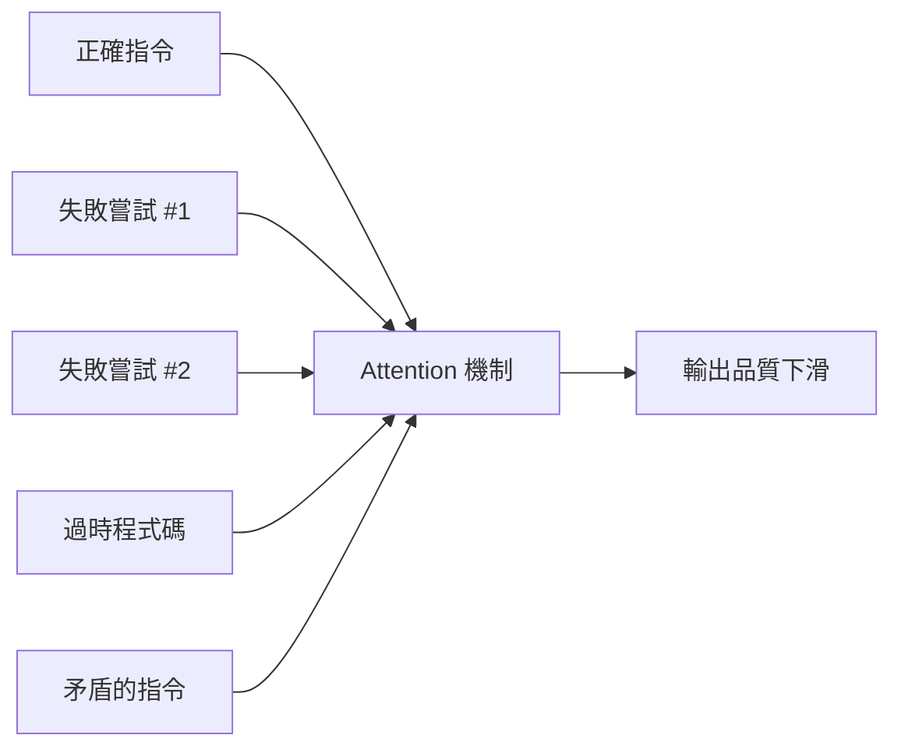
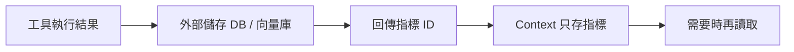

你有沒有遇過這種狀況：用 AI 代理做一個長時間任務，剛開始執行得很好，但越到後面品質越差，甚至開始重複犯相同的錯誤，或把已經修好的地方又改壞？這不是模型偷懶，也不是你的 prompt 出問題。這是一個有名字的現象：**Context Rot（情境腐敗）**。

## TL;DR

- **Context Rot**：隨著 AI 代理的對話歷史增長，輸出品質逐漸下滑的現象
- 根本原因：Transformer 把所有 Token 同等處理，舊的錯誤嘗試和成功指令一起競爭注意力
- 研究發現：Context Window 不到 50% 滿時，模型會遺失中間的內容；超過 50% 後，模型開始遺失最早的內容
- Databricks 研究：超過 32K Token 後，代理正確率明顯下滑，開始重複歷史操作
- 解法不是更大的 Context Window，而是主動管理：Memory Pointer Pattern、外部記憶、定期壓縮

## 是什麼

Context Rot 指的是：當 AI 代理的工作記憶（Context Window）隨著任務進行而不斷累積——舊的錯誤、過時的程式碼版本、重複的錯誤訊息、互相矛盾的指令——模型的輸出品質隨之退化的現象。

更大的 Context Window 只是推遲問題，無法根治。因為問題不在於 Token 數量，而在於 **訊號雜訊比（Signal-to-Noise Ratio）** 隨時間下降。

## 為什麼重要

隨著 AI 代理從「回答單一問題」演化成「執行多步驟工程任務」，Context Rot 的影響從「偶爾答錯」升級成「任務失敗」。一個需要 100 個步驟的任務，如果在第 60 步開始退化，所有後續工作都可能基於錯誤假設繼續下去，最後的結果比沒有 AI 更難收拾。

## 怎麼運作

### Transformer 的注意力機制

Transformer 在處理 Context 時不區分「新的指令」和「舊的錯誤記錄」——它們都是 Token，在 Self-Attention 中平等參與計算。這意味著：

Chroma 的研究（2025）發現：
- Context 不到 50% 滿：模型傾向於遺失中間位置的內容
- Context 超過 50% 滿：模型開始遺失最早的內容
- **結果**：不管 Context Window 有多大，關鍵資訊都有可能消失

### Databricks Mosaic 的研究數據

Databricks Mosaic 團隊發現，當 Token 數超過 32K 時：
- 代理正確率開始明顯下滑
- 代理會越來越傾向重複歷史中出現過的操作，而不是嘗試新解法
- 長對話中「卡在某個錯誤嘗試」的頻率顯著上升

## 跟 Context Window 大小的差別

很多工程師的第一反應是：「那就用更大的 Context Window 不就好了？」但這是一個常見誤解。

| | 更大的 Context Window | 主動 Context 管理 |
|-|---------------------|-----------------|
| 治標 | 推遲 Context 爆滿的時間點 | 從源頭控制噪音累積 |
| 治本 | 否 | 是 |
| 成本 | 更高（Token 費用線性增加） | 工程成本但推論成本低 |
| 適用場景 | 單次長文件處理 | 多輪任務、長期代理 |

Context Rot 在 Context Window 只有 30% 滿的時候就可能開始發生。更大的空間不是解法。

## 解法

### 1. Memory Pointer Pattern

核心思想：**不要把資料塞進 Context，只把資料的位址（指標）放進 Context。**

AWS 的 Memory Pointer Pattern 在材料科學工作流程中的測試：
- 傳統做法：工具輸出直接進 Context → 佔用 20,822,181 Token → 失敗
- Memory Pointer：工具輸出存到外部儲存，Context 只放索引 → 佔用 1,234 Token → 成功
- 效率提升：**16,000 倍以上**

### 2. 把 Context 當 RAM，不是磁碟

MindStudio 和 mem0.ai 的分析框架：

> Context Window 是 RAM：快速、可立即存取、但任務結束就清空。
> 把「公司所有已知知識」都推進 Context，期望模型全部記住，是在用 RAM 做資料庫的事。

正確做法：
- **工作記憶**（Context Window）：只放當前任務需要的內容
- **長期記憶**（外部資料庫）：專案規範、偏好、歷史決策
- **知識庫**（向量資料庫）：技術文件、API 參考

### 3. 定期壓縮（Context Compaction）

類似作業系統的垃圾回收：定期把 Context 中的對話歷史壓縮成摘要，保留關鍵事實，丟棄執行細節。

許多代理框架（Claude Code 內建的 Compaction 機制、LangChain 的 ConversationSummaryMemory）都在做這件事。

### 4. 乾淨的 Context 起點

StackOne 的研究建議：任務之間重置 Context，不要試圖把所有歷史帶進下一個任務。把重要的規範和架構決策存在一個永久性的 `PROJECT_RULES.md` 或 `ARCHITECTURE.md`，每次任務開始時讀取，而不是從對話歷史繼承。

## 小結

Context Rot 是 AI 代理從「玩具」到「生產工具」這段路上最容易被忽略的工程問題。它不會產生錯誤訊息，不會崩潰，只是悄悄讓輸出品質下滑，直到你發現已經積累了一堆需要手動修復的錯誤。

把 Context Window 當 RAM 管理，是 2025 年 AI 工程的核心原則之一：有限的資源、需要主動預算和壓縮，而不是無限塞入。

## 參考資料

- [Context Rot in AI Coding Agents: What It Is and How to Fix It | MindStudio](https://www.mindstudio.ai/blog/context-rot-ai-coding-agents-explained)
- [Context Window Behaves Like RAM, Not Storage | mem0.ai](https://mem0.ai/blog/context-window-is-ram-not-storage-why-most-agent-failures-happen-how-to-fix-them-in-2026)
- [AI Context Window Overflow: Memory Pointer Fix | AWS Dev Community](https://dev.to/aws/ai-context-window-overflow-memory-pointer-fix-3akc)
- [Context Rot: How Increasing Input Tokens Impacts LLM Performance | Chroma](https://www.trychroma.com/research/context-rot)
- [Agentic Context Engineering | StackOne](https://www.stackone.com/blog/agent-suicide-by-context/)
- [原始影片](https://www.youtube.com/watch?v=_Vz7b1pgEYg)
