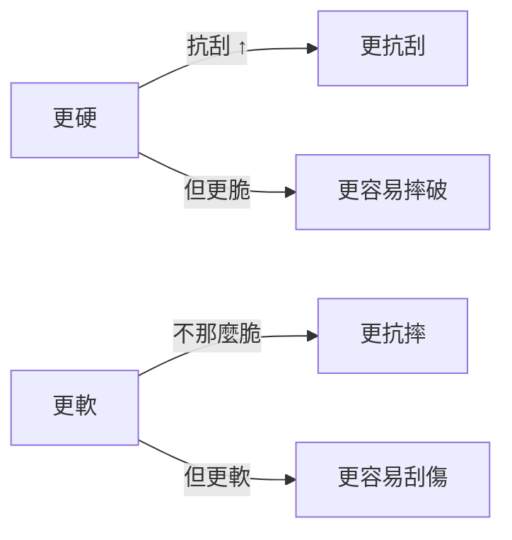

每年智慧型手機的發表會上，總會出現一張這樣的投影片：「這支手機比上一代抗摔四倍。」隔年換成「比去年抗刮三倍」，再隔年又變回「抗摔再提升三倍」。這些說法通常不算說謊——但它們**極度誤導**。因為抗摔與抗刮這兩件事，本質上是互相對抗的。

## TL;DR

「更抗摔」和「更抗刮」聽起來都是進步，但它們是一組拉扯彼此的取捨（trade-off）。你幾乎不可能在同一代產品上把兩者都大幅拉高。廠商能年復一年疊出漂亮標題，靠的就是**交替**強調其中一邊。而不管化學配方怎麼調，玻璃終究是玻璃——你口袋裡的沙子還是會刮傷它。

## 抗摔與抗刮，是一根滑桿的兩端

先把材料學的直覺講清楚。你可以把它想成一根滑桿（slider），甚至是兩根：

- 想要**更抗刮**，就把材料做得**更硬**。但更硬也代表更**脆**，更容易在摔落時碎裂。
- 想要**更抗摔**（不那麼脆、不那麼容易碎），就把材料做得**更軟**。但更軟就代表更**容易被刮傷**。

所以你只能挑一邊去最佳化。要在同一代裡把抗摔和抗刮**同時**戲劇性地提升，基本上是做不到的。

理解了這根滑桿，就能看穿發表會上那些標語的把戲。

## 為什麼廠商能年年疊出漂亮標題

當你連續幾年讀到「更抗刮、更抗摔、更抗刮、更抗摔」，你會以為手機的耐用度是像下面這樣一路往上：

一條持續向上的直線。

但真相是有**兩條曲線**：一條是抗刮、一條是抗摔，它們是**交替**在進步的。今年推抗摔，明年推抗刮，後年再回頭推抗摔。每一年都有一個真實的進步可以拿來當標題——只是那個進步，往往是以另一邊的退讓換來的。

這很聰明。廠商從來**沒有義務**去解釋「抗摔四倍」到底是相對於什麼、怎麼量出來的；而它沒說出口的潛台詞是：為了達成這個抗摔數字，材料很可能也變軟了一些，因此**更容易被刮**——反之亦然。

大多數高階智慧型手機其實不自己做玻璃，而是用康寧（Corning）的產品 **Gorilla Glass**。Gorilla Glass 第一代在 2007 年首度用在初代 iPhone 上，如今已經到第九代。回頭去翻它歷年在官網和規格表上的宣稱，會發現——不意外——它一直在「抗摔大幅提升」和「抗刮大幅提升」之間交替。當然，他們在化學配方和許多其他因素上也下了很多功夫，但這套交替行銷的骨架是清楚存在的。

## Ceramic Shield 也是一樣的故事

有人可能會說：那 iPhone 的 **Ceramic Shield** 呢？它是不是不一樣的等級？

Ceramic Shield 確實不錯，但它同樣不是無敵的。而且時間點很有意思：

- **第一代 Ceramic Shield** 隨 iPhone 12 推出，宣稱比先前的玻璃**抗摔四倍**。
- **Ceramic Shield 2** 隨 iPhone 17 推出，你猜對了——**抗刮三倍**。

先抗摔、再抗刮，一模一樣的交替節奏。

## 玻璃就是玻璃

不管配方怎麼調，有個物理事實躲不掉：它還是玻璃。在刮擦測試裡，這類螢幕大約在**莫氏硬度 6 級**開始出現刮痕、**7 級**出現更深的溝——因為它終究是玻璃。而你口袋裡的灰塵和沙子，成分往往是**石英（quartz）**，硬度比玻璃還高，所以每一次它都在你的螢幕上留下刮痕。目前還沒有任何玻璃能對此免疫。

## 「抗摔四倍」其實不只是玻璃的功勞

有趣的是，YouTube 上有人用盡可能科學的方式反覆摔 iPhone，去驗證 Apple 對 iPhone 12「抗摔四倍」的宣稱。結果這些測試**確實常常驗證了**這個說法——iPhone 在摔落中真的比較少破。

但如果把這一切**全部歸功於玻璃**，那就太天真了。決定螢幕摔不摔破的因素還有很多，而且影響可能不比玻璃小：

- 螢幕的**形狀**
- 機身的**厚度**
- **邊框（bezel）的材質**
- 邊緣是**平的還是彎的**

你或許還記得，iPhone 12 famously 回到了**直角平邊**的設計，而 iPhone 11 的側邊圓潤許多。這個結構上的改變，對於摔落時螢幕碎不碎，有著巨大的影響。但 Apple 可以把這一切——玻璃、形狀、邊框、結構——全部打包進「抗摔四倍」這一句話裡。

## 小結

下次再看到「比上一代抗摔／抗刮 N 倍」的標語，記得三件事：

1. **它多半沒說謊，但也沒告訴你全部。** 這個提升通常是以另一項特性的退讓換來的。
2. **抗摔與抗刮是交替進步的。** 連續幾年的漂亮標題，是兩條曲線輪流上場，不是同一條線一路往上。
3. **玻璃就是玻璃。** 口袋裡的沙子比它硬，這一點沒有任何一代產品逃得掉；而手機耐摔與否，結構設計往往和玻璃本身一樣關鍵。

## 參考資料

- [原始影片](https://www.youtube.com/watch?v=7YrdI7h2XoY)
