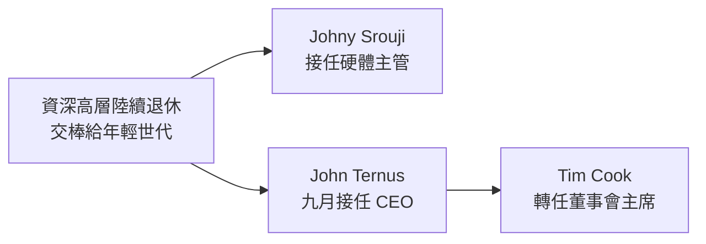

Apple 最近最值得關注的，不是什麼新產品，而是幕後正在發生的事。過去一週，Apple 的高層人事變動幾乎洗版了所有科技媒體：Tim Cook 確定將在今年卸下 Apple CEO 一職。我平常不太談企業的 CEO 更迭——因為在這種體量的公司裡，一兩個人的位子挪動通常改變不了什麼——但這一次不太一樣，值得從「接下來我們可能會拿到什麼樣的產品」這個角度來拆解。

## 換的不只是 CEO，而是一整批人

完整的故事是這樣的：John Ternus 將從九月開始接任 Apple 的 CEO。他先前的職務是硬體工程資深副總裁（Senior VP of Hardware Engineering）。他往上升之後，新的硬體主管會由 Johny Srouji 接手——就是那位在歷次 Apple 發表會上總是待在晶片實驗室、主導 Apple Silicon 的人，原本是硬體技術資深副總裁（Senior VP of Hardware Technologies）。

至於 Tim Cook，他不會離開 Apple，而是走經典的退休路線：轉任董事會主席（Chairman of the Board）。

一般來說，公司裡一兩個人換位子不會真的改變方向——這種巨型公司像一艘巨輪，成千上萬人各拿著一支槳，沒有任何單一個人能大幅扭轉整艘船的航向。但如果你過去幾個月有在關注 Apple，會發現這次不只是換一兩個人：有一大批資深高階主管、重要領導者陸續離開，而且大多是退休。這些人多半是任期很長、可預期會在差不多時間退場的 C-suite 高層，然後把方向盤交給 Apple 內部更年輕的一代。

現年 65 歲的 Tim Cook，本質上是這一連串、很可能是精心編排的接班安排裡「最後一塊、也最大的一塊骨牌」。

我的解讀是：這感覺像是一整排船槳被協調地朝同一個方向、以同樣的方式轉動，而這一次，似乎真的在改變整艘船的航向。而且我還蠻喜歡它看起來要去的方向。

## 「產品派」與「業務派」的差別

先給 Tim Cook 該有的肯定。不管你喜不喜歡他，他接下的大概是全科技業最難的一份工作：接在 Steve Jobs 之後。他雖然不是 Steve Jobs，卻用自己的方式做到了——他把供應鏈優化與經營管理的專長帶進 Apple，帶著公司衝上一兆、兩兆、三兆、四兆美元的市值，撐過了 15 年間截然不同的經濟與政治環境。投資人愛他，這一直是他最擅長的地方。

但這裡有個關鍵區別。Steve Jobs 是我會稱之為「產品人（product guy）」的那種：他是 CEO，也管行銷和策略，是願景家，但公司的舵手真的會鑽進產品的細節裡，去理解產品能做到什麼、什麼讓它變得出色。

Tim Cook 不是產品人，這完全沒關係，他當 CEO 一樣非常成功。但每當他談 Apple，很明顯他不在產品的細節裡。兩年前那場我和他的訪談就是例子——我犯了個錯，試圖跟他深入聊很多產品細節，結果變成一個梗：我基本上是在提醒他 Magic Mouse 的存在，而他得在當下臨時擠出點什麼來回應。你看得出來，那是他很久以來第一次想到那個產品。

而 John Ternus 是產品人。這不是隨口一說——他剛從硬體工程副總裁的位子上來，過去一年 Apple 一直帶著他上鏡、為 CEO 的鎂光燈做準備。兩年前我也訪問過他，我們針對 iPhone 的材料來回深談，聊到 Apple 對「可維修性 vs. 耐用性」的具體立場，內容相當細膩。不管你認不認同那個立場，重點是：這個人顯然一直待在產品的細節裡。而現在，他被放到公司裡高得多的位置上。

## 從近幾年的硬體，看接下來可能的方向

要猜 Ternus 掌舵後會怎樣，可以看 Apple 這幾年做得相當好的硬體工程：

- 那些 Jony Ive 設計、太薄、有鍵盤問題又會過熱的 MacBook Pro 走了；換上的是 Apple Silicon 世代、其實更厚、續航更長、連接埠更多的 MacBook Pro。
- 599 美元的 Mac mini 悄悄成為全科技業最划算的產品之一。
- 最新、最具破壞力的例子是 MacBook Neo：600 美元的價位，直接讓整個 Windows 筆電產業繃緊神經。

這裡補一段業界內幕：自 COVID 之後，Apple 的發表會不再是舞台上的現場簡報，而是預先錄製、打磨得非常精緻的影片。所以每次辦活動、邀大家去 Apple Park，其實是邀大家去看這支預錄影片——跟你在線上看到的直播是同一部。但你可能不知道的是，如果這是早上 10 點的直播，大約在 9:57，Tim Cook 會走到大螢幕前的舞台上，招牌式地道一聲「Good morning」，用大約三分鐘做個開場：沒什麼特別的，就是 CEO 的客套話。

而在 MacBook Neo 的活動上，說「Good morning」的是 John Ternus——那還是在他被宣布為 CEO 之前的幾週。這顯然是在讓他習慣主持這類場合，同時也象徵著他主導了 Neo 的開發、並親自把它介紹給世界。那場我甚至完全沒看到 Tim Cook。傳聞說九月本來就打算再讓 Ternus 上一次，而現在他當上 CEO，這件事更是十拿九穩。他很可能會像過去 Tim Cook 那樣，成為主持整場 iPhone 發表會的人——今年我們預期會看到 iPhone Fold（折疊 iPhone），而這似乎也是他在主導開發。

我的期待是：這位被賦予更高領導權、身邊也已經聚集了一批人的產品人，能繼續在有趣、有想法的硬體上揮出大棒——就像 MacBook Pro、MacBook Neo，以及折疊 iPhone 那樣。

## Tim Cook 時代的成績，與它的天花板

別誤會，Tim Cook 任內也出了不少扎實又有意思的產品：Apple Watch、AirTags，Vision Pro 是一次大膽的嘗試。而 AirPods 大概是最成功的例子——它們是全世界最受歡迎的耳機。

但 Apple、尤其是近年，明顯把重心轉向了各種服務：iCloud、Apple TV、Apple Music、Apple Fitness……為的是從龐大的 iPhone 裝機量裡榨出那甜美的、可持續的訂閱收入。投資人很愛，但我想看到有趣的產品重新回來。

讓我不太放心的是 Apple 的一種性格：他們似乎「格外害怕失敗的可能」，結果就是嘗試的東西變少了。有很多我想看到 Apple 做的東西，他們就是不做——一台專屬的相機、一台有螢幕的智慧家庭喇叭（而不只是 HomePod）、智慧眼鏡……折疊手機他們據說要跳進去了，但其他很多品類始終沒動。

問題在於，Apple 每推出一項新東西、尤其是新品類，感覺都非做成「宏大、革命性、劃時代」不可，這反而綁住了他們去嘗試更多有趣的東西。

打個比方：如果 Apple 是 YouTuber，他們是那種每六個月才更新一次的人；而 Samsung 和 Goog
