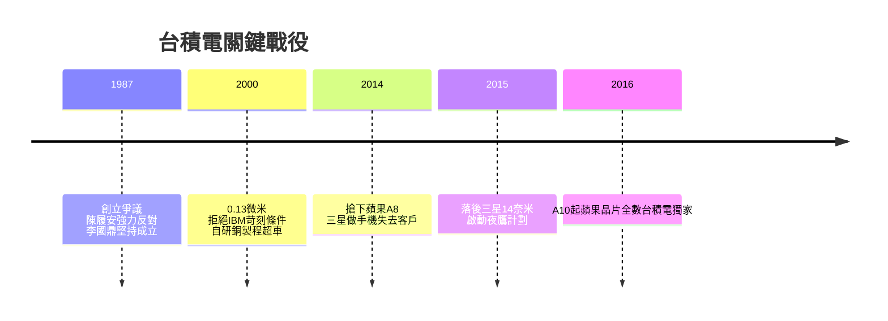

## TL;DR

台積電如今被全台灣人當成「護國神山」，但它 1987 年成立時，其實是一個爭議非常大、差點胎死腹中的創業計劃。這篇整理台積電從無人問津到晶圓代工市佔 72% 的幾場關鍵戰役：0.13 微米的自主研發、搶下蘋果訂單、被叛將反打後靠「夜鷹計劃」翻盤，以及一路擊退紫光趙偉國與 Intel 的故事。

## 現在的台積電有多強

先看兩個數字。根據 Counterpoint 的調查，在晶圓製造產業，台積電 2024 年第三季市佔率是 66%，到 2025 年第四季一整年過完，市佔率繼續往上爬到 **72%**。第二名的三星電子只有 7%，第三名的中芯國際 5%，台灣聯電與美國 GlobalFoundries 各 4%、並列第四。第一名和第二名之間差了十倍，這在任何產業都是罕見的碾壓。

財報同樣驚人。第一季通常是一年淡季、二月又特別短，但台積電今年第一季營收高達 1.1 兆元新台幣，年增率 35%，毛利率來到不可思議的 66.2%，單季 EPS 已經 22 元——去年同期還不到 14 元。

股價方面，台積電歷史最高價從 2330 元一路改寫到 2345 元。到 2026 年 4 月 30 日，台積電已經有 **251 萬個股東**，其中持有 1 到 999 股的零股股東就有 201 萬人，光零股就握有 24.3 萬張，以 2345 元計算價值約 5700 億元。而在 2019 年，一般人根本不會想買台積電——這中間的翻轉，是靠幾場硬仗打出來的。

## 第一關：差點被否決的創業計劃

台積電 1987 年成立時，行政院長孫運璿與科技顧問李國鼎（行政院政務委員）力挺從美國德州儀器請回來的張忠謀出來創業。但反對的力道非常強：當時的國科會主委陳履安強烈反對，而國科會正是掌握全國科學研究補助經費的機構。

陳履安出身名門，父親是蔣中正的左右手、前行政院長陳誠。他要求張忠謀的創業提案必須接受國外專家學者審查——但張忠謀當時是整個美國半導體業界職位最高的華人主管，在德州儀器擔任集團副總裁，帶過許多創新製造計劃，地球上幾乎找不到誰有資歷去審查他。陳履安甚至已經想好替代方案，還投入另一個創業計劃想打對台，最後不了了之。

最終在李國鼎堅持下，台積電才得以成立。這段難產過程被張忠謀寫進自傳，字裡行間仍能感受到血淚。（一個對照組：陳履安家族近期為紀念陳誠而設立的辭修中學，被爆出妻兒挪用公款 407 萬元遭檢方起訴——認輸要趁早，早點投資台積電就不用挪用公款了。）

## 第二關：0.13 微米，晶圓雙雄從此分家

2000 年前後，台積電與聯華電子（聯電）並駕齊驅，史稱「晶圓雙雄」。聯電其實成立更早（1980 年 vs. 台積電 1987 年），還孵化出聯發科技、欣興電子、聯詠科技、原相科技等一票重要公司。

分水嶺出現在 **0.13 微米（即 130 奈米）** 世代。2000 年，聯電引進 IBM 技術，做出台灣第一顆 0.13 微米晶片。當時 IBM 兩邊都找了，但開給台積電的條件極為嚴苛：要求台積電放棄自己的研發、把整個製程團隊搬到美國，才願意授權。

台積電拒絕，聯電答應了。結果台積電硬是自主研發出 0.13 微米銅製程，實力一路變強，後來與 Intel、三星形成領先群，反過來把 IBM 擠出局；而依賴 IBM 的聯電，因為靠山被擠走，後續製程一路落後。這是「自己掌握研發」與「依賴外部技術」兩條路的殘酷對照。

## 戒急用忍，意外保住護國神山

中芯國際成立後，台積電與聯電都想赴中設廠壓制對手，張忠謀與曹興誠幾乎照三餐罵政府。但台灣延續李登輝的「戒急用忍」政策，不允許晶圓廠西進。

聯電不顧反對偷跑，轉投資蘇州和艦科技，結果 2005 年陳水扁政府農曆年後發動突襲，搜索聯電與曹興誠住處，聯電經營從此長期受政治與訴訟干擾。曹興誠後來公開談和艦案，坦言在中國「賺少賠多」，還害聯電陷入泥淖，很希望當初沒去中國設廠。回頭看，戒急用忍反而保住了台灣的護國神山。

## 第三關：搶下蘋果，三星自己送上門

蘋果 2007 年推出第一代 iPhone 轟動全球，A 系列處理器（A4、A5、A6、A7，2007–2013）一直由三星電子代工——因為三星能同時做邏輯晶片與記憶體，整套解決方案好整合。台積電很想打進蘋果，卻不得其門而入。

轉折來自三星前會長李健熙的一個決定：三星既然會做記憶體、手機晶片、面板，乾脆自己做手機。但三星做的是 Android 手機，等於壯大蘋果的對手，賈伯斯大為不滿。蘋果決定分散風險，一邊對三星提專利訴訟，一邊由郭台銘牽線找上台積電，要求獨家製造下一代 20 奈米的 **A8 處理器**——這是台積電接到蘋果的第一張訂單。

這其實正中張忠謀的核心信仰。當年聯電轉投資一堆 IC 設計公司時，有人問台積電要不要跟進，張忠謀說：**台積電永遠不會做客戶的競爭產品**，因為客戶最終一定會選擇忠於客戶的晶圓廠。三星做手機打客戶，蘋果轉單，恰恰驗證了這套信念。

## 叛將反打與「夜鷹計劃」翻盤

故事沒這麼順。0.13 微米研發的一員大將梁孟松，在副總經理卡位戰輸給余振華後坐上冷板凳，2009 年含恨離開台積電。因為太太是韓國人，他很快被三星接觸，還挖走了台積電舊部。

2014 年台積電獨家拿下 A8 時，梁孟松已在三星做出 **14 奈米**製程，比台積電早半年量產，當時台積電還停在 16 奈米。於是蘋果 A9 又變成三星、台積電共享訂單，2015 年張忠謀親自向媒體證實「我們現在有點落後」。

面對叛將回頭反打，張忠謀啟動了著名的**夜鷹計劃**：編列 400 多名研發人員，改成三班制、24 小時不間斷研發，參與者底薪加 3 成、分紅加 5 成。結果大獲成功，台積電奪回領先。可以說，沒有夜鷹計劃，可能就沒有今天世界第一的台積電。

A9 這場戰役還有個有趣插曲：A9 由三星與台積電同時代工，iPhone 6s／6s Plus 用戶紛紛上網查自己手機裝的是哪家、互相比效能。主流評價認為台積電版機身不易發燙、續航較強，三星版則被貼上「發熱體質」標籤（之後還有著名的高通火龍機事件）。蘋果官方跳出來闢謠，說雙方差距只在 2–3% 以內，反而被解讀成「連蘋果都承認台積電比較好」。從 A10 之後，蘋果手機晶片就一代代由台積電獨家製造。趁勝追擊之下，台積電更在 10 奈米超車 Intel——「十萬青年十萬肝，GG 輪班救台灣」——Intel 十年前神一般的地位，自此落入下風至今未翻身。

## 兩個踢館者：紫光趙偉國與 Intel 基辛格

就在台積電與三星苦戰的 2015 年，中國紫光集團總裁趙偉國來台放話，說要買下台積電 25% 股權取得主導地位、合併聯發科與紫光晶片設計部門，甚至威脅若台灣政府不放行，就叫中國全面禁止進口台灣晶片。當時台積電 25% 市值已達 300 億美元，張忠謀強硬回嗆：「台積電市值那麼高，就怕你買不起。」如今趙偉國已被判刑、沒收財產。

另一個踢館者是 Intel 前 CEO 基辛格（Pat Gelsinger）。他 2021 年上任，正逢拜登政府為解決疫情期間晶片斷貨而推出晶片法案、用補助吸引晶圓廠赴美。基辛格公開受訪主張台灣地緣政治風險高、是「世界上最危險的地方」，美國政府不該把補助給外國公司。結果 Intel 股價從他上任時的六、七十美元一路崩到不剩 20 美元；台積電亞利桑那廠反而順利在美量產，股價在同期從五、六百衝上 1100 元新台幣。基辛格 2024 年被董事會突襲撤換、灰頭土臉離開——台灣這個「最危險的地方」還沒出事，他自己的危險先到了。

## 學到的事

回顧這幾場戰役，台積電能走到今天，靠的不是單一技術，而是幾個一以貫之的選擇：

- **掌握自己的研發**：0.13 微米拒絕 IBM 苛刻條件、堅持自研，是與聯電命運分岔的起點。
- **不與客戶競爭**：這個信仰讓蘋果在三星做手機後放心轉單，也是純代工模式的護城河。
- **落後時的決心**：三星靠叛將一度領先半年，張忠謀沒有自暴自棄，用夜鷹計劃 24 小時輪班奪回領先——如何面對挫折，往往比一時領先更決定最終勝負。

延伸一提，近期美股 AI CPU 領域，AMD 的表現被看好勝過 Intel，AMD 財報後股價一度上漲近兩成——半導體的爭霸戰，還在繼續。

## 參考資料

- [原始影片：Emmy 追劇時間「半導體爭霸戰」— 台積電究極解說](https://www.youtube.com/watch?v=gIX5E1G_dLE)
