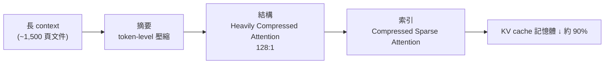

DeepSeek 4 發布了，隨附一篇 58 頁的研究論文，而且這次幾乎沒有藏私。它是目前我們能免費使用的最大型開源 AI 模型之一，最搶眼的一個數字是：**一個 100 萬 token 的 context window，而且是開源權重**。

換算成人話，你可以一次餵給它大約 1,500 頁的密集技術文件，它會全部讀進去。這種等級的長 context，兩年前還是 Google Gemini 拿來震撼全場的招牌功能，現在卻以開源、免費的形式送到我們手上。

## Pro 與 Flash：一個追平前沿，一個追平自己

DeepSeek 4 分成兩個版本：

- **Pro**：效果大致追平幾個月前那些「數十億美元等級」的前沿模型。
- **Flash**：體積小很多，卻在某些場景下能和 Pro 較勁。

更誇張的是算力。隨著輸出的文字越來越長，新的 **Pro 版本比上一代大約省下 3 倍算力**，而較輕量的 **Flash 版本則省下約 10 倍算力**。同樣的能力，用更少的計算就能跑出來。

## 三層壓縮：讓百萬 token 塞得進記憶體

真正的魔法在於它怎麼處理 KV cache。KV cache 可以想成模型在推論時的「草稿紙」——你寫進去的 prompt 和塞進去的文件都存在這裡。context 越長，這張草稿紙就越大，記憶體很快就吃不消。DeepSeek 4 用三層壓縮來解這個問題，可以用「讀一本書」的比喻來理解：

**第一層：token-level 壓縮（摘要）。**
就像讀書時把每一段濃縮成一句話。書還在，但你搜尋起來快多了。這是 token 層級的壓縮，把 KV cache 裡的內容先做一輪濃縮。

**第二層：Heavily Compressed Attention（結構）。**
光有摘要還是會累積成一大坨。想知道整本書的大致劇情？看目錄就好——每章一個短名字，你就能一眼掌握全局。論文把這一層描述成 **128 比 1 的壓縮**。

**第三層：Compressed Sparse Attention（索引）。**
目錄還不夠精準。想找書裡某一場打鬥發生在哪？翻索引——一份「詞彙／片語 → 位置」的清單，直接告訴你打鬥出現在哪幾頁。它幫你定位到最相關的少數幾頁。

三層疊起來——摘要、結構、索引——把 KV cache 的記憶體需求砍掉了**約 90%**。等於把 100 個字的東西壓進 10 個字的空間，而且論文宣稱資訊幾乎沒有損失。

一個重要的釐清：**這裡壓縮的是 KV cache，不是模型本身**。你還是得把完整的模型載入進來，別被媒體標題誤導成「可以把整個 DeepSeek Pro 塞進一台烤麵包機」——那是兩回事。

## 它真的記得住嗎？

壓縮這麼狠，會不會把資訊壓丟？作者用了經典的長文本記憶測試：在越來越長的 context 裡藏進 **8 個事實**，看模型能不能把它們找回來。

結果是：**Pro 版本的回想表現比 Google 旗艦 Gemini 3.1 Pro 還好**。這對一個開源免費模型來說相當驚人。

不過要誠實——就像其他系統一樣，當你越接近 context window 的上限，模型會開始退化：遺忘、飄移、幻覺。**文字塞得越滿，真實度越低**。這條界線要留意。

## 寫程式很強，但別過度期待

DeepSeek 4 在 coding 上表現很好。你可以輕鬆請它產生一段 JavaScript，貼到網頁就能跑；某些情況甚至能直接在 DeepSeek 的視窗裡一鍵執行程式。

但它不是萬能。作者本身做 light transport（也就是 ray tracing）研究，拿相關的小題目去試，一般任務沒問題，**碰到比較進階的演算法它仍然無法正確實作**。所以強，但有天花板。

## 價格：便宜到數字快失去意義

如果你有能力自架，硬體本身不便宜；但官方也提供線上存取，而且便宜得誇張：

- **有折扣時**：大約比 Anthropic 的 Claude 便宜 **30 倍**。
- **沒折扣時**：大約便宜 **8 到 20 倍**。

## 別被標題騙了：三個限制

媒體標題通常不會提這些，但它們不是小問題：

1. **只支援文字，不是多模態。** 它能吞 1,500 頁文件，但**不能**吃 10 小時音訊或一整部電影——沒有圖片、沒有音訊，用作者的話說「又瞎又聾」。
2. **連作者自己都沒完全搞懂。** 論文提到有兩個技巧能神奇地穩定訓練，但他們坦承不太確定為什麼有效。這其實是很多研究都會遇到的狀況，這份透明度值得尊重。
3. **逼近 context 上限就會崩。** 前面提過——越往窗口邊緣推，表現越不穩，使用時要小心。

## 一個順帶提到的技術：Engram

論文還用到一個叫 **Engram** 的技術。一般的 AI 幾乎每次都要把每個事實從頭重算一遍；Engram 讓它可以直接「回想」這些已算過的事實，而不是重算。聽起來簡單，實作沒那麼容易。

## 結尾：把「近掃、遠望」用在自己身上

DeepSeek 4 對開源、免費 AI 來說不是一小步。而它的核心思路其實也能借來用在思考上：

想像你在森林裡散步。你想抬頭看眼前的美景，但一抬頭可能就會絆倒；於是你只好盯著腳前的路——看風景，或看腳步，你沒辦法同時做兩件事。解法是什麼？**兩件都做**：近處掃一眼、遠處瞄一眼，一步一看，局部細節配上全局脈絡。

這正是 DeepSeek 4 在做的事——用不同層級的壓縮，同時保有細節與全貌。

## 參考資料

- [Two Minute Papers：DeepSeek 4 解析（原始影片）](https://www.youtube.com/watch?v=p7K3xfViWCE)
