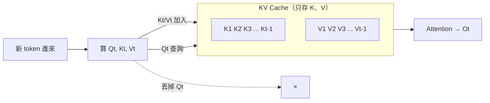

如果你用過任何一個基於 Transformer 的語言模型，那你其實一直在享受 KV Cache 帶來的好處。它的 Cache 發音跟「錢」的 Cash 一樣——而它確實也跟錢（GPU 記憶體、也就是成本）脫不了關係。這篇文章以李宏毅老師課程中的講法為本，說清楚 KV Cache 是什麼、為什麼它會撐爆你以為很大的倉庫，以及業界為了救這個倉庫想出了哪些辦法。

## 先回顧：語言模型是怎麼生成的

語言模型的生成，本質上就是「文字接龍」。人類先給一段 prompt，模型 output 一個 token，然後把這個 token 接回輸入、再 output 下一個，一直到輸出結束符號為止。

整個過程可以拆成兩段：

- **Prefill**：一次輸入一段很長的 sequence，把 prompt 全部算過一遍。
- **Decode**：接下來一個一個 token 地往外吐。

在 Prefill 階段，假設輸入有三個 token，每個 token 都會算出自己的 QKV，然後拿去算 attention：Q1 跟 K1 算 attention weight 再乘上 V1 得到 O1；Q2 跟前兩個 K 算 weight，對 V1、V2 做 weighted sum 得到 O2；Q3 同理。這裡有個關鍵——Q1、Q2、Q3 算出 O1、O2、O3 這三件事是可以平行運算的。

## KV Cache：一個非常簡單的概念

算完之後，我們會把 K1～K3 和 V1～V3 **存下來，把 Q 丟掉**。這個「把 K 和 V 存下來」的動作，就是 KV Cache。

為什麼可以丟掉 Q、只留 K 和 V？看 decode 階段就懂了。三個 token 進來後，模型生出第四個 token，這個 token 變成新輸入，我們得到 Q4、K4、V4。如果每次都要把第四個 token 接著前面所有 token 重新丟進模型、重算一次 K 和 V，實在太浪費了——因為把輸入乘上 matrix 算出 K/V、再算 attention，全都要花時間。

所以我們直接讀快取：Q4 去跟存好的 K1～K3、以及新的 K4 算 attention，再對 V1～V4 做 weighted sum 得到 O4。等第五個 token 進來時，它也只需要算自己的 Q5、K5、V5，前面四個 token 的 K/V 完全不必重算。



概念就這麼簡單。但實作上會撞到一個巨大的問題。

## 為什麼 KV Cache 會撐爆「倉庫」

你原本以為 GPU 記憶體這個倉庫很大、放什麼都行，但 KV Cache 有本事把它直接塞爆，原因有二：

1. **要存的 K/V 非常多**：每輸入或輸出一個 token，就要多存一組 K 和 V。序列一長，倉庫就滿了。
2. **K/V 不只一組**：我們通常做 Multi-Head Attention，有很多個 Query head，每個都有自己對應的 Key 和 Value。

用 **Gemma 2** 來實際算一下。以 27B 這個模型為例，它有 **46 層**，attention 部分用了 GQA（Grouped-Query Attention，稍後再談）——這裡先無視 GQA、假設它是一般的 attention，用 **30 個 head**、每個 QKV 向量 **128 維**。

每產生一個 token，要存的 K/V 大小是：

```
46 層 × 30 head × 128 維 × 2 bytes(FP16) × 2(K 和 V)
≈ 736 KB ≈ 0.72 MB
```

一個 token 不到 1MB，聽起來不多。但假設你用的是 **A100（80GB 記憶體）**，80GB 也只夠存大約 **114k（約 10 萬）個 token**。而現在我們對 context 的需求常常遠超 10 萬——於是當輸入或輸出的 sequence 太長，你就會看到 **CUDA out of memory**：那個你以為無比巨大的倉庫，是會被撐爆的。

為了讓倉庫撐久一點，業界發明了一大堆方法。

## 方法一：減少 K/V 的組數（MQA / GQA）

既然會被存下來的是 K 和 V、而 Q 不會，那自然的想法就是：Q 可以多，但 K/V 要少。

- **Multi-Query Attention（MQA）**：一樣有多個 Query，但**所有 Query 共用同一組 K 和 V**。倉庫佔用大幅下降。缺點是實際表現不太好。
- **Grouped-Query Attention（GQA）**：介於 MHA 和 MQA 之間。仍然有多組 K/V，但每一組配給多個 Query。例如四個 Query 分成兩組、每組共用一組 K/V——運作起來像是四個 Query 的 attention，卻只要存兩組 K/V。

這裡有個常被問到的點：為什麼是「不同 Query 共享同一組 K/V」，而不是反過來？答案就在 KV Cache——因為只有 K/V 會被存下來，讓它變少才有意義；Q 反正不進倉庫，多幾組無所謂。GQA 目前被廣泛採用，LLaMA、Gemma 這些知名模型裡都有它。

## 方法二：把 K/V 壓成 latent 向量（MLA）

**Multi-Head Latent Attention（MLA）** 的想法更激進：與其存好幾組 K/V，不如在 x 到多組 K/V 中間塞一個 bottleneck layer，先把 input x 壓成一個較低維的向量（記為 C），**倉庫裡只存 C**，之後再乘上不同的 transformation 展開成各組 Query 和 Key。這是需要訓練的，訓練時就要教模型學會這個壓縮。DeepSeek 用的就是這一招。

直覺上你會擔心：算 attention 時是不是得先把 C 解壓縮回一堆 K/V？如果要解壓縮，那算力根本沒省到，KV Cache 的優勢也就沒了。MLA 神奇的地方在於——**不需要解壓縮**，可以直接在壓縮維度上算。

推導很漂亮。假設要解壓縮，K = WK·C，attention 數值 a = Qᵀ·K = Qᵀ·WK·C。我們可以把 Q 和 WK 湊一對：先算 Q′ =（Qᵀ·WK）ᵀ，再讓 Q′ 直接跟 C 做 dot product，結果完全等價——這不是近似，是數學上相等。好處是，「把 Q 壓縮」這件事只要對每個 Query 做**一次**；而如果去解壓縮 C，C 的數量是跟 sequence 長度綁在一起的，你得對一整串做解壓縮，太花時間。

Weighted sum 那邊也一樣。O = Σ αᵢ·Vᵢ，而 Vᵢ = WV·Cᵢ，把 WV 提出來就變成 O = WV·(Σ αᵢ·Cᵢ)。所以你可以**先在壓縮的 C 上做 weighted sum，最後只解壓縮一次**，不必對每個 C 各解一次。實務上 MLA 甚至能拿到比原本 Multi-Head Attention 稍好一點的結果。

## 方法三：限制 attention 的範圍

前面兩招在改 K/V 的**組數**，這一類則是限制**要 attend 的長度**。

**Sliding Window Attention**：每次做 attention 時不看整個 sequence，只看前面一個固定 window（例如 4096）的範圍。這樣 KV Cache 就有了固定上限。缺點是單層看得短，但因為 Transformer 是多層堆疊，上層的 query 透過下層又間接看到更前面的 token——只要層數夠深，等效視野仍然可以很大，實際範圍取決於深度。這招曾用在某個版本的 **Mistral 7B**。

**混合層**：也可以只把「部分層」換成 sliding window、其他層維持完整 attention，藉此減少要存的 K/V。**GPT OSS**（OpenAI 近年少數釋出的模型）就用了一層 sliding window、一層完整 attention 交錯的設置。

## 方法四：Streaming LLM 與「attention sink」

Sliding Window 在輸入很長時常讓表現變差。**Streaming LLM** 發現一個極簡的救法：只要 attention 範圍裡**包含整個 sequence 最開頭的那幾個 token**，表現就穩了。而且這招連額外 training 都不用——訓練時沒特別教，只要在 inference 時把最前面幾個 token 加進 sliding window，效果就大增。

實驗（橫軸是輸入長度、縱軸是 perplexity，越小越好）顯示：完整的 dense attention 在超過訓練時看過的 window 長度後，表現會突然崩壞；純 window attention 一旦輸入超過 window 也會瞬間變差；但 Streaming LLM 讓模型多看開頭幾個 token 後，就能穩定處理訓練時從沒見過的超長輸入。

為什麼開頭的 token 這麼重要？因為 attention 是「強制」的——所有 attention weight 加起來必須是 1，每個 query 無論如何都得 attend 到某個地方。當某個 token 其實沒什麼好 attend 的時候，模型的預設行為就是把注意力倒到第一個 token 上（也就是所謂的 attention sink）。一旦你不給它第一個 token，它整個世界就崩壞、不知道該怎麼 attend；把第一個 token 還給它，行為立刻恢復正常。

## 方法五：直接丟掉沒用的 KV（pruning）

還有一條路是把沒用的 K/V 從倉庫裡直接刪掉。2023 年就有兩篇經典論文——**Scissorhands** 和 **H2O**——發現了非常類似的現象：**多數 token 的 K/V 後來根本沒被 attend 過**。

把不同位置（例如第 178、228、278 個位置）的 attention 視覺化會看到：一大片區域的 token 從頭到尾沒人 attend 它，存這些 K/V 只是白佔空間；反而有少數 token 會被反覆 attend，那些才值得留。於是這些方法的精神就像倉庫管理——一組 K/V 如果一直沒人來拿，過陣子就把它丟掉。

效果如何？以 Scissorhands 的結果來看，橫軸是壓縮量，它甚至能壓縮 5 倍（只保留 20% token 的 K/V），在很多任務上表現仍然差不多。不過後續也有文獻指出：碰到很難的任務時亂丟 K/V 還是會掉分，所以「怎麼 pruning 才最有效」後來衍生出滿坑滿谷的論文。

## 跨對話的 KV Cache：prefix 共用

前面講的 KV Cache 都是同一個對話內的。但它其實也能跨對話用。假設模型先生成過「大家好我是大金」並存了 KV Cache，這時另一個人 prompt「大家好我是小金」——這兩句話的**前五個 token 一模一樣**，那前五個 token 的 K/V 就能直接搬過去用。

但要注意兩點：

- 「大」和「小」對應的 K/V 不同，所以整句的 KV Cache 不能互換。
- 就算兩句都有「金」這個字，也**不能**把上面那個「金」的 KV Cache 挪到下面用。因為每個 token 算出來的 representation 取決於它前面看過什麼；前面從「大」變「小」，representation 就變了，存下來的 K/V 也就不同。

換句話說，**只有擁有完全相同 prefix（前綴）的兩個 sequence，才能共用那段 prefix 的 K/V。**

## 小結

KV Cache 本身是個一句話就能講完的概念——把 K 和 V 存下來、別重算。但正因為它會隨序列長度和 head 數量線性膨脹，它同時也是限制長文本 LLM 部署的核心瓶頸。從 MQA/GQA 減少組數、MLA 壓進 latent 空間、Sliding Window 與 Streaming LLM 限制範圍、pruning 丟掉沒用的 K/V，到跨對話的 prefix 共用——這一整條技術路線，做的都是同一件事：讓那個會被撐爆的倉庫，撐得再久一點。

## 參考資料

- 課程原始影片：[https://www.youtube.com/watch?v=fDQaadKysSA](https://www.youtube.com/watch?v=fDQaadKysSA)
- 內文提及的相關研究：Scissorhands、H2O（KV Cache pruning，2023）、Streaming LLM（attention sink）；模型架構範例：Gemma 2（GQA）、Mistral 7B（Sliding Window Attention）、GPT OSS（混合層 attention）、DeepSeek（MLA）
