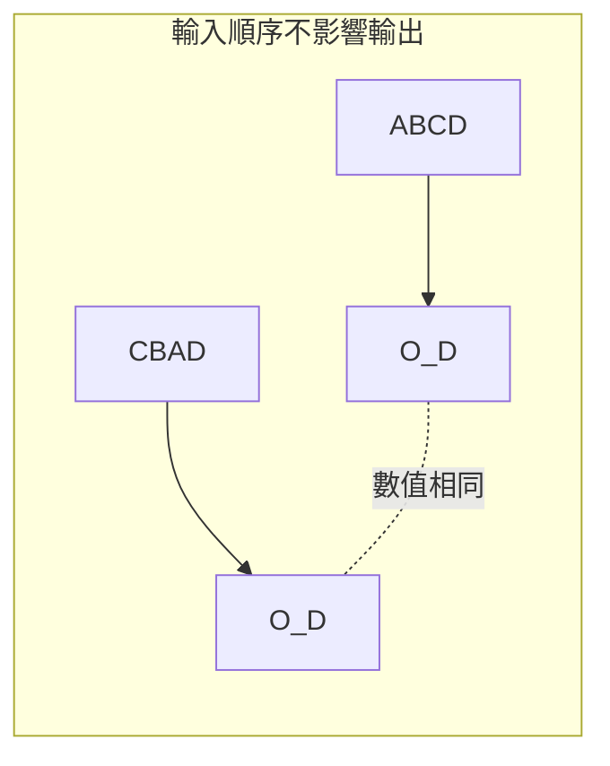
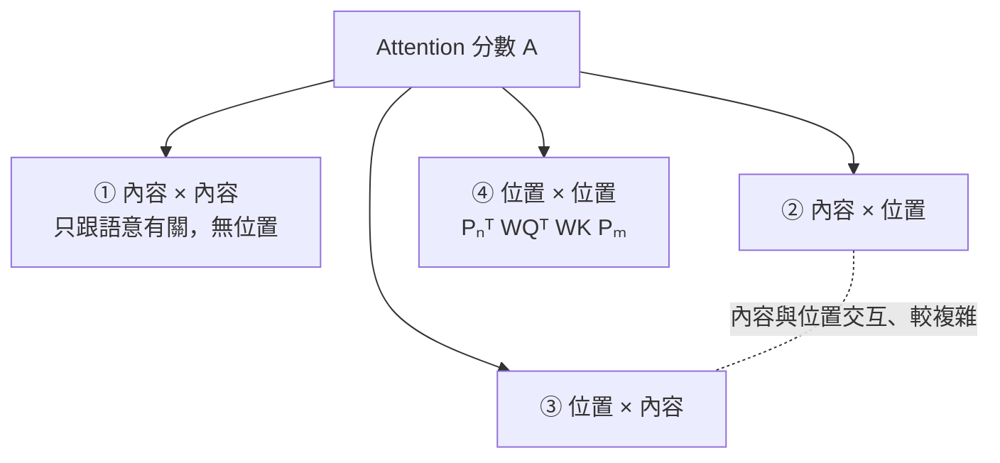

「你打我」和「我打你」是同樣三個字、不同順序，意思卻完全相反。如果 Transformer 分不出這兩句話的差別，那它根本沒辦法理解語言。問題是——原始的 Transformer 的 Self-Attention **真的分不出來**。這篇就來講 Positional Embedding（位置編碼）這個技術：它讓 Transformer 知道輸入 Token 的順序。

## 先搞清楚：Self-Attention 為什麼「看不到」順序

大型語言模型背後是一個叫 Transformer 的神經網路。它的輸入是一串 Token，輸出是去預測下一個 Token。

Transformer 怎麼處理輸入？首先每個 Token 會被轉成一個向量，也就是 Embedding；這些向量會被送進一層一層的 Layer，而每個 Layer 裡都有一個 Self-Attention 模組。Self-Attention 做的事情是：輸入一排 Token，吐出數目一樣的另一排 Token。

我們看它的計算過程。假設輸入 4 個 Token，轉成 4 個 Embedding，用 X_A 到 X_D 表示。每個 Embedding 會分別乘上三個矩陣，變成 Q、K、V。若要算 X_D 位置的輸出 O_D：

1. 用 X_D 產生的 query Q_D，去和每個 Token 的 key K 做內積，得到 Attention weight
2. 對這些 weight 做 Softmax 做 Normalization
3. 用 normalized 後的 weight，對每個 Token 的 value 向量做 weighted sum，得到 O_D

**關鍵就在最後這個 weighted sum**。假設我們把 A 跟 C 兩個 Token 對調，輸入從 ABCD 變成 CBAD，會對 O_D 造成什麼影響？答案是**完全沒有影響**。因為當 A、C 位置對調，它們對應的 Q、K、V 和 Attention weight 也跟著對調，而 weighted sum 就只是把所有 value 加起來——先加 C 還是先加 A，結果一模一樣。



這就是所謂的「排列不變（permutation-invariant）」。對集合類的問題沒差，但對語言是致命的：「你打我」（ABC）和「我打你」（CBA）最後一個位置算出來的 Embedding 竟然一樣，模型就沒辦法分辨這兩句話。

所以我們必須額外給 Transformer 位置的資訊。

> 註：課程尾聲其實會提到，Self-Attention 並非完全沒有位置資訊——它偷偷藏了一點。但先照最直覺、最傳統的講法，把它當成沒有位置資訊來處理。

## 方案一：Absolute Positional Embedding

最早的想法很直接：**對每一個位置，都設計一個專屬的 Embedding**，代表這個位置的資訊。用 P_0 到 P_3 代表位置 0、1、2、3 的專屬向量，然後把它加到 Token 上。

- 順序是 ABCD：A 加 P_0、B 加 P_1……
- 順序是 CBAD：C 加 P_0、B 加 P_1……

這樣一來，同樣是 X_A，放在位置 0 時加的是 P_0，放在位置 2 時加的是 P_2。對 Self-Attention 來說，它看到的不再是單純的 X_A，而是「放在位置 0 的 X_A」和「放在位置 2 的 X_A」——變成不同的東西了，算出來的 Attention 輸出自然就不同。位置資訊就這樣被注入了。

剩下的問題是：這些 P_0、P_1…… 到底長什麼樣子？

## Sinusoidal Positional Embedding：用 sin / cos 建構位置

Transformer 誕生的時候（可以想像成深度學習的「寒武紀」）採用的，是一種叫 **Sinusoidal** 的位置編碼。

先講符號。用 `d` 代表 Positional Embedding 的長度（這是你可以自己決定的，例如 128、256），用 `P_k[i]` 代表第 k 個位置的 Embedding 向量的第 i 個數值。建構規則如下：

```
偶數維度：P_k[2i]   = sin( k / 10000^(2i/d) )
奇數維度：P_k[2i+1] = cos( k / 10000^(2i/d) )
```

拆開來看每個部分：

- **分子 k**：第幾個位置。k 越大，送進 sin／cos 的角度越大
- **分母 10000^(2i/d)**：i 是第幾個維度。維度不同，分母不同，就改變了角度的變化速度
- 偶數維度用 sin、奇數維度用 cos，但同一對的角度是一樣的

### 圖像化：不同維度 = 不同頻率的波

如果把所有位置在**第 0 維**的數值拿出來（P_0[0]、P_1[0]…P_49[0]），沿著位置軸看，會看到一條 **sine 波**；看第 1 維（奇數），會看到一條 **cosine 波**；看第 10 維，又是一條 sine 波，但**週期跟第 0 維不一樣**——因為分母裡的 i 不同。

把所有位置、所有維度畫成一張熱力圖（橫軸是位置、縱軸一列一列是各維度、顏色代表數值，黃色接近 1、深藍接近 −1，因為是三角函數所以數值只落在 −1 到 1 之間），會看到一張佈滿深淺斑紋的圖：奇偶維度交錯，靠近 0 的維度變化劇烈（頻率高），維度編號越大變化越緩慢（頻率低）。

### 時鐘指針的比喻

換個角度看：偶數維度是 sin、奇數維度是 cos，**每一對（第 2i 維 + 第 2i+1 維）合起來，其實就是二維平面上的一根指針**，隨著位置 k 增加而不斷旋轉。

指針轉一圈需要多少個 k？三角函數週期是 2π，所以令 `k / 10000^(2i/d) = 2π`，得到：

```
週期 k = 2π × 10000^(2i/d)
```

以 d = 128（i 從 0 到 63）為例：

| 維度對 | i | 轉一圈所需的位置數 k |
|--------|---|----------------------|
| 第 0、1 維 | 0 | 約 6.3（轉最快，像秒針）|
| 第 64、65 維 | 32 | 約 628.3（像分針）|
| 第 126、127 維 | 63 | 約 54000（轉最慢，像時針）|

一般時鐘只有三根指針，這裡有幾根呢？看維度有多少——128 維就是 **64 根轉速全都不一樣的指針**。我們希望 Self-Attention 看著這 64 根指針，就能判斷出「現在在哪個位置」。

## 為什麼是這個設計？因為它藏著「相對位置」

用指針表示位置聽起來合理，但方法明明很多，2017 年 Transformer 的作者為什麼偏偏選這個？論文正文只用了一句話帶過，微言大義：他們希望位置編碼能考慮 **relative position（相對位置）**。

什麼是相對位置？看「貓吃了魚」這句話。「貓」和「魚」中間隔了兩個 Token，假設處理「魚」時要 attend 回「貓」，分數是 0.7。現在我在前面硬塞一大堆字——「今天早上我看到貓吃了魚」，甚至塞 1000 個 Token 讓它變成某部長篇小說的一段——**「貓吃了魚」這個事件本身沒變**，我們會希望「魚 attend 到貓」算出來還是 0.7。

反過來，如果「貓」在句首、「魚」在句尾，兩者距離很遠，我們就希望 attention 小一點。

換句話說，**真正重要的往往是相對距離，而不是絕對位置**。而 Sinusoidal 位置編碼恰好有一個能支撐相對位置的漂亮性質。

### 核心性質：P_{k+R} = M_R · P_k

這個性質是說：把位置 k 的 Embedding 乘上一個矩陣 M_R，就會得到位置 k+R 的 Embedding，而**這個矩陣只跟相對距離 R 有關，跟絕對位置 k 無關**：

```
P_1   × M_3 = P_4
P_11  × M_3 = P_14
P_101 × M_3 = P_104
```

怎麼證明？把分母那一長串 `10000^(2i/d)` 簡記成 Z（注意 Z 裡面藏著 i）。位置 k+R 的一對維度是 `sin((k+R)/Z)` 與 `cos((k+R)/Z)`。用高中的**合角公式**展開：

```
sin(A+B) = sinA·cosB + cosA·sinB
cos(A+B) = cosA·cosB − sinA·sinB
```

展開後，`sin(k/Z)`、`cos(k/Z)` 這些項正好就是 P_k 的第 2i、2i+1 維。整理成矩陣形式，就得到一個只跟 R／Z 有關的 2×2 旋轉矩陣 M_{R,i}：

```
[ P_{k+R}[2i]   ]   [ cos(R/Z)  sin(R/Z) ] [ P_k[2i]   ]
[ P_{k+R}[2i+1] ] = [ -sin(R/Z) cos(R/Z) ] [ P_k[2i+1] ]
```

把每一對維度的 M_{R,i} 沿對角線排起來（其他位置補 0），就組成完整的 M_R。於是 `P_{k+R} = M_R · P_k`——兩個位置的 Embedding 之間的關係，只由相對距離 R 決定。（注意 Z 裡有 i，所以不同維度的小方塊 M_{R,i} 長得不一樣。）

## 這個性質怎麼影響 Self-Attention

有了 M_R，來看它對 attention 分數的實際影響。位置 n 的 Token（當 query）和位置 m 的 Token（當 key），各自的 Q、K 都是「Token Embedding + Positional Embedding」再乘上轉換矩陣。attention 分數是 Q 和 K 做內積：

```
A = (W_Q (X + P_n))ᵀ · (W_K (X + P_m))
```

把括號展開，會得到**四項**：



- **第 ① 項**：只跟內容有關，完全不看位置
- **第 ②③ 項**：內容和位置交互，比較複雜，先擱著
- **第 ④ 項**：`P_nᵀ W_Qᵀ W_K P_m`，**只跟位置有關**

第 ④ 項單看只跟絕對位置 m、n 有關，看不出相對性。但因為 Sinusoidal 有 `P_{k+R} = M_R P_k` 的性質，我們可以把 `P_m` 換成 `M_{m−n} · P_n`，於是這一項就變成：

```
P_nᵀ · (跟相對距離 m−n 有關的矩陣) · W_Q W_K · P_n
```

——出現了一項**跟相對位置 (m−n) 有關**的成分，被加進 attention 分數裡，讓 attention 能感知相對距離。

不過要誠實地說：這個影響是**相當間接的**。這一項裡除了相對位置，還混著絕對位置和其他東西；而且四項裡真正純粹跟相對位置有關的也就這麼一小塊。Sinusoidal 是拐了一個彎，才勉強把相對資訊塞進 attention。

## 小結：接下來要走向 Relative Positional Embedding

整理一下這條演進線：

1. **問題**：Self-Attention 排列不變，分不出 Token 順序
2. **Absolute Positional Embedding**：給每個位置一個專屬向量，加到 Token 上
3. **Sinusoidal**：用不同頻率的 sin／cos 建構這些向量，兩兩維度合成轉速不同的指針
4. **意外的好處**：`P_{k+R} = M_R P_k` 讓 attention 能**間接**感知相對位置

既然大家真正想要的是「把相對資訊加進 attention」，那何必拐彎抹角、去設計這種神奇的絕對位置編碼？能不能乾脆跳過 Positional Embedding，直接改 attention？——這就是接下來 **Relative Positional Embedding** 時代要回答的問題了。

## 參考資料

- [原始課程影片（YouTube）](https://www.youtube.com/watch?v=Ll-wk8x3G_g)
