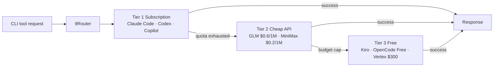

You subscribed to Claude Pro, then bought Cursor, and your company handed you GitHub Copilot too — and now every service manages its own quota in isolation: when one runs out you switch to another by hand, OAuth tokens expire after a few hours and force a re-login, and each tool ships its API in a different format. You've paid for plenty of capacity, yet you keep hitting rate limits at exactly the moment you need them most.

[9Router](https://github.com/decolua/9router) takes a dead-simple angle: run an OpenAI-compatible proxy on your machine, collect every AI coding tool's requests into one place, and automatically route them to whichever provider is currently "cheapest and still has quota." It has racked up 18k stars on GitHub, is actively maintained, and ships with a matching npm package and Docker image.

## Design Philosophy: Tools Only Know One Endpoint

The traditional approach has every tool configure its own provider and hold its own API key. The moment a provider changes, you reconfigure every tool.

9Router pulls that layer out: as long as a tool supports a "custom OpenAI endpoint," you point them all at `http://localhost:20128/v1` and hand provider selection, switching, and authentication entirely to 9Router. In other words, **swapping providers is 9Router's problem; your tools get configured once and never need touching again.**

```bash
npm install -g 9router
9router
# Dashboard opens at http://localhost:20128
```

Once it's running, just change each tool's endpoint and API key to the values the dashboard gives you:

```
Claude Code / Codex / Cursor / Cline settings:
  Endpoint: http://localhost:20128/v1
  API Key:  (copy from dashboard)
  Model:    e.g. kr/claude-sonnet-4.5
```

API keys and OAuth tokens are stored only on your machine — nothing is sent to a third party.

## Three-Tier Fallback Routing

The core mechanism is three-tier fallback that only drops down once the current tier is exhausted, ordered from lowest cost to highest:



Switching between tiers is automatic — no manual intervention needed; when a provider has multiple accounts it can round-robin across them, and the dashboard offers live quota tracking with reset countdowns.

The currently reliable options in the free tier:

| Free Provider | What you get |
|---|---|
| **Kiro AI** | Claude 4.5 + GLM-5 + MiniMax, billed as unlimited free |
| **OpenCode Free** | No auth required, auto-discovers available models |
| **Vertex AI** | Gemini 3 Pro + GLM-5 + DeepSeek, $300 free credit |

> The README notes that the free plans for iFlow, Qwen, and Gemini CLI were shut down one after another over the course of 2026; the three above are the current mainstays.

## OAuth Auto-Refresh

For OAuth-based subscription services like Claude Code, Codex, GitHub, Cursor, and Antigravity, tokens usually last only a few hours. 9Router refreshes them automatically before they expire, so long sessions don't get cut off mid-way and force a re-login.

## Cross-API Format Translation

Different providers use different native API formats (OpenAI's and Claude's messages structures, for instance, aren't the same). 9Router translates formats automatically as it routes:

```
Your tool (OpenAI format) → 9Router →  each provider's native format
                                       Claude · Gemini · Cursor · Vertex …
```

Your tool only needs to speak OpenAI format — no need to write a separate adapter for each provider.

## Built-in RTK Token Compression

9Router ships with an **RTK (Result Token Kit)** middleware that targets the contents of `tool_result` payloads (shell output like git diff, grep, ls, log): it detects the type, filters out redundancy, and only then feeds it to the LLM. The project claims this saves **20–40% of input tokens** per request.

> Note the naming clash: this RTK is a middleware built into 9Router, and it merely shares an abbreviation with a separate, standalone Rust tool, [RTK (Rust Token Killer)](https://github.com/rtk-ai/rtk) — they are not the same thing.

## Supported Tools and Deployment

**CLI tools**: Claude Code, OpenClaw, Codex, OpenCode, Cursor, Antigravity, Cline, Continue, Droid, Roo, Copilot, Kilo Code.

**Providers**: OAuth-based ones (Claude Code, Antigravity, Codex, GitHub, Cursor) plus 40-some API-key-based ones (OpenRouter, GLM, …).

**Deployment**: runs on localhost by default; you can also launch from source or via Docker, and some in the community have demonstrated deploying it to Hugging Face Spaces as a free, always-on alternative to a VPS.

## Who It's For, and Who It Isn't

**A good fit**: anyone juggling multiple AI subscriptions who wants automatic quota fallback, or who wants to share one AI setup across several machines. Configure once, and all tools funnel through 9Router.

**Things to watch**: using an unofficial proxy to hook into subscription services is fundamentally a way of working around each vendor's intended usage, and individual providers carry a risk of bans or ToS violations — you'll need to weigh that yourself. And if your actual pain point is "shell command output blowing up the context," that's a different dimension of the problem, and you can pair this with a dedicated command-output compression tool instead.

## References

- [9Router GitHub](https://github.com/decolua/9router)
- [9Router official site](https://9router.com)
