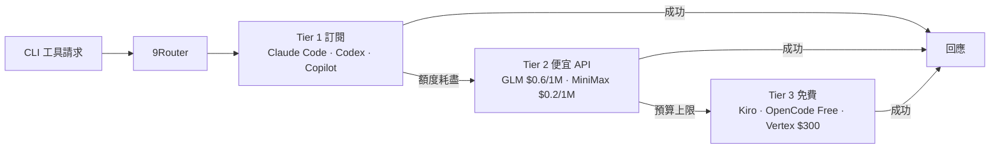

訂了 Claude Pro、又買了 Cursor、公司還發了 GitHub Copilot——結果每個服務的額度各管各的：一個用完要手動切到另一個，OAuth token 過幾小時就過期要重登，而且每個工具送出的 API 格式還不一樣。額度明明買了一堆，卻常常在最需要的時候撞到 rate limit。

[9Router](https://github.com/decolua/9router) 的切入點很單純：在本機跑一個 OpenAI-compatible 的 proxy，把所有 AI coding 工具的請求統一收進來，再自動路由到當下「最划算又還有額度」的 provider。它在 GitHub 上累積了 1.8 萬顆星、更新活躍，背後有對應的 npm 套件與 Docker image。

## 設計哲學：工具只認一個 endpoint

傳統做法是每個工具各自設定 provider、各自塞 API key。Provider 一變動，每個工具都要重設一次。

9Router 把這層抽出來：工具端只要支援「自訂 OpenAI endpoint」，就全部指向 `http://localhost:20128/v1`，provider 的選擇、切換、認證全部交給 9Router。換句話說，**provider 怎麼換都是 9Router 的事，工具本身的設定一次到位、之後不用動。**

```bash
npm install -g 9router
9router
# Dashboard 開在 http://localhost:20128
```

啟動後把工具的 endpoint 與 API key 改成 dashboard 給的值即可：

```
Claude Code / Codex / Cursor / Cline 設定：
  Endpoint: http://localhost:20128/v1
  API Key:  （從 dashboard 複製）
  Model:    例如 kr/claude-sonnet-4.5
```

API key 與 OAuth token 都只存在本機，不會送往第三方。

## 三層 Fallback 路由

核心機制是按「成本由低到高用完才往下掉」的三層 fallback：



三層之間自動切換，不需要手動介入；同一個 provider 有多個帳號時可以 round-robin 分配，dashboard 提供即時額度追蹤與重置倒數。

免費層目前可靠的選項：

| 免費 Provider | 內容 |
|---|---|
| **Kiro AI** | Claude 4.5 + GLM-5 + MiniMax，標榜 unlimited free |
| **OpenCode Free** | 免認證、自動抓取可用模型 |
| **Vertex AI** | Gemini 3 Pro + GLM-5 + DeepSeek，$300 免費額度 |

> README 註明：iFlow、Qwen、Gemini CLI 的免費方案在 2026 年陸續關閉，現在主力是上面三個。

## OAuth 自動刷新

Claude Code、Codex、GitHub、Cursor、Antigravity 這些走 OAuth 的訂閱服務，token 效期通常只有幾小時。9Router 會在過期前自動刷新，避免長 session 中途斷線重登。

## 跨 API 格式轉換

不同 provider 的原生 API 格式不同（OpenAI 與 Claude 的 messages 結構就不一樣）。9Router 在路由時自動做格式轉換：

```
你的工具（OpenAI 格式）→ 9Router →  各 provider 原生格式
                                    Claude · Gemini · Cursor · Vertex …
```

工具端只要會講 OpenAI 格式就夠，不必為每個 provider 各寫一套。

## 內建 RTK Token 壓縮

9Router 內建一個 **RTK（Result Token Kit）** middleware，針對 `tool_result` 的內容（git diff、grep、ls、log 這類 shell 輸出）偵測類型、過濾冗餘後再送進 LLM，官方宣稱每次請求省 **20–40% 輸入 token**。

> 注意命名衝突：這個 RTK 是 9Router 內建的 middleware，跟另一個獨立的 Rust 工具 [RTK (Rust Token Killer)](https://github.com/rtk-ai/rtk) 只是縮寫相同、不是同一個東西。

## 支援的工具與部署

**CLI 工具**：Claude Code、OpenClaw、Codex、OpenCode、Cursor、Antigravity、Cline、Continue、Droid、Roo、Copilot、Kilo Code。

**Provider**：OAuth 類（Claude Code、Antigravity、Codex、GitHub、Cursor）+ 40 多個 API key 類（OpenRouter、GLM…）。

**部署**：預設跑 localhost；也可從原始碼或 Docker 啟動，社群還有人示範部署到 Hugging Face Spaces 當作免費常駐替代 VPS 的方案。

## 適合誰、不適合誰

**適合**：同時有多個 AI 訂閱、想要額度自動 fallback、或要在多台裝置共用同一套 AI 設定的人。設定一次，所有工具統一進 9Router。

**要留意**：用非官方 proxy 接訂閱服務，本質上是繞過各家原本的用法，個別 provider 有封號或違反 ToS 的風險，自己要評估。如果你的痛點其實是「shell 命令輸出把 context 撐爆」，那是另一個維度的問題，可以單獨搭配命令輸出層的壓縮工具。

## 參考資料

- [9Router GitHub](https://github.com/decolua/9router)
- [9Router 官方網站](https://9router.com)
