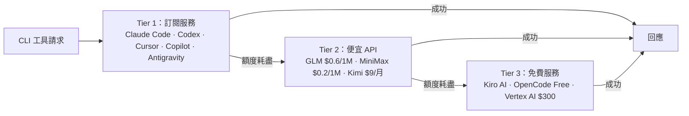

訂了 Claude Pro、Cursor、GitHub Copilot，但各自的額度管理很麻煩——某個服務用完要手動切換，OAuth token 過期要重新登入，而且不同工具送的 API 格式不一樣，沒辦法統一管理。

[9Router](https://github.com/decolua/9router) 在本機跑一個 OpenAI-compatible proxy，讓所有 AI coding 工具的請求統一進來，再自動路由到最適合的 provider。

## 安裝

```bash
npm install -g 9router
9router
```

啟動後 dashboard 在 `http://localhost:20128`。把 Claude Code、Cursor、Cline 等工具的 API endpoint 改指向這裡，後面的事 9Router 自己處理。

API key 和 OAuth token 只存在本機，不會傳給任何第三方服務。

## 三層 Fallback 路由



三層之間自動切換，不需要手動介入。多帳號可做 round-robin 分配，dashboard 有即時額度追蹤與 reset 倒數。

## OAuth Auto-Refresh

Claude Code、Codex、GitHub、Cursor 這些訂閱服務用 OAuth 認證，token 有效期通常幾小時。9Router 在 token 過期前自動刷新，不會因為 session 太長而中斷。

## 跨 API 格式轉換

不同 provider 的 API 格式不同，但你的工具只要支援自訂 OpenAI endpoint 就夠了：

```
你的工具（OpenAI 格式）→ 9Router → 各 provider 原生格式
                                    Claude · Gemini · Cursor · Kiro
                                    Vertex · Antigravity · Ollama ...
```

格式轉換在路由時自動發生，不需要為每個 provider 各自設定。

## 內建 Token 壓縮

**RTK 壓縮**（Result Token Kit）：偵測 tool output 的類型（git diff、logs、grep 結果），過濾冗餘後再送給 LLM，聲稱省 20-40% 輸入 token。

**Caveman Mode**：在 system prompt 注入指令，要求模型給出更簡短但資訊密度更高的回應，聲稱省最多 65% 輸出 token。適合自動化 pipeline 或對話輪數很多的場景。

注意：這裡的 RTK 是 9Router 自己的 middleware，跟獨立的 [RTK (Rust Token Killer)](https://github.com/rtk-ai/rtk) 是不同工具，只是縮寫相同。

## 支援的 CLI 工具

Claude Code、Codex、OpenClaw、Cursor、Antigravity、Cline、Continue、Droid、Roo、GitHub Copilot、Kilo Code。

## 部署選項

| 方式 | 適合情境 |
|------|---------|
| Localhost | 個人使用，預設 |
| VPS / Cloud | 多台裝置共用同一個路由設定 |
| Docker | 單一指令啟動，volume 持久資料 |
| Cloudflare Workers | 全球 edge 分發，低延遲 |

## 2026 Provider 異動

| Provider | 狀態 |
|----------|------|
| iFlow | 原免費無限，2026 年改收費 |
| Qwen Code | 免費 OAuth 方案 2026/04/15 停止 |
| Gemini CLI | 仍可用，但用非官方工具有被封號風險 |

目前 Tier 3 可靠的選項：**Kiro AI**（Claude 4.5 + GLM-5 + MiniMax）、**OpenCode Free**（免認證）、**Vertex AI**（$300 免費額度）。

## 適合誰

同時有多個 AI 訂閱、想要額度自動 fallback，或需要在不同裝置共用 AI 設定的人。設定一次，所有工具統一進 9Router，provider 怎麼換都不用動工具本身的設定。

如果你的問題是 shell 命令輸出把 context 撐爆，那是另一個維度的問題，可以搭配 [RTK (Rust Token Killer)](https://github.com/rtk-ai/rtk)——它在命令輸出層做壓縮，跟 9Router 互補。

## 參考資料

- [9Router GitHub](https://github.com/decolua/9router)
