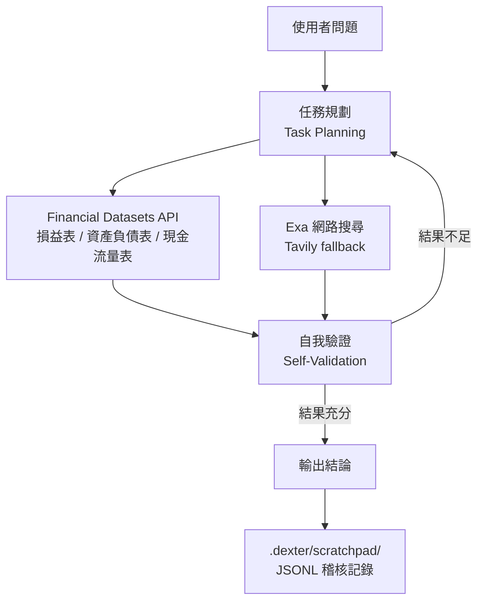

"Analyze a company's financial health over the past few years"—traditionally this means you go pull the financial statements yourself, break down the numbers, and cross-reference them. Dexter aims to turn it into: you drop the question in, and the agent plans out the research steps, fetches real-time market data, checks its own results, and finally hands you a data-backed conclusion.

Author virattt sums up its positioning in one line: **"Think Claude Code, but built specifically for financial research."**—conceptually, an autonomous agent purpose-built for financial research that thinks, plans, and corrects itself along the way.

## Agent Execution Architecture

Dexter isn't just a RAG pipeline, nor is it "an LLM plus a search tool." Its core is a **plan–execute–self-validate** loop: first it breaks a complex question into structured research steps, picks the right tools to fetch data, then checks whether its output is complete—and if not, keeps iterating.

The official docs list five core capabilities:

- **Intelligent Task Planning**: automatically decomposes complex queries into structured research steps.
- **Autonomous Execution**: selects and runs the appropriate tools on its own to gather financial data.
- **Self-Validation**: checks its own output and iterates repeatedly until the task is complete.
- **Real-Time Financial Data**: can access income statements, balance sheets, and cash flow statements.
- **Safety Features**: built-in loop detection and an execution step cap to prevent runaway execution.

## A Few Design Decisions Worth Noting

**Loop detection and a step cap**

The most classic failure mode for an autonomous agent is that it keeps feeling like "I need more data," calling tools endlessly and iterating forever, until API costs and time blow up. Dexter treats loop detection and a maximum step limit as built-in safety mechanisms rather than after-the-fact patches—this is the basic line of defense that lets an agent actually run in a real environment.

**JSONL scratchpad: an auditable decision chain**

Dexter logs all tool calls from each query to a scratchpad file, generating a new JSONL file (newline-delimited JSON) under `.dexter/scratchpad/` for every query. Each line records one kind of event:

- `init`: the original query.
- `tool_result`: each tool call, including the arguments, the raw returned result, and the LLM's summary of that result.
- `thinking`: the agent's reasoning steps.

Because every step leaves a trace, you can precisely reconstruct after the fact what data the agent actually fetched and how it interpreted it—especially useful for debugging "why did it reach this conclusion."

**LangSmith evaluation + LLM-as-judge**

Dexter ships with an evaluation suite that tests the agent against a dataset of financial questions. Evaluation is traced with LangSmith and scores answer correctness using an LLM-as-judge approach. You can run it over all questions (`bun run src/evals/run.ts`) or sample (with `--sample 10`). While it runs, a live UI shows progress, the current question, and the running accuracy; results are logged to LangSmith for analysis. This turns "did quality improve after switching provider or changing the prompt" into something quantifiable rather than a gut feeling.

**Multi-provider, switchable at the config layer**

It defaults to OpenAI (`OPENAI_API_KEY` is required), but you can swap in Anthropic, Google, xAI, or route through OpenRouter; it also supports running locally via Ollama. Switching provider is an environment-variable-level configuration and doesn't require touching agent logic—handy for anyone wanting to control cost or compare how different models perform.

**WhatsApp gateway**

Dexter offers a WhatsApp gateway: after connecting your phone to the gateway (log in by scanning a QR code), you send messages in your "chat with yourself," and Dexter processes them and sends the reply back to the same chat. For situations where you're used to your phone and don't want to open a terminal, this lowers the barrier to use.

## Tech Stack and Data Sources

Dexter runs on the [Bun](https://bun.com) runtime (v1.0 or above required). After installing, use `bun start` to enter interactive mode and `bun dev` to develop in watch mode.

- **Financial data**: from the Financial Datasets API, officially positioned as "institutional-grade market data for agents," providing income statements, balance sheets, cash flow statements, and more.
- **Web search**: Exa is the first choice, with Tavily as a fallback (both are optional).

Licensed under the MIT License.

## What to Know Before Using It

The project spells out a disclaimer right at the top of the README: **for educational, entertainment, and informational purposes only—not for actual trading or investment**. It is not financial, investment, tax, or legal advice; it makes no guarantee of accuracy, completeness, or fitness for purpose; its output may be wrong, incomplete, or outdated. The correctness of the financial data depends on the upstream API, and the LLM's reasoning itself can also err.

In other words, it's suited to exploratory research, understanding the structure of financial statements, or learning autonomous-agent design patterns—not to be taken directly into trading decisions.

## References

- [Dexter GitHub](https://github.com/virattt/dexter)
- [Financial Datasets API](https://financialdatasets.ai/)
- [Exa AI](https://exa.ai/)
- [Bun](https://bun.com/)
- [LangSmith](https://smith.langchain.com/)
- [Ollama](https://ollama.com/)
