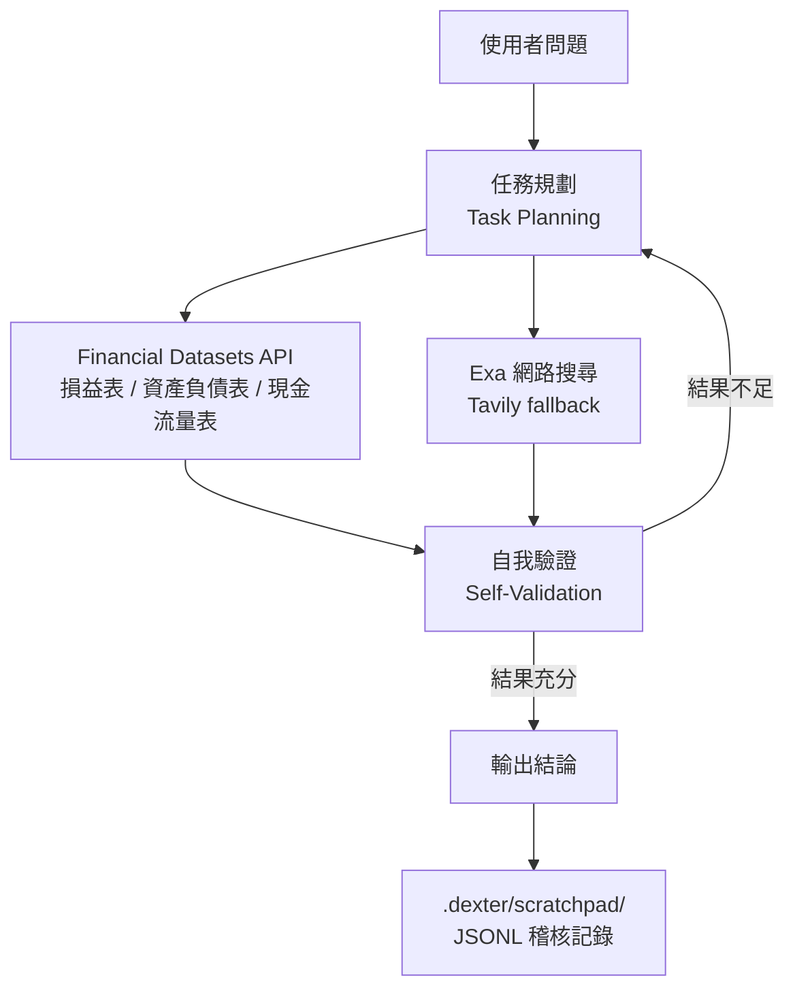

「幫我分析某家公司近幾年的財務健康度」——這件事傳統上要你自己去抓財報、拆數字、交叉比對。Dexter 想把它變成：你把問題丟進去，agent 自己規劃研究步驟、抓即時市場數據、檢查自己的結果，最後給你一個有數據支撐的結論。

作者 virattt 用一句話概括它的定位：**「Think Claude Code, but built specifically for financial research.」**——概念上就是一個專為金融研究打造的自主 agent，會思考、會規劃，也會在過程中修正自己。

## Agent 執行架構

Dexter 不是單純的 RAG pipeline，也不是「LLM 加上一個 search 工具」的組合。它的核心是一個**規劃—執行—自我驗證**的迴圈：先把複雜問題拆成有結構的研究步驟，選對工具去取得資料，再檢查自己的產出是否完整，不夠就繼續迭代。

官方列出的核心能力有五項：

- **Intelligent Task Planning**：自動把複雜查詢拆解成結構化的研究步驟。
- **Autonomous Execution**：自行挑選並執行合適的工具去蒐集金融數據。
- **Self-Validation**：檢查自己的產出，反覆迭代直到任務完成。
- **Real-Time Financial Data**：可取用損益表、資產負債表、現金流量表。
- **Safety Features**：內建 loop detection 與執行步數上限，防止失控執行。

## 幾個值得關注的設計決策

**Loop detection 與步數上限**

Autonomous agent 最典型的失控模式，就是它一直覺得「我需要更多資料」，不斷呼叫工具、無限迭代，最後 API 費用與時間爆炸。Dexter 把 loop detection 與最大步數限制當成內建的安全機制，而不是事後補丁——這是讓 agent 能在真實環境跑起來的基本防線。

**JSONL scratchpad：可稽核的決策鏈**

Dexter 會把每次查詢的所有工具呼叫都記錄到一個 scratchpad 檔案，每次查詢在 `.dexter/scratchpad/` 底下產生一個新的 JSONL 檔（newline-delimited JSON）。每一行記錄一種事件：

- `init`：原始查詢。
- `tool_result`：每次工具呼叫，包含參數、原始回傳結果，以及 LLM 對結果的摘要。
- `thinking`：agent 的推理步驟。

因為每一步都留痕，你可以事後精確重建 agent 到底抓了什麼資料、又是怎麼解讀的——對 debug「為什麼它得出這個結論」特別有用。

**LangSmith 評估 + LLM-as-judge**

Dexter 附了一套 evaluation suite，拿一組金融問題的資料集來測 agent。評估用 LangSmith 追蹤，並以 LLM-as-judge 的方式替答案的正確性打分。你可以對全部問題跑（`bun run src/evals/run.ts`），也可以抽樣（加上 `--sample 10`）。跑的時候有即時 UI 顯示進度、當前問題與累積正確率,結果會記到 LangSmith 供分析。這讓「換 provider 或改 prompt 後品質有沒有變好」變成可量化的事，而不只是靠感覺。

**多 provider，設定層即可切換**

預設走 OpenAI（`OPENAI_API_KEY` 是必要條件），但可以替換成 Anthropic、Google、xAI，或透過 OpenRouter;也支援用 Ollama 在本地執行。切換 provider 是環境變數層面的設定，不需要動 agent 邏輯——對想控制成本或比較不同模型效果的人很實用。

**WhatsApp gateway**

Dexter 提供一個 WhatsApp gateway：把手機連上 gateway（掃 QR code 登入）後，你在「與自己的對話」裡發訊息，Dexter 就會處理並把回覆送回同一個對話。對習慣用手機、不想開終端機的情境，這降低了使用門檻。

## 技術棧與資料來源

Dexter 跑在 [Bun](https://bun.com) runtime 上（需要 v1.0 或以上）。安裝後用 `bun start` 進互動模式、`bun dev` 進 watch 模式開發。

- **金融數據**：來自 Financial Datasets API，官方定位為「institutional-grade market data for agents」，提供損益表、資產負債表、現金流量表等。
- **網路搜尋**：Exa 為首選，Tavily 作為 fallback(兩者皆為選用)。

授權為 MIT License。

## 使用前要知道的事

專案在 README 開頭就明確標注 disclaimer：**僅供教育、娛樂與資訊用途，不用於真實交易或投資**。它不是財務、投資、稅務或法律建議;不保證正確性、完整性或適用性;輸出可能錯誤、不完整或過時。財務數據的正確性取決於上游 API，LLM 的推理本身也可能出錯。

換句話說，它適合拿來做探索性的研究、理解財報結構，或學習 autonomous agent 的設計模式——不適合直接拿去做交易決策。

## 參考資料

- [Dexter GitHub](https://github.com/virattt/dexter)
- [Financial Datasets API](https://financialdatasets.ai/)
- [Exa AI](https://exa.ai/)
- [Bun](https://bun.com/)
- [LangSmith](https://smith.langchain.com/)
- [Ollama](https://ollama.com/)
