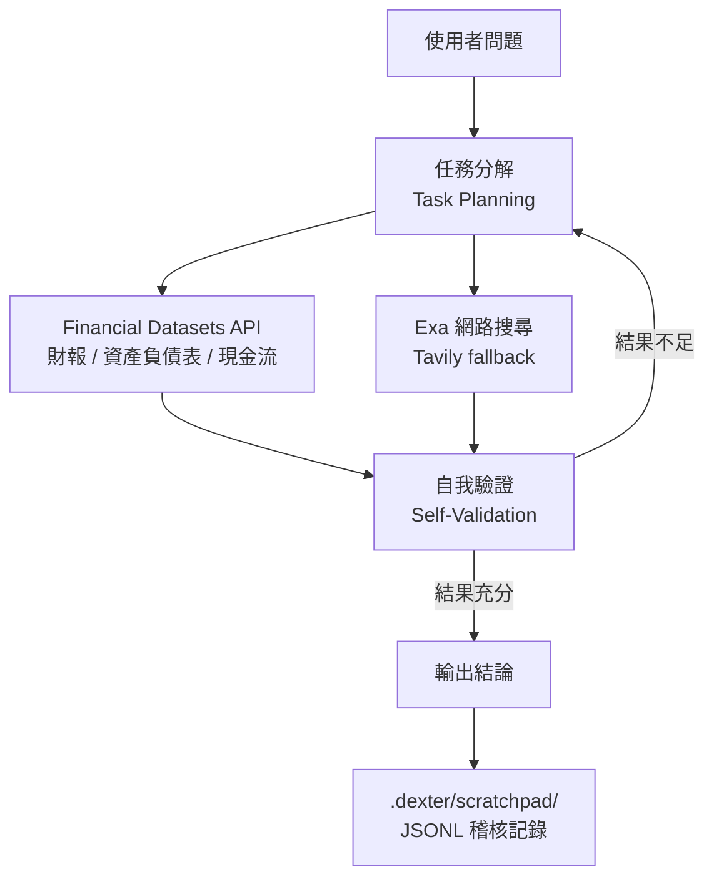

問一個問題：「分析 AAPL 最近三年的財務健康度」。傳統方式是你自己去抓財報、讀新聞、整理數字。Dexter 讓這件事變成：你丟問題進去，agent 自己跑完整個研究流程，最後給你結論。

25.2k ⭐、3.1k forks，由 virattt 開發，2026 年 5 月發佈 v2026.5.9。

## Agent 執行架構

Dexter 不是 RAG pipeline，也不是 LLM 加 search 的簡單組合。它的核心是一個**計畫—執行—驗證**的迴圈：先把問題拆成子任務，執行每個子任務取得資料，然後自我評估結果是否夠完整，不夠就繼續迭代。

## 幾個設計決策值得關注

**Loop Detection 與執行步數上限**

Autonomous agent 最容易出的問題是失控迴圈——agent 認為自己需要更多資料，不斷呼叫工具，最後 API 費用爆炸。Dexter 內建 loop detection 和最大執行步數限制，強制截停。這不是 nice-to-have，是讓 agent 在實際環境跑得起來的基本防線。

**JSONL Scratchpad**

所有工具呼叫、查詢參數、回傳結果、推理步驟都以 newline-delimited JSON 寫進 `.dexter/scratchpad/`。這讓你可以事後重建 agent 的完整決策鏈，知道它為什麼得出某個結論，也方便 debug 哪個步驟的結果出了問題。

**LangSmith 評估框架**

內建 eval runner，用 LLM-as-judge 方式評分——讓另一個 LLM 評估 Dexter 的答案是否正確。可以對全部測試問題跑，也可以抽樣。這讓你可以量化 agent 在不同 LLM provider 或 prompt 版本下的品質差異，而不只是靠人工感覺。

**多 Provider 支援**

預設 OpenAI，但可以替換成 Anthropic Claude、Google Gemini、xAI，或用 Ollama 在本地執行。provider 的切換是設定層面的，不需要改 agent 邏輯。這對想要控制成本或測試不同模型效果的人來說很實用。

**WhatsApp 整合**

把手機連到 gateway，直接用 WhatsApp 發問，不需要開終端機。對於習慣手機操作的使用情境，這個整合降低了使用門檻。

## 技術棧

TypeScript（codebase 99.4%）、Bun runtime（v1.0+）。財務數據來自 Financial Datasets API（機構級資料），網路搜尋用 Exa API，Tavily 作為 fallback。

## 使用前要知道的事

Dexter 明確標注：輸出是教育和資訊用途，**不是投資建議，結果可能不準確或過時**。財務數據的正確性取決於上游 API，LLM 的推理也可能出錯。

它適合探索性的研究問題、理解財報結構、學習 autonomous agent 的設計模式。不適合直接用於交易決策。

## 參考資料

- [Dexter GitHub](https://github.com/virattt/dexter)
- [Financial Datasets API](https://financialdatasets.ai/)
- [Exa AI](https://exa.ai/)
- [LangSmith](https://smith.langchain.com/)
- [Ollama](https://ollama.com/)
