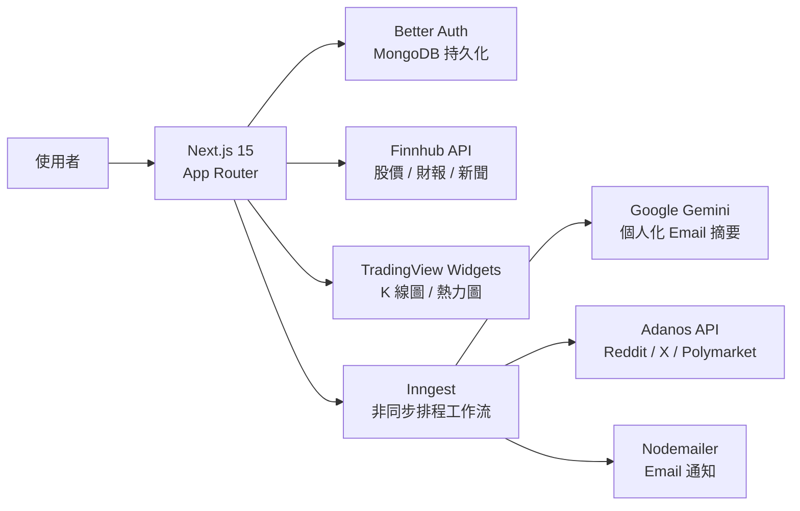

Bloomberg 和 Refinitiv 的訂閱費擋掉了大部分散戶和學生。OpenStock 的起點是一個直白的信念：「技術應該屬於所有人，知識應該是開放的、免費的、可取得的。」

這個專案不是個人 side project，而是 Open Dev Society 的社群計畫——一個明確定位為「拒絕 gatekeeping、歡迎每個自學者」的開源組織。11.3k ⭐、1.5k forks，AGPL-3.0 授權。

## 技術架構

前端 TypeScript 比例 91.7%，用 Tailwind CSS v4（不需要設定檔）+ shadcn/ui + Radix UI，Turbopack 加速 production build。

## 功能

**Command+K 全局搜尋**：不需要在頁面間跳，直接鍵盤叫出股票搜尋。

**個人 Watchlist**：每個帳號有獨立追蹤清單，資料存 MongoDB。Better Auth 管理 session，支援 email/password 登入。

**AI 個人化摘要**：Inngest 排程觸發，Gemini 根據每個使用者的 watchlist 生成客製化的每日市場摘要 Email。AI provider 設計成可替換（Gemini、MiniMax、Siray），不鎖定單一廠商。

**情緒分析**：整合 Adanos API，從 Reddit、X.com、新聞媒體、Polymarket 預測市場拉取情緒信號。這是 optional 整合，不是核心依賴。

**TradingView 嵌入**：K 線圖、市場熱力圖直接用 TradingView widget，不需要自己處理圖表渲染。

## 適用情境與限制

自架需要：Node.js 20+、MongoDB（本地 Docker Compose 或 Atlas）、Finnhub API key。設定主要透過 `.env` 環境變數，development 跑 `pnpm dev`，production 用 `pnpm build`。

**免費 Finnhub tier 有延遲數據**。即時報價需要升級到 Finnhub 付費方案，這是唯一的成本項目。股市數據不是來自 OpenStock 自己的資料庫，延遲程度取決於上游 provider 的條款。

OpenStock 不是券商，沒有交易功能，定位是**市場情報工具**，不是交易平台。

## 從教學專案到社群產品

這個專案有個值得一提的 origin：它從 Adrian Hajdin（JavaScript Mastery）的教學影片出發，但 Open Dev Society 把它重新包裝成社群擁有的開源工具，而不是教學的附屬品。這個選擇——AGPL-3.0 授權、拒絕商業化、歡迎 beginner contributor——比技術棧更能說明這個專案的性格。

## 參考資料

- [OpenStock GitHub](https://github.com/Open-Dev-Society/OpenStock)
- [Open Dev Society](https://github.com/Open-Dev-Society)
- [Finnhub API](https://finnhub.io/)
- [Inngest](https://www.inngest.com/)
- [Better Auth](https://www.better-auth.com/)
- [TradingView Widgets](https://www.tradingview.com/widget/)
