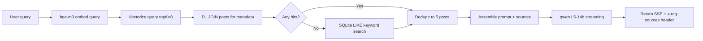

RAG (Retrieval-Augmented Generation) has almost become synonymous with "vector database + semantic search," but [VectifyAI/PageIndex](https://github.com/VectifyAI/PageIndex) proposes a counter-thesis: **vector similarity is not the same as relevance**. Rather than using embeddings to find the "most alike" passage, let the LLM reason directly about "where the answer is." This article takes apart PageIndex's architecture in depth and fully compares it against the Hybrid RAG (bge-m3 + Cloudflare Vectorize) this site actually runs.

## PageIndex: Tree Index + Agent Reasoning

PageIndex's core idea is to index a document into a **hierarchical tree** (much like a table of contents), then let an LLM Agent navigate that tree through tool calls — instead of dumping every chunk into embedding space all at once.

### Building the Index (Index Phase)

Given a PDF or Markdown document, PageIndex produces a JSON tree structure like this:

```json
{
  "title": "財務報表分析",
  "node_id": "0001",
  "start_index": 1,
  "end_index": 80,
  "summary": "本文件涵蓋 2023 年度損益表、資產負債表與現金流量表...",
  "nodes": [
    {
      "title": "損益表",
      "node_id": "0002",
      "start_index": 5,
      "end_index": 22,
      "summary": "營收 42億、毛利率 38%、淨利 6.1億..."
    },
    {
      "title": "資產負債表",
      "node_id": "0003",
      "start_index": 23,
      "end_index": 41,
      "summary": "..."
    }
  ]
}
```

Each node records the section title, the page range, an LLM-generated summary, and its child nodes. By default each node is capped at 10 pages / 20,000 tokens, with support for automatically detecting an existing table of contents from the document's first 20 pages.

### Reasoning-Based Retrieval (Retrieval Phase)

When a query comes in, the LLM Agent has three tools:

1. **`get_document()`** — fetch basic document info (page count, description)
2. **`get_document_structure()`** — fetch the full tree structure (summaries only, no full text)
3. **`get_page_content(pages='5-7')`** — fetch the actual content of the specified pages

The Agent's system prompt forces it to proceed in order: first confirm the document structure → locate the relevant nodes → fetch only the content of the necessary pages → answer. This mimics how a human expert flips through a book.

```mermaid
sequenceDiagram
  participant User
  participant Agent as "LLM Agent"
  participant Index as "Page Index Tree"

  User->>Agent: Question: What was the 2023 gross margin?
  Agent->>Index: get_document_structure()
  Index->>Agent: Tree summary (with each section's summary)
  Agent->>Index: get_page_content(pages='5-10')
  Index->>Agent: Income statement page content
  Agent->>User: Answer: Gross margin 38%, from the income statement on p.7
  Note right of User: get_document_structure() only
  Note over User,Agent,Index: LLM Agent answers the question
```

### Performance and Positioning

PageIndex reaches **98.7% accuracy** on FinanceBench (a financial-document QA benchmark), far ahead of traditional vector RAG. The defining traits of that scenario: the documents have a fixed structure (financial-report format), answers require precise numbers, and a bad chunk split directly causes errors. The project flies the banner of "vectorless, reasoning-based RAG," has 33k stars on GitHub with active development, and has launched the PageIndex File System (a file-level tree index) to extend the same reasoning-based retrieval to "an entire corpus" rather than a single document.

---

## This Site's Hybrid RAG

This site (Engineer News) takes a different route: **vector search as the primary path, keyword search as the backup**, all running on the Cloudflare edge.

### Building the Index (sync-to-d1.ts)

```
Markdown article
  → split into paragraph chunks on double newlines (max 1000 chars)
  → bge-m3 embed each chunk (1024 dim)
  → store in Cloudflare Vectorize (cosine similarity)
  → store chunk metadata in D1 SQLite (doc_chunks table)
```

The splitting is straightforward:

```typescript
function chunkText(text: string, maxLength = 1000): string[] {
  const paragraphs = text.split(/\n\n+/);
  const chunks: string[] = [];
  let current = '';
  for (const p of paragraphs) {
    if ((current + p).length > maxLength) {
      if (current) chunks.push(current.trim());
      current = p;
    } else {
      current += (current ? '\n\n' : '') + p;
    }
  }
  if (current) chunks.push(current.trim());
  return chunks;
}
```

### Query Flow (api/search.ts)



The chunk IDs found by Vectorize are used to fetch the full content back from D1, keeping at most one chunk per article (deduped within an article) for a total of 5 sources. When the vector path returns nothing, it falls back to a SQLite LIKE query, ranked with weighting across title / tldr / content.

---

## The Core Difference Between the Two Routes


| Aspect | PageIndex | This site's Hybrid RAG |
|------|-----------|----------------|
| **Index structure** | Hierarchical tree (sections + summaries) | Flat paragraph chunks |
| **Vector DB** | Not needed | Cloudflare Vectorize |
| **Retrieval mechanism** | LLM Agent tool calls | Vector cosine similarity |
| **Fallback** | None (reasoning is the primary path) | SQLite LIKE keyword search |
| **Embedding** | None | bge-m3 1024-dim |
| **Generation model** | Any (OpenAI Agents SDK, swappable to any LLM) | qwen1.5-14b-chat-awq |
| **Document structure preserved** | Section hierarchy fully preserved | Lost after chunking |
| **Long-document support** | Core design (financial reports, etc.) | Mainly short blog posts |
| **Multi-turn conversation** | Full history supported | Single turn |
| **Explainability** | Reasoning path is traceable | Vector scores aren't intuitive |
| **Inference cost** | High (multiple LLM reasoning hops for navigation) | Low (Workers AI) |
| **Deployment environment** | Python + OpenAI API | Cloudflare edge |

---

## The "Similarity ≠ Relevance" Thesis

PageIndex's central claim deserves to be taken seriously. Vector similarity is essentially asking "how semantically close is this text to the query?" — but the real question is "can this text answer the question?"

The most classic failure case: querying "the company's 2023 EBITDA," vectors might recall every passage that mentions EBITDA — methodology introductions, historical comparisons, accounting-standard explanations — but the only one that actually holds the answer is that single line of numbers on page 12 of the financial report. If that line happens to be split into a different chunk from its surrounding context, vector search simply fails.

PageIndex's LLM reasoning understands that "the EBITDA calculation will only appear in the income-statement section," and navigates straight there.

But this advantage has a prerequisite: **the document has structure**. For documents with clear sections — financial reports, legal documents, technical manuals — a tree index makes a noticeable difference. For short blog posts like this site's, the structural differences between paragraphs aren't that large, and vector similarity as a proxy is already good enough.

---

## Overall

The two architectures answer different questions:

**PageIndex** suits: long documents that need precise numbers or specific facts, documents with clear structure (financial reports / legal / manuals), use cases that can absorb GPT-4o-level inference cost, and applications that need to trace "which page the answer came from."

**Hybrid vector RAG** suits: semantic search over large collections of short documents, low-latency needs, deployment on the edge or in resource-constrained environments, and documents that are semantically rich but structurally flat (blogs, news, notes).

This site's current implementation is a reasonable tradeoff for the blog-search scenario. If it ever needs to support "searching PDF reports" or "searching long technical documents," PageIndex's reasoning route is worth serious consideration — or at minimum, its idea of embedding a "title + tldr + chunk" combination, rather than embedding the chunk content alone, is worth borrowing.

## References

- [VectifyAI/PageIndex — GitHub](https://github.com/VectifyAI/PageIndex)
- [FinanceBench — financial-document QA benchmark](https://github.com/patronus-ai/financebench)
- [BAAI/bge-m3 — Hugging Face](https://huggingface.co/BAAI/bge-m3)
- [Cloudflare Vectorize docs](https://developers.cloudflare.com/vectorize/)
- [LiteLLM — Multi-LLM integration](https://docs.litellm.ai/)
- [OpenAI Agents SDK](https://openai.github.io/openai-agents-python/)
