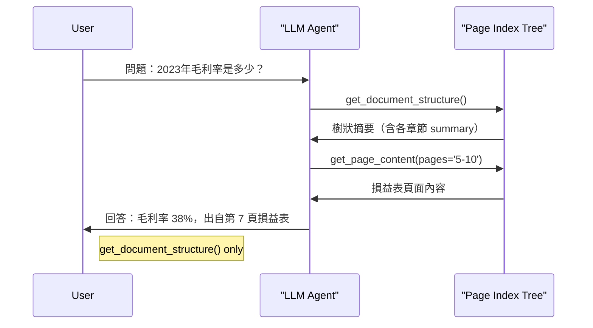
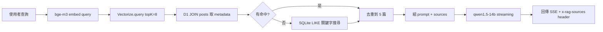
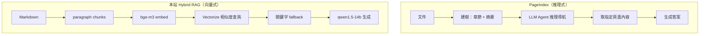

RAG（Retrieval-Augmented Generation）現在幾乎預設就是「向量資料庫 + 語意搜尋」，但 [VectifyAI/PageIndex](https://github.com/VectifyAI/PageIndex) 提出了一個反命題：**向量相似度不等於相關性**，與其用 embedding 找「最像」的段落，不如讓 LLM 直接推理「哪裡有答案」。這篇文章深入拆解 PageIndex 的架構，並跟本站實際使用的 Hybrid RAG（bge-m3 + Cloudflare Vectorize）做完整比較。

## PageIndex：樹狀索引 + Agent 推理

PageIndex 的核心思想是把文件索引成一棵**階層樹**（類似目錄），再讓 LLM Agent 透過工具呼叫導航這棵樹，而不是一次把所有 chunk 都丟進 embedding 空間。

### 建立索引（Index Phase）

輸入一份 PDF 或 Markdown 文件後，PageIndex 會產生如下的 JSON 樹結構：

```json
{
  "title": "財務報表分析",
  "node_id": "0001",
  "start_index": 1,
  "end_index": 80,
  "summary": "本文件涵蓋 2023 年度損益表、資產負債表與現金流量表...",
  "nodes": [
    {
      "title": "損益表",
      "node_id": "0002",
      "start_index": 5,
      "end_index": 22,
      "summary": "營收 42億、毛利率 38%、淨利 6.1億..."
    },
    {
      "title": "資產負債表",
      "node_id": "0003",
      "start_index": 23,
      "end_index": 41,
      "summary": "..."
    }
  ]
}
```

每個節點記錄：章節標題、頁碼範圍、LLM 生成的摘要，以及子節點。預設每節點上限 10 頁 / 20,000 tokens，支援自動從文件前 20 頁偵測現有目錄。

### 推理式檢索（Retrieval Phase）

查詢進來時，LLM Agent 擁有三個工具：

1. **`get_document()`** — 取得文件基本資訊（頁數、描述）
2. **`get_document_structure()`** — 取得完整樹狀結構（只有摘要，沒有全文）
3. **`get_page_content(pages='5-7')`** — 取得指定頁碼的實際內容

Agent 的 system prompt 強制它依序：先確認文件結構 → 定位相關節點 → 只拿必要頁碼的內容 → 回答。這模擬了人類專家翻書的模式。



### 效能與定位

PageIndex 在 FinanceBench（財務文件 QA 基準）達到 **98.7% 準確率**，大幅超越傳統向量 RAG。這個場景的特性是：文件有固定結構（財報格式）、答案需要精確數字、chunk 切壞會直接導致錯誤。

---

## 本站的 Hybrid RAG

本站（Engineer News）使用的是另一條路：**向量搜尋為主、關鍵字搜尋為輔**，全部跑在 Cloudflare edge 上。

### 建立索引（sync-to-d1.ts）

```
Markdown 文章
  → 按雙換行切 paragraph chunks（max 1000 chars）
  → bge-m3 embed 每個 chunk（384 dim）
  → 存入 Cloudflare Vectorize（cosine similarity）
  → chunk metadata 存 D1 SQLite（doc_chunks table）
```

切法很直接：

```typescript
function chunkText(text: string, maxLength = 1000): string[] {
  const paragraphs = text.split(/\n\n+/);
  const chunks: string[] = [];
  let current = '';
  for (const p of paragraphs) {
    if ((current + p).length > maxLength) {
      if (current) chunks.push(current.trim());
      current = p;
    } else {
      current += (current ? '\n\n' : '') + p;
    }
  }
  if (current) chunks.push(current.trim());
  return chunks;
}
```

### 查詢流程（api/search.ts）



Vectorize 找到的 chunk ID 再回 D1 撈完整內容，最多保留每篇文章一個 chunk（同篇去重），總計 5 篇來源。向量找不到任何結果時，fallback 到 SQLite 的 LIKE 查詢，按 title / tldr / content 加權排序。

---

## 兩種路線的核心差異



| 面向 | PageIndex | 本站 Hybrid RAG |
|------|-----------|----------------|
| **索引結構** | 階層樹（章節 + 摘要） | 平坦 paragraph chunks |
| **向量 DB** | 不需要 | Cloudflare Vectorize |
| **檢索機制** | LLM Agent 工具呼叫 | 向量餘弦相似度 |
| **Fallback** | 無（推理即主路徑） | SQLite LIKE 關鍵字搜尋 |
| **Embedding** | 無 | bge-m3 384-dim |
| **生成模型** | GPT-4o | qwen1.5-14b-chat-awq |
| **文件結構保留** | 完整保留章節層級 | 切碎後失去結構 |
| **長文件支援** | 設計核心（財報等） | 短 blog post 為主 |
| **多輪對話** | 支援完整 history | 單輪 |
| **可解釋性** | 推理路徑可追蹤 | 向量分數不直觀 |
| **推理成本** | 高（GPT-4o 兩次） | 低（Workers AI） |
| **部署環境** | Python + OpenAI API | Cloudflare edge |

---

## 「相似度 ≠ 相關性」這個命題

PageIndex 的核心主張值得認真對待。向量相似度本質上是在問「這段文字語意上跟查詢有多接近？」，但真正的問題是「這段文字能不能回答這個問題？」

最典型的失敗案例：查詢「公司 2023 年的 EBITDA」，向量可能召回所有提到 EBITDA 的段落，包括方法論介紹、歷史比較、會計準則說明——但真正有答案的只有財報第 12 頁那一行數字。如果那一行剛好跟前後文被切在不同 chunk，向量搜尋就直接失敗。

PageIndex 的 LLM 推理能理解「損益表章節才會有 EBITDA 的計算結果」，然後直接導航過去。

但這個優勢有前提：**文件有結構**。對於財報、法律文件、技術手冊這類有明確章節的文件，樹狀索引效果顯著。對本站這種短篇 blog post，段落之間的結構差異沒那麼大，向量相似度作為 proxy 已經夠用。

---

## 整體來說

兩種架構回答的是不同的問題：

**PageIndex** 適合：需要精確數字或特定事實的長文件、文件結構清晰（財報/法律/手冊）、可接受 GPT-4o 等級的推理成本、需要追蹤「答案出自第幾頁」的應用場景。

**Hybrid 向量 RAG** 適合：大量短文件的語意搜尋、需要低延遲、部署在 edge 或資源受限環境、文件語意豐富但結構扁平（blog、新聞、筆記）。

本站目前的實作在 blog 搜尋場景是合理的取捨。如果未來要支援「搜尋 PDF 報告」或「搜尋長篇技術文件」，PageIndex 的推理路線值得認真考慮——或至少可以借鑒它的「embed title + tldr + chunk 組合」而非單純 embed chunk 內容的思路。

## 參考資料

- [VectifyAI/PageIndex — GitHub](https://github.com/VectifyAI/PageIndex)
- [FinanceBench — 財務文件 QA 基準](https://github.com/patronus-ai/financebench)
- [BAAI/bge-m3 — Hugging Face](https://huggingface.co/BAAI/bge-m3)
- [Cloudflare Vectorize 文件](https://developers.cloudflare.com/vectorize/)
- [LiteLLM — Multi-LLM 整合](https://docs.litellm.ai/)
- [OpenAI Agents SDK](https://openai.github.io/openai-agents-python/)
