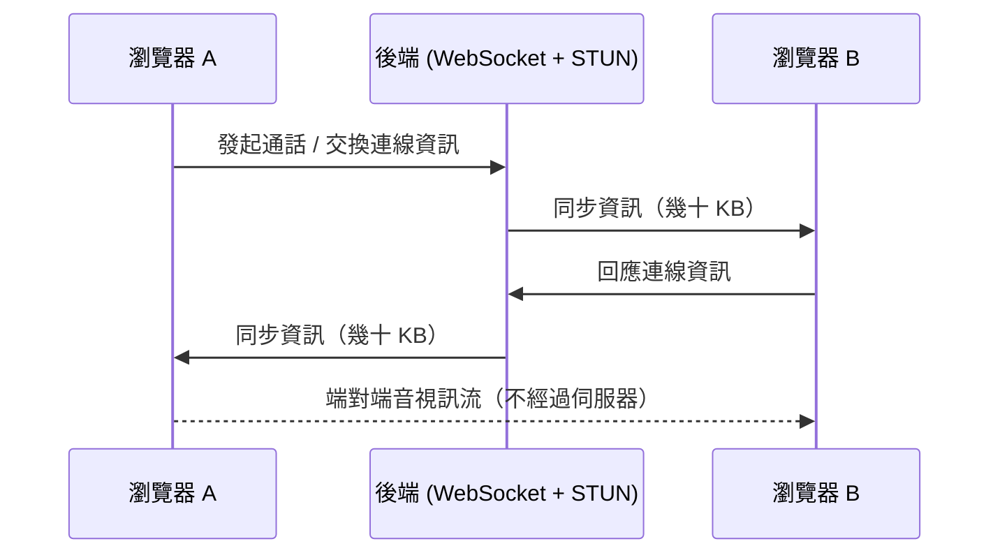

有些產品來自市場調查，這個產品來自一句「不好意思」。

作者是一位會開直播的技術 YouTuber，直播時他常鼓勵觀眾連麥提問，但幾乎沒人敢——一問都是「不好意思在那麼多人面前說話」。偏偏基於隱私考量，他又沒有加任何粉絲的微信、也沒留電話，一直找不到一個合適的一對一聊天管道。

「求人不如求己」，於是他乾脆自己做了一個：**o2o**，一個完全跑在瀏覽器裡的一對一視訊通話平台。而所謂「自己做」，其實全程都是 AI 在寫程式碼，他扮演的是「大家最討厭的產品經理」——備好工作環境、定好需求、然後等著驗收。

## o2o 是什麼

- **不用安裝任何東西**：直接點「發起通話」，把產生的網址發給對方，兩個人就能在瀏覽器裡視訊。
- **不限時**：想聊多久聊多久，沒有時間限制。
- **全平台**：任何電腦或手機的瀏覽器都能開，因為用的都是原生瀏覽器功能。
- **規劃中的功能**：螢幕共享、視訊錄製、檔案分享等。

要注意的是，o2o 並不是「和 AI 通話」的產品——AI 只是它的建造者。實際通話的是兩個真人，這也正好回應了那位社恐粉絲的需求：一個私密、低門檻、不用面對一堆觀眾的一對一管道。

## 為什麼幾乎零成本：WebRTC 的架構選擇

作者強調「主打的就是一個勤儉節約」。整個專案部署在他**現有**的資源上——某雲端服務商託管的 Kubernetes 叢集、Redis 與 Postgres 實例，所以沒有增加額外成本。

有人會問：視訊通話的頻寬難道不用錢嗎？這就要談到技術棧。核心是兩個原生瀏覽器 API：

- **WebRTC**：2011 年就成為 W3C 標準的網頁即時通訊 API，能讓兩個瀏覽器做端對端（P2P）音視訊傳輸。
- **WebSocket**：負責在雙方之間同步資訊。

關鍵在於：**音視訊流是端對端直傳的，伺服器只負責「幫忙同步一下雙方的資訊」**。所以後端只需要提供非常基本的業務 API 加上一個 WebSocket 介面，而在一次視訊通話裡，這些介面最多只會消耗幾十 KB 的流量。

### 一個刻意的取捨：只給 STUN，不給 TURN

在給 AI 的 prompt 最後，作者特別要求：**只提供 STUN Server，不要提供 TURN Server。**

- **STUN**：透過公共網路確認雙方的 IP 位址，讓兩端能直接建立 P2P 連線。
- **TURN**：當雙方所處的網路（例如某些企業網路、校園網路）不允許公網端對端連線時，就需要 TURN 作為中轉站——所有視訊流都得從這台伺服器進出。

問題就在這裡：一旦用了 TURN，**所有頻寬成本都要作者自己承擔**。權衡之後，他決定 o2o 不支援企業、校園這類複雜網路，也就不提供 TURN。

這也正是「想聊多久就聊多久」的底氣——因為端對端消耗的都是**使用者自己的流量**，對作者來說無所謂。這是一個典型的 indie developer 成本決策：用縮小適用範圍，換來近乎為零的營運成本。

## 真正的成本，藏在 debug 裡

作者說整個開發花了約 10 小時，但大部分時間其實是 AI 在跑，他只是偶爾測試、找 bug。整個任務包含 **6 個對話 session**，以這個模型 **200K 的上下文窗口**來算，總共用掉大約 **120 萬個 token**。

有趣的是 token 的分佈：

> 初始的 prompt 加上初始生成的程式碼，總共只用了大約 **10 萬個 token**；後面上百次對話、上百萬個 token，基本上全都花在 debug 上。

因為 session 之間會失憶，他採用的作法是——每個新 session 的開頭 prompt，都塞進「從最初始 prompt 到前面所有 session 的總結」，尤其詳細記錄上一個 session 發生過的所有事情：提交了哪些資訊、總結出哪些 bug、最後怎麼修的。等於是手動幫 AI 維護一份長期記憶。

### 一個吃掉 20 萬 token 的狀態機 bug

第五個 session 幾乎整整一小時，都在修同一個 bug：**視訊通話過程中斷開重連的問題。**

根源在於 WebRTC 原理上是允許多人視訊的。要做到嚴格的一對一，就得在業務邏輯裡限制同時連線的人數，並即時記錄參與者的「進入 / 通話開始 / 斷開 / 通話結束」等狀態。而這些狀態同時存在三個地方：

- WebSocket 連線裡
- 伺服器端的記憶體裡
- Redis 快取裡

只要狀態變更時沒處理好同步，記憶體與快取就會不一致，於是出現詭異的症狀：**一人斷線導致全員下線**，或是**斷線重連之後卻顯示「已滿員」**。

> 這印證了那句老話：一切計算機問題都是狀態機問題。

那一小時裡，AI 根據作者這個 QA 的回饋，反覆翻看自己寫的程式碼、反覆打補丁——新增中間狀態、修正記憶體與快取的讀寫順序、及時清理過期的 Redis 資料。最後大約花了 **20 萬個 token** 才修好這一個 bug。但作者的結論是：綜合考量，這肯定比他自己下場 debug 更划算。

## 心得：AI 寫程式的分水嶺，是「持續 debug 的能力」

作者從這個專案看到一個趨勢：

> 在「一句話生成一個沒什麼用的簡單網站」的 Vibe Coding 時代過去之後，AI 編程若要真正進入複雜的軟體工程領域，最重要的能力，就是在**超長的任務窗口裡持續 debug**。

原因很直接：稍有複雜度的軟體都會結合前端、後端、資料端，加上一堆業務邏輯，AI 幾乎不可能一次到位。所以大部分時間注定要花在「測試 → debug」的循環裡。o2o 就是最好的例子：10 萬 token 蓋好房子，剩下一百多萬 token 都在修水電。

## 還沒做、但瀏覽器早就準備好的功能

作者列了幾個接下來想加、而且**單靠瀏覽器原生 API 就能實現**的功能：

- **RTCDataChannel** → 端對端檔案傳輸
- **MediaDevices API** → 螢幕共享
- **MediaStream API** → 視訊錄製
- **Web Audio API** → 聲音降噪
- **WebCodecs API** → 畫面打浮水印

他的感想是：「瀏覽器就是一個無窮無盡的寶庫。」對想省成本的 indie developer 來說，這句話值得抄下來——很多你以為要付費第三方服務才能做的事，瀏覽器早就內建了。

## 參考資料

- [原始影片：我做了一個一對一視訊通話平台 o2o](https://www.youtube.com/watch?v=M1bifAQSVcY)
- [WebRTC — W3C / MDN 文件](https
