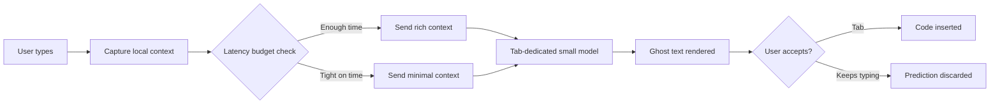

Cursor is the fastest-growing AI code editor. Built by Sualeh Asif, Arvid Lunnemark, Aman Sanger, and Michael Truell — four friends who met studying at MIT — it's the flagship product of Anysphere Inc., founded in 2022. Two years after launch, Cursor crossed $500M in annual revenue, likely the fastest any developer tools company has reached that milestone. Outlets including Pragmatic Engineer and ByteByteGo have covered the engineering in depth. This article distills what's most useful.

## TL;DR

- Cursor is a fork of VSCode, not an extension — this was the decision that made everything else possible
- Tab prediction engineering challenge: prediction in tens of milliseconds without disrupting typing flow
- Agent Mode lesson: tool calls must be trained into the model; prompting alone isn't reliable enough
- Routing strategy: not every step needs the biggest model — speed is itself a product feature
- The only metric that ultimately matters is whether users keep trusting the tool

## Design Philosophy

### Why Fork VSCode?

Cursor's first major engineering decision was to fork VSCode rather than build a VS Code extension. The reasoning is clean:

**Extension API limitations**: extensions can't deeply change editor-core behavior — you can't redesign selection mechanics, insert truly inline ghost text, or change the semantics of file switching. The surface area of what you can make AI-native is fundamentally bounded.

**The cost of building from scratch**: a stable code editor solves thousands of hard problems — Unicode handling, syntax highlighting, LSP integration, cross-platform font rendering. Rebuilding all of that would have consumed years before any AI differentiation was possible.

Their conclusion: **our value is not in building a stable editor; it's in changing how developers program.** Forking lets them stand on VSCode's stability and direct all their engineering energy toward AI integration.

### "Changing the Fundamental Act of Programming"

Cursor's design philosophy isn't "autocomplete for code." It's a redefinition of the engineer-code relationship:

- You describe intent; AI generates implementation details
- You set direction and verify; AI iterates
- Context is a tool you manage, not just a conversation history

## Core Concepts

### Tab Prediction: Latency Engineering

Cursor Tab is the most recognizable Cursor feature. The engineering challenge:

**Speed requirement**: prediction must complete in **tens of milliseconds** — not hundreds. Ghost text that appears with any perceptible lag disrupts the typing rhythm and introduces cognitive friction.

**Context amount vs. quality tradeoff**: richer context sent to the model produces better predictions, but retrieving and transmitting it takes time. This is a continuously tuned engineering parameter:

- Too little context → irrelevant suggestions
- Too much context → latency too high, experience breaks

**Custom model training**: Cursor trains a dedicated small model for Tab prediction rather than calling a general-purpose large model. The goal is an optimal balance between accuracy and inference speed.

### Agent Mode: Production Lessons

Cursor's Agent Mode (formerly Composer) is the most complex engineering piece. Key lessons:

**Tool calls must be trained in, not prompted in**

Early experiments tried teaching models how to call tools (search, read file, run command) via prompting. The finding: prompting alone isn't reliable enough for long-running tasks. For editing operations like search-and-replace, small mistakes break the edit, and the model needs to have internalized when and how to invoke tools.

The solution was training on trajectory data showing the model the correct sequence of tool calls for various coding situations.

**The pipeline ceiling**

Early Cursor used a fixed pipeline: analyze → plan → execute → verify. This worked well for simple tasks but hit a ceiling on tasks requiring dynamic strategy adjustments.

Lesson: **pipelines hit ceilings; knowing when you've hit one matters more than picking the right architecture upfront.**

**Speed as a product feature**

Not every step needs the largest frontier model. Cursor's strategy is routing:

- Simple steps → small fast model (low latency)
- Complex planning → large model (high accuracy)

Routing smaller steps to fast models made Cursor's responsiveness a competitive differentiator, not just a performance metric.

## Compared to Alternatives

| | Cursor | GitHub Copilot | Cline (VS Code extension) |
|-|--------|---------------|--------------------------|
| Architecture | VSCode fork | VS Code extension | VS Code extension |
| Tab completion | Custom-trained model | GPT-4 family | External API dependent |
| Agent mode | Built-in (in-house) | Copilot coding agent | Built-in (external API) |
| Custom models | Yes | Limited | No |
| Customization depth | Deepest (UI-level changes) | API-bounded | API-bounded |

## When Cursor Is and Isn't the Right Choice

**Cursor fits well when:**
- You want deep AI integration as a daily development environment
- You need an agent to execute multi-step tasks (Agent Mode)
- You're latency-sensitive and want Tab prediction to feel instantaneous

**Cursor may not fit when:**
- You need tight compatibility with your existing VS Code extension ecosystem (some extensions may behave differently on the fork)
- Your enterprise environment has strict code-off-device policies (verify Cursor's privacy mode)
- You only need basic autocomplete and don't need agent capabilities

## Summary

The most transferable engineering lessons from Cursor aren't about which model they use or which framework they chose — they're about the **clarity of tradeoffs**:

1. UX requirements came before architecture choices (fork first so you can control latency)
2. Speed is a feature, not a metric (route steps by complexity)
3. User trust is the only terminal metric (one bad agent edit can end the relationship)
4. Offline benchmarks are useful signals; user retention is the real evaluation

From zero to $500M ARR in two years. That trajectory wasn't just good models — it was a deep understanding of how engineers actually write code, and what it would take to make AI feel like a reliable collaborator rather than a risky tool.

## References

- [Real-world engineering challenges: building Cursor | Pragmatic Engineer](https://newsletter.pragmaticengineer.com/p/cursor)
- [How Cursor Shipped its Coding Agent to Production | ByteByteGo](https://blog.bytebytego.com/p/how-cursor-shipped-its-coding-agent)
- [How Cursor Actually Works: Architecture and Engineering | Data Science Collective](https://medium.com/data-science-collective/how-cursor-actually-works-c0702d5d91a9)
- [The rise of Cursor: $300M ARR | Lenny's Podcast](https://podcasts.apple.com/us/podcast/the-rise-of-cursor-the-%24300m-arr-ai-tool-that/id1627920305?i=1000705681302)
- [Cursor.so with Aman Sanger of Anysphere | Latent Space](https://www.latent.space/p/cursor)
- [Original video](https://www.youtube.com/watch?v=dUMsFQ8y3gM)
