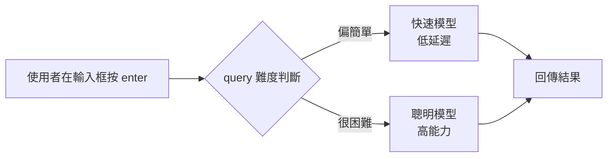

Cursor 團隊在一場訪談中談了他們幾天前釋出的 Composer 1.5 模型。這篇整理聚焦在其中最有工程參考價值的幾個決策：**為什麼要自己訓練模型**、**RL 能帶來哪些外部工具做不到的能力**，以及**支撐 RL 訓練的基礎設施到底有多重**。內容嚴格依據訪談本身，不做外部腦補。

## Composer 1.5：介於 Sonnet 4.5 與 Opus 4.5 之間

Cursor 團隊對 Composer 1.5 的定位很直白：他們認為這是目前能用到的最好的模型之一，能力大約落在 **Sonnet 4.5 與 Opus 4.5 之間**。他們也誠實地說「還不是 Opus」——做出好模型本來就很難——但對接下來能持續做出更好的模型很有信心。

這個模型 **幾乎完全是透過大量、大量的 RL（reinforcement learning）訓練** 出來的。

比模型分數更值得注意的，是他們對「模型該有什麼手感」的看法。他們追求的不是那種「按下 enter 之後你就可以去睡覺」的模型，而是希望模型**又快、用起來又很投入（engaging）**：你輸入 query，模型就用它能做到的最快速度把事情做完。速度在這裡不是事後優化，而是產品體驗的一部分。

## 為什麼要自己訓練模型，而不是搭上前沿模型的浪潮

問到「自研模型 vs. 直接用前沿模型」的取捨，Cursor 團隊的核心論點是：**當產品和模型越來越深度整合時，你在乎的功能必須直接做進模型本身**。

原因是——有些能力如果沒有被訓練進模型裡，模型就是用不好那個東西。你沒辦法只靠外面包一層 prompt 把它補回來。

## RL 才能學會的能力：從 grep 到 semantic search

團隊舉了兩個具體例子來說明「必須做進模型」是什麼意思。

**grep**：以前有些模型連 grep 都用不好。要讓模型變得非常擅長 grep，做法就是用 RL 去針對這件事做訓練。

**semantic search**：Composer 系列模型的一個經典特點，是非常擅長用 semantic search。面對一個**非常大的 code base**，這些模型能在 **一到三次查詢** 內就找到該去的地方，而不是動用幾十次 grep。

他們認為這類能力**只能透過 RL 學會**。往前看，他們特別想讓模型擅長的一件事，是**大量遞迴的 sub agent**——目標是在幾乎所有 query 上，都能在**兩到三分鐘內**把問題解掉。而要做到這種程度，基本上就必須訓練自己的模型。

## 撐起 RL 的基礎設施：數百萬個 sandbox

被問到 RL 的技術細節時，團隊表示演算法層面不方便多談，但基礎設施（跑程式碼與環境）這塊反而更有意思。

RL 是一項新技術，正因為新，**隨著你把規模拉大，基礎設施會變得相當複雜**。實際做 RL 時，你是在**同時跑數百萬個 sandbox**。

這裡有個關鍵的產業觀察：**做到某個規模之後，你根本沒辦法向任何人「買」這套基礎設施**。過去十年建立的軟體公司，多半是這樣運作的——遇到很難的事，就外包給供應商，AWS 幫你打點底層，你在上面專心寫好軟體，關注點漂亮地分離。

但當你一年要吃掉 **上億等級的 CPU compute**，這種分工就行不通了。你必須自己想清楚：**要怎麼把同時運行的數十萬、甚至數百萬個 sandbox 編排起來，餵給 RL 訓練**。這已經不是「租雲端」能解決的問題，而是必須自建的系統。

## 模型路由：讓使用者不必去想要用哪個模型

既然同時存在前沿模型、Composer 1.5 等多個選項，使用者該怎麼選？團隊的其中一個目標，是讓使用者**根本不必去想模型這件事**：

> 你面前只有一個輸入框，按下 enter，剩下的不用管。

背後的邏輯是依難度自動路由：

- 偏簡單的 query → 走**非常快的模型**
- 真的很困難的 query → 走**很聰明的模型**

這樣一來，簡單的問題得到極快的回應，困難的問題交給最強的模型處理，而使用者完全不必為了選模型而分心。

## 小結

這場訪談沒有談營收數字，也沒有談編輯器架構，而是聚焦在一件事：**Cursor 為什麼要走上自研模型這條路**。可以歸納成三點：

1. **能力要內建**：grep、semantic search 這類能力得靠 RL 訓練進模型，不是外部 prompt 能補的。
2. **RL 是自建工程**：數百萬 sandbox、上億等級 CPU compute 的規模，讓「外包給供應商」的舊模式失效。
3. **速度即產品**：模型要快、要讓人願意一直用，並用路由讓使用者不必操心選哪個模型。

## 參考資料

- [原始影片：Cursor 團隊談 Composer 1.5](https://www.youtube.com/watch?v=dUMsFQ8y3gM)
