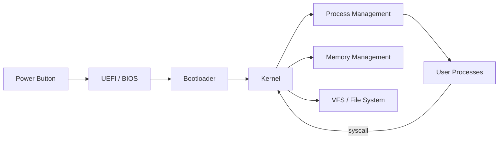

You use an operating system every day. But do you know what actually happens between pressing the power button and your first process running?

Fireship's video compresses every major OS concept into about 15 minutes, using the boot-to-shutdown lifecycle as a narrative backbone — turning what textbooks spread across dozens of chapters into a single coherent story. This post follows the same arc.

## TL;DR

An operating system is the software layer between hardware and applications, managing CPU, memory, storage, and I/O. The best way to understand it is to follow a computer from power-on to shutdown — each phase maps to a specific OS subsystem.

## What It Is

An **operating system** intermediates between applications and hardware. Its four core responsibilities:

1. **Resource management** — who gets CPU time, how much memory, which disk blocks
2. **Isolation** — one crashing program shouldn't take down the system
3. **Abstraction** — applications don't need to know which CPU model or disk format they're running on
4. **Interface** — standard APIs (syscalls, file system, network) that applications can target

## Why It Matters

Without an OS, every application would need to handle CPU scheduling, memory allocation, and hardware drivers itself — a practically impossible requirement. The OS absorbs that complexity so developers can focus on application logic.

Understanding OS internals makes you a better systems programmer: you can reason about why `fork()` is cheap but `exec()` is expensive, why many small files are slower than one large file, why context switches create performance bottlenecks.

## How It Works: Boot to Shutdown

### Firmware

When you press the power button, the first thing the CPU executes isn't Linux or Windows — it's **firmware**, a low-level program burned into a chip on the motherboard.

Modern machines use **UEFI** (Unified Extensible Firmware Interface); older machines use BIOS. Firmware's job:

- **POST (Power-On Self Test)**: verify CPU, RAM, and storage are functional
- Initialize hardware devices
- Locate the bootloader and hand over control

UEFI is a significant upgrade over legacy BIOS: it supports disks over 2TB (GPT partition tables), provides a graphical interface, and enables Secure Boot.

### Bootloader

Firmware finds the bootloader on the boot disk (GRUB on Linux systems) and hands control to it. The bootloader's only job:

1. Read the OS **kernel** image from disk
2. Load the kernel into RAM
3. Transfer control to the kernel

This takes a few seconds and is the bridge between the firmware world and the operating system world.

### Kernel

The kernel is the OS core, running in **kernel mode** with direct access to all hardware. It owns everything that follows:

```
Kernel
├── Process Management
├── Memory Management
├── File System (VFS)
├── Device Drivers
└── System Call Interface
```

Linux is a **monolithic kernel** — all subsystems share one memory space, maximizing call efficiency. macOS's XNU is a **hybrid kernel**, running some components in user space for stability.

### Process Management

Once the kernel starts, it begins creating **processes**. Each process is an independent execution instance with its own:

- Virtual address space
- Open file descriptors
- Process ID (PID)
- At least one **thread**

Processes are isolated from each other — a crash in one process doesn't directly kill others. **Threads** are the execution units within a process; all threads in the same process share memory, making them efficient for cooperative parallel work (but requiring locks to prevent data races).

### CPU Scheduling

A machine might have dozens of processes "running" simultaneously, but CPU cores are finite. The **scheduler** decides who runs and for how long:

- **Preemptive scheduling**: the scheduler can forcibly interrupt a running process and give the CPU to another
- **Time slice**: each process typically gets a few milliseconds of CPU time per turn
- **Priority**: real-time tasks (audio playback, input handling) run before background work

Linux uses the **CFS (Completely Fair Scheduler)**, which tracks each process's "virtual runtime" and always schedules the one that has run the least — preventing any process from starving indefinitely.

### Memory Management

Each process sees a **virtual address space**, not physical memory addresses. The OS uses **paging** to maintain a mapping table between virtual addresses and physical page frames.

Three benefits of this design:

- **Isolation**: process A cannot read process B's memory even on the same machine
- **Demand paging**: physical page frames are only allocated when memory is actually accessed, speeding up startup
- **Swap**: when physical RAM is full, the OS evicts infrequently-used pages to disk to free space for active processes

### Inter-Process Communication (IPC)

Processes are isolated, but sometimes they need to cooperate. The OS provides several **IPC mechanisms**:

| Mechanism | Use Case |
|-----------|----------|
| Pipe | Parent-child processes, one-way data flow (`cmd1 \| cmd2`) |
| Unix Socket | Bidirectional local communication |
| Shared Memory | High-throughput data exchange |
| Signal | Lightweight notifications (`SIGTERM`, `SIGKILL`) |
| Message Queue | Asynchronous message passing |

### File System

To applications, all persistent data is accessed as "files." The OS provides a unified interface via the **Virtual File System (VFS)** — the underlying storage can be ext4, APFS, NTFS, tmpfs, or NFS, but the API looks the same to applications.

Linux's "everything is a file" philosophy exposes hardware devices (`/dev/sda`), process information (`/proc/1234/status`), and kernel settings (`/sys/`) all as readable/writable file paths — one consistent interface for the entire system.

### System Calls

Applications run in **user mode** and cannot directly access hardware or kernel data structures. Any time an application needs OS services (reading a file, opening a socket, spawning a process), it must make a **system call** that switches to kernel mode:

```c
open()   // open a file, get a file descriptor
read()   // read data from fd into a buffer
write()  // write buffer data to fd
fork()   // clone the current process
exec()   // replace the current process image with a new program
exit()   // terminate the process, release resources
```

Every syscall involves a user mode → kernel mode context switch, which has measurable overhead. This is why high-performance I/O frameworks like `epoll` and `io_uring` are designed explicitly to **reduce syscall count**.

`strace` is the go-to tool for intercepting syscalls and seeing exactly what a process is asking the OS to do:

```bash
strace -e openat,read,write ls /tmp
```

## Boot to Shutdown at a Glance



## How OS Differs from VMs and Containers

| | Operating System | Virtual Machine | Container |
|--|-----------------|-----------------|-----------|
| Kernel | Own kernel | Own kernel | Shares host kernel |
| Isolation layer | Hardware | Hypervisor | cgroups + namespaces |
| Startup time | Seconds | Seconds–minutes | Milliseconds–seconds |
| Overhead | Low | High | Very low |

Containers (Docker, Podman) aren't "lightweight VMs" — they're isolated processes sharing the host kernel, using Linux **cgroups** for resource limits and **namespaces** for visibility isolation. This is why Docker on macOS and Windows requires a Linux VM underneath: neither OS has a Linux kernel.

## Summary

The OS has a clear logical chain: firmware initializes hardware → bootloader loads the kernel → kernel establishes process and memory management → processes access OS services via syscalls.

Each layer solves one specific problem: firmware abstracts hardware variation, the kernel abstracts resource contention, VFS abstracts storage backends, and the syscall interface abstracts privileged mode switching. Understanding this abstraction chain lets you reason about program behavior at the OS level rather than treating it as a black box.

## References

- [Every operating system concept in one video... — Fireship (YouTube)](https://www.youtube.com/watch?v=MtxP2pyCvYA)
- [Fireship Channel](https://www.youtube.com/@Fireship)
- [Operating Systems Unveiled: From Boot-Up to Shutdown — OVEX TECH](https://blog.ovexro.com/operating-systems-unveiled-from-boot-up-to-shutdown)
