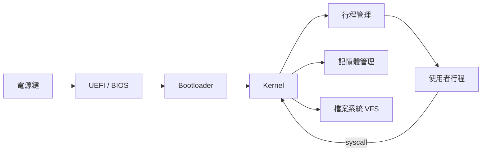

你每天都在用作業系統，但你知道按下電源鍵之後，在你的程式開始執行之前，系統裡究竟發生了什麼嗎？

Fireship 的這支影片把作業系統所有核心概念壓進了約 15 分鐘，用「從開機到關機」的生命週期當主軸，把原本散落在教科書各個章節的概念串成一條清晰的敘事線。這篇文章跟著同樣的主軸走，幫你建立對作業系統的完整心理模型。

## TL;DR

作業系統是介於硬體和應用程式之間的軟體層，負責管理 CPU、記憶體、儲存裝置和 I/O 裝置。理解它的最好方式是跟著一台電腦從開機到關機走一遍——每個階段都對應一組 OS 子系統。

## 是什麼

**作業系統（Operating System）**是一組系統軟體，負責在應用程式和硬體之間扮演中間人的角色。它的核心任務有四：

1. **資源管理**：決定誰能用 CPU、多少記憶體、哪塊磁碟空間
2. **隔離性**：確保一個程式的崩潰不會拖垮整個系統
3. **抽象化**：讓應用程式不需要知道底層是哪一顆 CPU 或哪種磁碟格式
4. **介面**：提供 syscall、檔案系統、網路等標準介面給程式使用

## 為什麼重要

沒有作業系統，每個應用程式都要自己處理 CPU 排程、記憶體分配、硬體驅動——這幾乎是不可能的任務。OS 把這些複雜性收攏在一起，讓開發者可以專注在應用邏輯本身。

理解 OS 的內部機制，能讓你更準確地預測程式行為：為什麼 `fork()` 快但 `exec()` 慢、為什麼大量小檔案比單一大檔案慢、為什麼 context switch 是效能瓶頸的來源。

## 怎麼運作：從開機到關機

### 韌體（Firmware）

電源鍵按下去，CPU 第一個執行的不是 Linux 也不是 Windows，而是**韌體**——燒錄在主機板晶片上的低階程式。

現代電腦用的是 **UEFI**（Unified Extensible Firmware Interface），舊機器則是 BIOS。韌體的任務：

- **POST（Power-On Self Test）**：確認 CPU、記憶體、儲存裝置都能正常運作
- 初始化硬體裝置
- 找到開機磁碟，交棒給開機載入器

UEFI 比傳統 BIOS 進步許多：支援超過 2TB 的開機磁碟（GPT 分割表）、提供圖形介面、支援安全開機（Secure Boot）。

### 開機載入器（Bootloader）

韌體找到開機磁碟上的 Bootloader（例如 GRUB）後，把控制權交給它。Bootloader 的任務很單純：

1. 從磁碟讀取 OS **核心（Kernel）**映像檔
2. 把 Kernel 載入記憶體（RAM）
3. 把控制權交給 Kernel

這個階段通常只有幾秒鐘，但它是從「韌體的世界」進入「作業系統的世界」的關鍵橋樑。

### 核心（Kernel）

Kernel 是作業系統的核心，在**特權模式（Kernel Mode）**下執行，可以直接存取所有硬體資源。它管理的東西幾乎涵蓋後續所有子系統：

```
Kernel
├── 行程管理（Process Management）
├── 記憶體管理（Memory Management）
├── 檔案系統（File System / VFS）
├── 裝置驅動程式（Device Drivers）
└── 系統呼叫介面（System Call Interface）
```

Linux 是**單體核心（Monolithic Kernel）**，所有子系統都跑在同一個記憶體空間，呼叫效率高；macOS 的 XNU 是**混合核心（Hybrid Kernel）**，部分功能跑在使用者空間以提升穩定性。

### 行程管理（Process Management）

Kernel 啟動後，系統開始建立**行程（Process）**。每個行程是一個獨立的執行實例，有自己的：

- 虛擬記憶體位址空間
- 開啟的檔案描述子（File Descriptors）
- 行程 ID（PID）
- 至少一條**執行緒（Thread）**

行程之間彼此隔離——一個行程崩潰不會直接影響其他行程。**執行緒**則是行程內部的執行單元，同一行程的所有執行緒共享記憶體空間，適合需要高度協作的並行工作（但也因此需要鎖機制避免資料競爭）。

### CPU 排程（CPU Scheduling）

一台電腦可能同時有幾十個行程在「執行」，但 CPU 核心數是有限的。**排程器（Scheduler）**決定誰先執行、執行多久：

- **搶佔式排程（Preemptive Scheduling）**：排程器可以強制中斷一個行程，把 CPU 交給另一個
- **時間片（Time Slice）**：每個行程輪到的 CPU 時間通常在數毫秒量級
- **優先級（Priority）**：即時任務（音訊播放、輸入響應）比一般後台任務優先

Linux 使用 **CFS（Completely Fair Scheduler，完全公平排程器）**，根據每個行程「虛擬執行時間」來決定下一個排程的是誰，確保沒有任何行程被長期餓死（starvation）。

### 記憶體管理（Memory Management）

每個行程看到的都是**虛擬位址空間**，不是實際的實體記憶體位址。作業系統透過**分頁（Paging）**機制維護對照表，把虛擬位址映射到實體記憶體的頁框（Page Frame）。

這個設計帶來三個關鍵好處：

- **隔離性**：行程 A 無法直接讀寫行程 B 的記憶體，即使它們都在同一台機器上
- **按需分頁（Demand Paging）**：記憶體頁只在真正被存取時才分配實體頁框，啟動速度更快
- **Swap**：當實體記憶體不足時，OS 把較少使用的頁面交換到磁碟，騰出空間給活躍的行程

### 行程間通訊（IPC）

行程彼此隔離，但有時需要協作。作業系統提供幾種 **IPC（Inter-Process Communication）**機制：

| 機制 | 適用場景 |
|------|----------|
| Pipe | 父子行程、單向資料流（`cmd1 \| cmd2`） |
| Unix Socket | 本機行程間的雙向通訊 |
| 共享記憶體（Shared Memory） | 大量資料、高效能要求 |
| Signal | 輕量通知（如 `SIGTERM`、`SIGKILL`） |
| Message Queue | 非同步訊息傳遞 |

### 檔案系統（File System）

對應用程式而言，所有持久化資料都透過「檔案」存取。作業系統透過**虛擬檔案系統（VFS）**提供統一介面，底層可以是 ext4、APFS、NTFS、tmpfs 甚至網路檔案系統（NFS）——對應用程式來說 API 都是一樣的。

Linux 的「一切皆檔案」哲學把硬體裝置（`/dev/sda`）、行程資訊（`/proc/1234/status`）、核心設定（`/sys/`）都暴露成可讀寫的檔案介面，讓 shell 工具可以用同一套 I/O API 操作幾乎所有系統資源。

### 系統呼叫（System Call）

應用程式執行在**使用者模式（User Mode）**，無法直接存取硬體或核心資料結構。每當需要 OS 服務（讀檔、開啟 Socket、建立行程），就必須透過**系統呼叫（syscall）**切換到 Kernel Mode：

```c
open()   // 開啟檔案，取得 file descriptor
read()   // 從 fd 讀取資料到緩衝區
write()  // 把緩衝區資料寫入 fd
fork()   // 複製當前行程，建立子行程
exec()   // 以新程式取代當前行程的映像
exit()   // 結束行程，釋放資源
```

每次 syscall 都涉及一次 User Mode → Kernel Mode 的切換（context switch），這個開銷不算小。這也是為什麼高效能 I/O 框架（epoll、io_uring）的設計目標之一是**減少 syscall 次數**。

`strace` 可以攔截並顯示一個行程發出的所有 syscall，是除錯「程式到底在對 OS 要求什麼」的利器：

```bash
strace -e openat,read,write ls /tmp
```

## 從開機到關機的完整路徑



## 跟虛擬機、容器的差別

| | 作業系統 | 虛擬機（VM） | 容器（Container） |
|--|----------|--------------|-------------------|
| Kernel | 自己的 Kernel | 自己的 Kernel | 共享宿主機 Kernel |
| 隔離機制 | 硬體本身 | Hypervisor | cgroups + namespaces |
| 啟動速度 | 秒級 | 秒～分鐘 | 毫秒～秒 |
| 資源開銷 | 低 | 高 | 極低 |

容器（Docker、Podman）不是「輕量 VM」——它們其實是共享宿主機 Kernel 的隔離行程，隔離靠的是 Linux 的 **cgroups**（資源限制）和 **namespaces**（視野隔離）。所以 Docker 在 macOS 和 Windows 上必須跑一個 Linux VM，因為 macOS/Windows 沒有 Linux Kernel。

## 小結

作業系統的設計有一條清晰的邏輯線：韌體初始化硬體 → Bootloader 載入 Kernel → Kernel 建立行程和記憶體管理基礎 → 行程透過 syscall 存取 OS 服務。

每個層次都解決了一個明確的問題：韌體抽象了硬體差異，Kernel 抽象了資源競爭，VFS 抽象了儲存後端，syscall 介面抽象了特權模式切換。理解這條抽象鏈，你就能更準確地預測程式在 OS 層面的行為，而不是把它當黑盒猜測。

## 參考資料

- [Every operating system concept in one video... — Fireship（YouTube）](https://www.youtube.com/watch?v=MtxP2pyCvYA)
- [Fireship 頻道](https://www.youtube.com/@Fireship)
- [Operating Systems Unveiled: From Boot-Up to Shutdown — OVEX TECH](https://blog.ovexro.com/operating-systems-unveiled-from-boot-up-to-shutdown)
