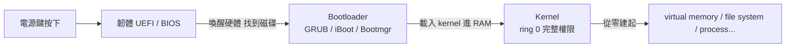

此刻你能看這支影片，是因為某個作業系統決定「可以」。你的 CPU 正同時跑著幾百支程式，Chrome 莫名其妙吃掉一堆 RAM，但當你晃動滑鼠時游標依然順暢地跟著移動。這其實不正常——它是作業系統這個「最被低估的軟體」每秒重複上千次的小奇蹟。

Fireship 這支影片的切入點很聰明：不從教科書的章節目錄講起，而是跟著一台電腦「從你按下電源鍵，到你氣到直接關機」這條時間軸走一遍，看 bootloader、process、scheduling、thread、system call、virtual memory、interrupt、privilege ring、I/O、inode 這些名詞如何協作。這篇文章跟著同樣的主軸，把其中最核心的幾個階段講清楚。

## 一點歷史

第一個作業系統 **GM-NAAIO** 在 1956 年由 General Motors 推出，因為有工程師覺得人類不該把時間浪費在手動把打孔卡片餵進兩層樓高的 IBM 大型主機裡。那個系統一次只能跑一支程式，沒有記憶體保護、沒有使用者、沒有檔案的概念——但它當機的次數還是比後來的 Windows Millennium Edition 少。七十年後的今天，我們終於可以把整套機制拆開來看。

## 階段一：Bootloader

你按下電源鍵，電力打到主機板上，CPU 在**最原始的狀態**下醒過來。這個當下，還沒有記憶體管理，甚至連「檔案」這個概念都不存在——就只是一顆核心，在韌體裡**寫死的位址**上開始執行指令。

在現代機器上，這個韌體是 **UEFI**；在更古老的機器上叫 **BIOS**。韌體的工作很單純：喚醒剛好夠用的硬體，找到一顆磁碟，然後把控制權**交棒給 bootloader**。

不同系統的 bootloader 名字不一樣：

- Linux 上叫 **GRUB**（Grand Unified Bootloader）
- Mac 上叫 **iBoot**
- Windows 上叫 **Bootmgr**

但 bootloader 的任務都一樣簡單：在磁碟上找到 **kernel**，把它載入 **RAM**。這就是那個「交棒」的瞬間。交棒之後，CPU 開始執行 kernel 的程式碼，並握有**完整的硬體權限**。

值得注意的是：此時你電腦裡所有「有趣的東西」——檔案、process、視窗——**都還不存在**。kernel 得在接下來短短幾秒內，從零把這一切建起來。

## 階段二：Privilege Rings

在 kernel 繼續往下建之前，得先理解 CPU 提供的保護機制：**privilege rings**。

CPU 用多個特權等級來保護自己。在 x86 上其實有四個 ring，但**真正重要的只有兩個**：

- **Ring 0**——kernel 所在，基本上想幹嘛都可以。
- **Ring 3**——user space，可以跑應用程式，但要做別的事幾乎都得先「請求許可」。

問題在於：現在 kernel 是在 **ring 0** 裡跑 C 程式碼，**完全沒有護欄**。只要一個指標指錯，整台機器就會「著火」。這也是影片開玩笑說 kernel 開發者為什麼要靠喝酒度日的原因。

但這道由 **CPU 本身強制執行**的隔離牆非常關鍵：如果沒有它，每一支程式都能讀取其他程式的記憶體、隨手弄垮整個系統。有了 privilege ring，一支有 bug 的程式**通常只能弄死它自己**。

## 階段三：Virtual Memory —— 計算領域最大的謊言

接下來 kernel 要說出「計算領域裡最大的謊言」：**virtual memory**。

這個「騙局」是這樣運作的：當程式之後請求某個記憶體位址時，**那個位址其實不存在**。它是一個假的**虛擬位址**，會被一塊叫 **MMU**（Memory Management Unit，記憶體管理單元）的硬體翻譯成**真正的實體位址**。而 MMU 依賴的資料結構叫 **page table**——正是 kernel 此刻在建的東西。

記憶體以一塊塊叫 **page** 的單位發出去，每塊**通常 4KB**。真正有意思的是：**每個 process 都有自己的 page table**。這代表兩支應用程式可以同時運作而不會互相破壞——你的瀏覽器讀不到密碼管理器的記憶體，反之亦然。它們活在各自平行的宇宙裡，只有 kernel 能看穿彼此之間。

為了加速，MMU 還會把最近做過的翻譯結果快取在一個小結構 **TLB**（Translation Lookaside Buffer）裡。所謂一次「translation」，就是一個虛擬位址對應到一個實體位址的映射。

而當程式碰到一個**目前不在 RAM 裡**的 page，MMU 會拋出一個 **page fault**：這會喚醒 kernel、從磁碟把該 page 載入，然後讓程式**像什麼事都沒發生過一樣**繼續執行。

## 階段四：File System

有了這些記憶體上的「謊言」之後，就輪到 **file system**。

在最底層，你的磁碟其實只是**一長排編號的區塊（blocks）**。file system 就是那個「掩蓋這件事」的軟體層——它讓上層看到的是有名字、有目錄結構的檔案，而不是一堆冷冰冰的區塊編號。（影片接下來會延伸到 inode 等更底層的實作，這也是「一切從區塊到檔案」這條翻譯鏈的核心。）

## 小結

把這四個階段串起來，你會發現一個一致的主題：**作業系統一層層地在裸機之上疊出「方便的假象」**。

- 韌體與 bootloader 把 CPU 從一個只會執行寫死位址的裸核心，帶進 kernel 的世界。
- privilege rings 用硬體強制的隔離，換來「一支程式壞掉不會拖垮全部」的穩定性。
- virtual memory 給每個 process 一個獨立、隔離的位址空間的錯覺。
- file system 把一排區塊編號包裝成我們熟悉的檔案。

理解這條「從無到有」的路徑，比死背各章名詞更能建立起對作業系統的心智模型——因為每一個抽象層，都是為了解決前一層赤裸暴露出來的某個真實問題而存在。

## 參考資料

- [Operating Systems in 15 Minutes（Fireship）](https://www.youtube.com/watch?v=MtxP2pyCvYA)
