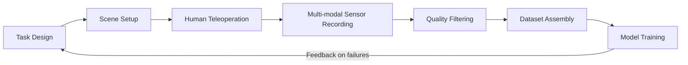

When most people think about what limits AI progress, they imagine compute bottlenecks or algorithmic breakthroughs. In the language model world, that framing is roughly correct. But in robotics, the most pressing constraint has always been something far more mundane: data. Not text scraped from the web, not labeled images from crowdsourcing platforms — but the frame-by-frame recording of a robot arm picking up a strawberry, folding a shirt, or driving a screw into the correct hole. This kind of data is so expensive to produce that it has spawned an entirely distinct industry: the data collection factory.

## TL;DR

Embodied AI training is bottlenecked not by models but by physical demonstration data. Data collection factories are facilities that record large volumes of human-operated robot demonstrations under controlled conditions. A single usable demonstration can require dozens of minutes of human effort to produce a few seconds of valid data. Understanding this bottleneck is foundational to understanding the state of the robotics industry.

## What Is It

A robot data collection factory is a specialized facility that produces demonstration data for robot training. The core workflow involves human operators — either physically guiding a robot arm or teleoperating it via VR controllers — performing specific physical tasks while every sensor fires simultaneously: RGB cameras, depth sensors, force-torque sensors, joint encoders. Annotators then filter for demonstrations where the motion was smooth and the task succeeded.

The three most common collection methods are:

- **Teleoperation**: Operators wear VR headsets or use handheld controllers to remotely control a robot arm. Used at scale by Meta, Physical Intelligence (Pi), Figure, and others.
- **Kinesthetic teaching**: An operator physically moves the arm through a task by hand, recording the end-effector trajectory. Useful for fine-grained manipulation, but hard to scale.
- **Synthetic data**: Demonstrations generated automatically inside a simulator. Low cost, but a significant sim-to-real gap means the model often needs substantial fine-tuning before it works in the real world.

## Why It Matters

Language model training can draw on trillions of tokens already sitting on the internet. Physical robot demonstrations don't have that luxury — there is no pre-existing archive of "humans doing manipulation tasks." Millennia of embodied human experience were never systematically recorded.

Compounding the problem, robot data is tightly coupled to the physical hardware. Demonstrations collected on a UR5 arm typically don't transfer cleanly to a Franka arm: different joint configurations, different end-effector geometry, different force profiles. Changing hardware platforms often means restarting data collection from scratch.

The downstream consequences are significant:

1. **Dataset scale lags behind language by orders of magnitude.** The largest open robotics demonstration dataset (Open X-Embodiment) contains roughly one million demonstrations. Language models train on trillions of tokens.
2. **Models fail on subtle distribution shifts.** Change the lighting, move an object two centimeters, and a robot trained on narrow factory data can fail completely.
3. **Marginal data cost remains high.** Even with efficient tooling, the per-demonstration cost (hardware, operator time, quality review) stays substantial.

## How It Works

**Task design** defines the success criterion precisely — for example, "pick the specified object from an unordered pile and place it in the target bin."

**Scene setup** must faithfully replicate deployment conditions: lighting, surface materials, object variety and placement diversity. Overly uniform scenes produce models that overfit badly.

**Teleoperation** is the highest labor-cost stage. Operators need training to produce smooth, natural motion; hesitant or jerky demonstrations degrade training quality. Fatigue measurably reduces data quality over a shift.

**Quality filtering** is typically semi-automated: automated success detection (did the object land in the bin?) plus human review of motion smoothness and safety. Roughly 40–60% of raw recorded footage passes quality gates.

**Dataset assembly** covers sensor time-synchronization, coordinate frame normalization, and format conversion (RLDS, HDF5, and LeRobot are common formats).

## Alternatives and Comparisons

| Approach | Cost | Generalization | Sim-to-Real Gap | Scalability |
|----------|------|----------------|-----------------|-------------|
| Real-world teleoperation | High | Medium-high | None | Low |
| Synthetic (simulation) | Low | Low (requires fine-tuning) | Significant | High |
| Video imitation (YouTube) | Very low | Low (no action labels) | Requires alignment | High |
| Autonomous RL exploration | Medium | Medium | Low | Medium |

Several research directions aim to reduce dependence on manual collection: using foundation vision models (DINO, SAM) to automate annotation, learning motion priors directly from internet video (UniPi, VideoPretrain), and world-model pretraining to extract physical priors before fine-tuning on sparse demonstrations. These remain mostly research-stage; manual data collection factories still dominate production deployments.

## Conclusion

Data collection factories expose a fundamental asymmetry between language AI and embodied AI. Language models won partly because internet-scale text already existed. Robots have to manufacture their own training data, and that process is slow, expensive, and deeply human-labor-intensive.

Recognizing this constraint changes how you evaluate robotics companies. The most durable moats are often not model architectures but data assets: who has the most diverse demonstrations, across the most hardware platforms, in the most varied real-world conditions.

## References

- [Robot Data Collection Factory: Why Robot Data Is So Scarce (YouTube)](https://www.youtube.com/watch?v=ZvHIuIIZ3Is)
- [Open X-Embodiment: Robotic Learning Datasets and RT-X Models](https://robotics-transformer-x.github.io/)
- [LeRobot: Making AI for Robotics more accessible](https://github.com/huggingface/lerobot)
