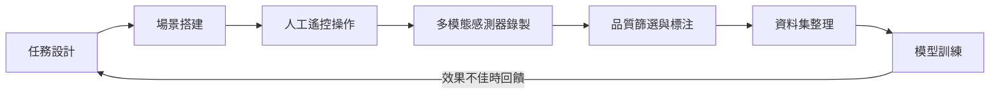

當 ChatGPT 橫空出世的時候，大多數人把焦點放在模型架構與算力競賽上。但在機器人領域，業界最頭痛的問題從來都不是算法——而是資料。不是那種可以從網路上爬取的文字或圖片，而是機器人在真實空間裡抓取一顆草莓、折一件衣服、把螺絲鎖進正確孔位的每一幀動作序列。這類資料的採集成本之高、難度之大，催生了一個完全不同的行業：資料採集工廠（Data Collection Factory）。

## TL;DR

具身智慧機器人的訓練瓶頸不在模型，在資料。資料採集工廠是專門在受控環境下大規模錄製機器人動作示範的設施，一條有效的示範資料可能需要耗費數十分鐘人工操作才能產出幾秒鐘的可用片段。理解這個瓶頸，是理解整個機器人產業現況的第一步。

## 是什麼

資料採集工廠是一種為機器人訓練提供高品質示範資料的專門設施，核心工作是：讓人類遠端遙控或直接操作機械手臂，執行特定的物理任務，同時錄製所有感測器資料（RGB 影像、深度影像、力覺、關節角度等），再由標注人員篩選出動作流暢、任務成功的片段，最終形成可供訓練的示範資料集。

這不是普通的影像資料標注，而是「體現式」（embodied）資料的生產線。每一條資料都綁定了特定的機器人形態、特定的場景設置與特定的任務目標，無法像文字或圖片資料那樣跨場景複用。

常見的資料採集方式包括：

- **遠端遙控（Teleoperation）**：操作員戴上 VR 頭盔或使用雙手柄，遠端控制機械手臂完成任務。Meta、Physical Intelligence（Pi）、Figure 等公司均採用此方式大規模採集資料。
- **示範引導（Kinesthetic Teaching）**：直接手把手移動機械手臂完成任務，記錄末端執行器的軌跡。適合精細動作，但擴展性較低。
- **合成資料（Synthetic Data）**：在仿真環境中自動生成資料，成本低但存在 sim-to-real gap，落地時需要大量 fine-tuning。

## 為什麼重要

語言模型的訓練資料可以從網路爬取幾兆個 token，而機器人的動作資料根本不存在「網路上現成的海量來源」。人類幾千年累積的物理操作經驗，沒有被系統性地記錄下來。

更棘手的是，機器人資料高度依賴「具身形態（embodiment）」。一個在 UR5 機械臂上採集的抓取資料，很難直接遷移到 Franka 機械臂上使用，因為關節自由度、末端執行器形狀、力覺分佈都不同。這意味著每換一款機器人平台，資料採集幾乎要重頭來過。

資料採集的稀缺性造成了幾個連鎖效應：

1. **訓練資料量遠低於語言模型**：目前業界最大的開放機器人示範資料集 Open X-Embodiment 也只有約 100 萬條示範，對比語言模型動輒兆級 token 的訓練量，差距懸殊。
2. **模型泛化能力受限**：資料場景有限，導致模型在面對細微的場景變化（光線改變、物件擺放位置不同）時就容易失敗。
3. **資料採集成本高昂**：一個資料採集工廠的建置需要大量機械手臂、感測器、場景道具，加上人力成本，一條有效示範資料的邊際成本仍相當高。

## 怎麼運作

一個典型的資料採集工廠流程如下：

**任務設計**階段需要明確定義機器人要學會什麼，例如「從無序堆疊的物件中抓取指定物品並放入容器」，同時確定成功標準。

**場景搭建**要盡量還原真實部署環境，包括光線條件、地面材質、物件種類與擺放多樣性。若場景過於單一，訓練出的模型將嚴重過擬合。

**人工遙控操作**是最耗費人力的環節。操作員需要接受培訓，確保動作流暢自然（過於猶豫或停頓的示範會對訓練產生負面影響）。一個熟練操作員每小時能產出的有效示範數量有限，且疲勞會顯著降低資料品質。

**品質篩選**通常需要半自動化工具輔助：自動偵測任務是否成功（例如物件是否落入目標容器），再由人工審核動作平滑度與安全性。粗略估計，原始錄製片段中只有 40–60% 能通過品質門檻。

**資料集整理**包括感測器時間同步、座標系標準化、格式轉換（常見格式有 RLDS、HDF5、LeRobot 等）。

## 跟常見替代方案的差別

| 方式 | 成本 | 泛化能力 | Sim-to-Real 差距 | 擴展性 |
|------|------|----------|------------------|--------|
| 真實世界人工遙控 | 高 | 中高 | 無 | 低 |
| 合成資料（仿真） | 低 | 低（需 fine-tune） | 顯著 | 高 |
| 影片學習（YouTube） | 極低 | 低（無動作標注） | 需要額外對齊 | 高 |
| 機器自我探索（RL） | 中 | 中 | 低 | 中 |

近年來有幾個有趣的方向嘗試降低對人工採集的依賴：

- **DINO/SAM 輔助自動標注**：用視覺基礎模型自動偵測物件位置，減少人工標注成本。
- **影片模仿學習（Video Imitation Learning）**：直接從 YouTube 影片中提取動作先驗，再與機器人感測器資料對齊，代表性工作有 UniPi、VideoPretrain 等。
- **世界模型預訓練**：讓模型先在大量影像資料上預訓練物理動態知識，再用少量真實示範 fine-tune，可大幅減少對資料採集工廠的依賴。

不過這些方法目前都還在研究階段，在工業部署中，人工資料採集仍是主流。

## 小結

資料採集工廠揭示了一個深刻的現實：具身 AI 的瓶頸與語言 AI 截然不同。語言模型的勝利在於網路上本就存在天文數字的文字資料；機器人則必須自己創造訓練資料，而這個過程慢、貴、且高度依賴人力。

理解這個瓶頸，能幫助你更精準地評估機器人公司的技術壁壘——那些在資料採集上投入最多、資料集最多元的公司，往往才是真正的長期競爭者，而非單純靠模型架構創新取勝的公司。

## 參考資料

- [揭秘数采工厂：稀缺的机器人数据，到底难在哪儿？（YouTube）](https://www.youtube.com/watch?v=ZvHIuIIZ3Is)
- [Open X-Embodiment: Robotic Learning Datasets and RT-X Models](https://robotics-transformer-x.github.io/)
- [LeRobot: Making AI for Robotics more accessible](https://github.com/huggingface/lerobot)