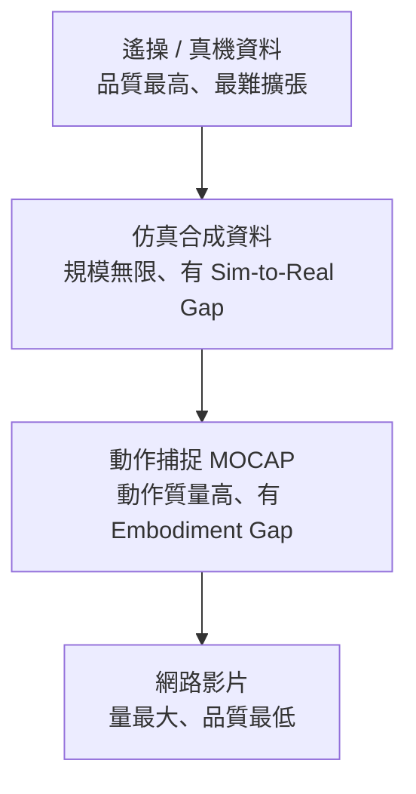

問一個問題：機器人領域最羨慕大語言模型的什麼？答案是**資料**。

當 Scaling Law 讓大語言模型一路狂飆、以萬億 token 餵養出一代又一代更強的智能時，機器人領域卻困在「資料荒漠」裡，讓具身智能的泛化性與自主性進展緩慢。這篇整理自《硅谷101》走訪上海機器人數採工廠、並訪談 Sharpa、智元、覓蜂等公司的內容，試著回答三件事：為什麼 AI 能用的資料機器人用不了、機器人的四層資料金字塔如何運作、以及這個難題可能怎麼解。

## 為什麼機器人的資料不能從網路上爬

大語言模型是靠「吃掉互聯網」變聰明的。文本、程式碼、圖片、聲音、影片——這些模型需要的原料，本來就大量存在於網路上（在不考慮版權的前提下）。語言模型用的是「世界的文本」，圖像模型用的是「世界的瞬間截圖」，影片模型用的是「世界的連續變化」。

但機器人需要的是**具身本體在真實物理世界裡、和具體物體發生具體交互時，產生的多維度感測器訊號**：視覺、力覺、關節位置、電機控制量，全部要精確同步、時間戳對齊，才構成一條有用的訓練軌跡。這種資料從來沒有被系統性地記錄過，也沒有任何理由會被動地產生。

更棘手的是：我們比較容易採集到的是「人在操作」的資料（例如 MOCAP 動捕、YouTube 影片），而不是「機器人自己在幹活」的資料。要做好 teleoperation（遙操作）讓機器人去操作，其實相當困難——因為**操作員感受不到機器人的感受**。這就是整個行業資料困境的根源：每一條高品質資料都必須從零開始生產。

用幾個數字感受這個缺口：

- Google DeepMind 研發 **RT-1** 時，動用 13 台機器人，在辦公室、廚房環境持續採集了整整 **17 個月**，才累積約 **13 萬條**操作軌跡、覆蓋 700 多項技能。
- 為了訓練 **RT-2**，Google 聯合全球 34 所研究機構，把 60 個已有資料集合併，加上來自 22 種機器人平台的真機資料，才湊出 **Open X-Embodiment**——一個超過 **100 萬條**軌跡的開源資料集，被認為是目前全球最大的跨機構真機資料集。但它涵蓋的 527 項技能與現實世界的需求之間，仍是以數量級計的差距。

面對這麼難取得的資料，行業摸索出四條並行路線。它們的品質由低到高排列，構成一座金字塔——每一層都有自己的優勢、上限，和真實的代價。

## 第一層：遙操（真機）資料——最貴、最慢、但最能落地

金字塔頂層是遙操資料，又稱「真機資料」。遙操員透過外骨骼或遙操系統，即時操控機器人在真實場景完成操作，機器人所有感測器全程錄製。這層資料資訊最完整：真實的物理接觸、真實的不確定性、真實的失敗與恢復。

在上海智元機器人的數採工廠，現場有 200 台機器，每台至少配一位採集員，有些任務還會多配一位同事負責布置場景。

**遙操員遠比想像中難當。** 好的採集員和差的採集員，效率可能差到 3 倍。一位有天賦的採集員，首先協調性要好、空間感要特別好——因為他其實是「隔空控制另一個身體」，沒有直觀的力反饋，只能靠肉眼閉環。而且機器人的手臂構型和人不一樣，人能達到的姿態機器未必夠得到，所以他還要預判機器人怎樣才能更高效地夠到、去設計自己的軌跡。空間精度判斷不準，就會抓過頭、夠不到、或一夾就滑。最後還要體力好，一天下來非常辛苦。

養成一位採集員，需要約**一週培訓**才入門，任務難度再逐級遞加；即使有天賦，從零基礎到「九成功力」也大約要**一個月**（zero to hero 一個月）。

即使是專家水平的遙操員，也不是每條資料都算有效。一位專業遙操員 **8 小時工作，平均產出約 2–3 小時有效資料**——中間要布置場景、上傳資料，操作也總有失敗要丟棄重來，大約只有 1/4 能用。

所以真機資料的優劣很直白：優勢是**準確、容易直接部署、後期調參成本低**；代價是**貴、慢、不容易指數級擴張**，涉及硬體、場地、人工標注與監督、時間成本，規模完全不在互聯網資料的量級。

這也是為什麼數採工廠在中國快速發展、在人力成本高昂的美國卻進展較慢——特斯拉曾開出採集員時薪 50 美元的招聘。覓蜂科技 2026 年真機遙操產能接近 **200 萬小時**，另規劃採集約 **800 萬小時**的 Human-Centric 資料，背後是將近 **2000 台機器人**與對應規模的採集團隊，在中國國內與東南亞多地同步運作。受訪者也坦言：100 萬小時在特定領域已能達到很好的效果，但「大家到了 100 萬一定會想 1000 萬」，這只是第一步。這就是機器人行業裡的「石油業務」。

## 第二層：仿真合成資料——規模無限，但有 Sim-to-Real Gap

金字塔往下第二層是「仿真合成資料」，規模效應最極致，也是 NVIDIA 重點押注的路線。它不是從真實世界採集，而是在虛擬環境裡「生成」出來的。NVIDIA Isaac Lab 可以在單台 GPU 上並行運行成千上萬個虛擬機器人同時訓練——你想要多少資料就有多少資料。

仿真還能做到真機採集做不到的事：**生成現實中極難遇到的邊緣場景**。機器人在仿真裡可以反覆摔倒、反覆失敗，所有失敗都變成資料，卻不造成任何真實損失。

Sharpa 在 2026 年 CES 上爆紅的乒乓球機器人，就是花約 **40 小時純仿真資料**訓練出 **0.02 秒**量級的擊球反應速度。Sharpa 還與 NVIDIA 合作了一個觸覺仿真工具 **Tacmap**：傳統視觸覺需要在仿真裡建模指尖，但你不可能在仿真裡裝攝影機去看標記點的形變。Tacmap 改用物體與指尖穿膜的深度圖作為介質，在仿真裡高效得到 deformation map（形變圖）；現實中也用類似方式得到形變圖，再訓練一個 translation model 把 raw image 翻譯成形變圖，藉此實現觸覺技能的 Sim-to-Real，做精細操作。

但這條路線有個巨大漏洞：**Sim-to-Real Gap**（仿真到現實的鴻溝）。仿真環境是人用程式碼構建的物理世界近似，真實世界的物理要複雜得多。舉例：機器人在仿真裡學會抓塑膠杯，杯子的重量、摩擦係數、形變都是固定參數；但真實世界裡，濕手和乾手拿杯子的摩擦係數不同、杯裡有沒有水重量不同、光滑桌面和粗糙桌面滑動方式也不同。

大體而言，**運動學層面**（關節怎麼彎、手臂走什麼軌跡）相對容易在仿真裡做好；真正難的是**動力學層面**——物體接觸時力怎麼傳遞、軟性材料怎麼形變、液體怎麼流動，這些對今天的物理引擎還很難完整複現。結果就是機器人在仿真裡疊了一萬次衣服，面對真實毛衣卻因為布料柔軟程度和參數對不上而出錯。這不是模型不夠聰明，是它從沒經歷過真實的物理接觸。

目前的解法有三種：**域隨機化**（不追求完美仿真，而是做很多不一樣的仿真，逼模型忽略差異、抓住本質）、**把仿真做得更真**（NVIDIA 的主攻方向）、**用少量真機資料做微調**。但受訪者張凱峰認為，最難的是環境動力學的對齊——你很難把物理世界的 Transition Model（狀態轉移模型）對齊到現實環境，這需要科學方法上的創新。此外還有反過來的 **Real-to-Sim Gap**：真實世界有無限的細節、噪音與不規則事件，很難準確「搬進」仿真裡。

## 第三層：動作捕捉（MOCAP）——記錄「人怎麼動」，再映射給機器人

第三層是動作捕捉資料，用光學設備或視覺演算法追蹤人手的運動軌跡，比純視覺多了「怎麼動」的維度。它的本質是記錄「人是怎麼動的」，再把動作映射到機器人上。Physical Intelligence 的 π0 系列就大量使用這類資料；**π0.5** 在約 **400 小時**移動操作資料與大規模網路資料的基礎上，實現了在真實家庭環境完成長程任務。

動捕的優點是資料品質高、在運動結構上能大幅減少無效資料，對複雜動作特別有效——很多花俏的機器人跳舞、武術任務都用到動捕，這是純強化學習很難達到的。

但除了成本貴、覆蓋有限，它有兩個關鍵劣勢：

- **Embodiment Gap（具身鴻溝）**：人和機器人的身體結構不一樣。視覺上你看到的是人的手不是機器手（視覺 gap）；狀態上，動捕得到的 state 本身不準確，會有自遮擋、被物體遮擋的問題，得到的動作也不準。更深一層，人手操作時依賴皮膚上密布的觸覺感受器即時調整力度，機器人沒有這套系統——所以即使動作軌跡被精確複製，完成任務的能力也不會自動跟上。
- **Functional Retargeting**：機器人只是模仿動作的「形狀」，而沒有理解這個動作要完成什麼。把人的動作映射到機器人後，只做了運動學上的對應，沒有實現操作語義上的對應，於是會出現關節角度超限、力矩不夠、平衡失敗等問題。

正因如此，動捕資料在一定程度上和第四層的影片資料一起，被視為「低品質資料」。

## 第四層：網路影片——唯一「不缺」的原料，卻教不會動作

從 YouTube 到抖音，人類完成各種任務的影片海量存在，這是具身智能訓練裡唯一真正「不缺」的原料。但它能教會機器人什麼？

姚卯青有個貼切的比喻：**看再多別人打乒乓球的比賽影片，你第一天拿起球拍還是接不住球。** 影片給機器人建立了關於物理世界的基礎認知——知道乒乓球是什麼形狀、打球大概是什麼動作——但從「知道」到「會做」之間隔著一道鴻溝，因為影片裡根本沒有動作訊號，只有結果。

Sharpa 把互聯網影片稱為「最低品質的資料」：最大劣勢是**沒有力與觸覺資訊**，優勢是量非常大。它能給兩類資訊：一是「世界是怎麼變化的」，可以用這種 in-the-wild 資料去訓練 World Models（世界模型）；二是操作的 affordance（預設用途）資訊。

在影片資料裡，兩個概念被認為對機器人最有用：

- **Egocentric（自我中心）**：以機器人的視角看出去的第一視角影片——看到桌子、杯子、自己的機械臂，甚至遮擋、接觸與動態變化，能直接用於決策。人形機器人從攝影機看到的正是這種視角。Apple 在 2025 年 5 月發布 **EgoDex** 資料集，用 Apple Vision Pro 採集了 **829 小時**第一人稱影片，每一幀都配有手部每個關節的精確 3D 追蹤，覆蓋繫鞋帶、折衣物等 **194 種**桌面操作任務，完全開源。覓蜂則推出 **MEgo** 系列無本體採集設備（MEgo Gripper、MEgo View）搭配 MEgo Engine，試圖降低資料採集對實體機器人本體的依賴。
- **Human-Centric**：圍繞人類的行為、意圖、偏好或示範來構建，讓機器人學習「人想要的行為方式」與「人類標準中的正確做法」。它可以是第一視角，也可以是第三視角。

兩者的交集——**人類在第一視角下完成任務的資料**——被視為影片資料中最有價值的部分。NVIDIA 在 2026 年 3 月推出的 **EgoScale** 就用超過 **20000 小時**人類影片預訓練，精確的骨骼手部追蹤讓模型能提取並重定位 **21 個**人體運動關鍵點，構建統一的機器人運動空間。

正因影片海量又低成本，如果哪家公司能透過技術突破讓這些影片「更可用」，就能大幅提升機器人表現。Sharpa 年初發布的 **CraftNet** 就是一種思路：用一套觸覺反射層 **System 0** 做補償，上層策略（System 1）只需給出粗糙的動作意圖與手勢，底層觸覺系統依即時力反饋自動完成精細調整——從硬體層降低對上層資料精度的要求，達到「點石成金」、把大量低品質資料用起來的效果。

## 沒有黃金配方：四層怎麼混

一個真理在這裡再次成立：魚與熊掌不可兼得。**最精確、最高品質的真機資料，最少最難取得；最容易取得的影片資料，品質最低最不可用。** 所以行業現在的做法是把它們混合起來用。

但業界的普遍共識是：**沒有統一標準、沒有黃金配方。** 每家公司都有自己的配方與天平，因為技術路線還在多路徑探索、尚未收斂到單一範式，而且訓練目標也不唯一——工業場景可能要求某一特定任務做到極致、100% 成功率、人的節拍效率；另一些場景則更看重泛化性，能接受 98–99% 成功率、甚至允許人在過程中接管兜底。目標不同，資料比例就不同。

Sharpa 對不同任務就採不同策略：乒乓球機器人用純仿真訓練約 40 小時；發牌機器人用模仿學習，用了約 **200–300 小時**遙操資料加上一些 Egocentric 資料。

張凱峰給了一個平均估算：在較複雜的任務中，**遙操資料 : 動捕資料 ≈ 1:100，動捕資料 : 互聯網影片 ≈ 1:100**。換算下來，遙操資料在整個資料池裡大約只佔**萬分之一**——但就是這萬分之一，往往決定模型能否在真實場景落地。如果一定要選一個更重要的點，他選**資料品質**：只有高品質資料才能訓出有用的模型；但既然數量很難規模化，就得折中，用金字塔的方式把每一層資料都利用起來。

## 中美路線分岔：工廠 vs. 捷徑

處理「太貴、太慢」的方式，中美走出了不同的路。

**中國**（如智元）直接把資料做成工廠，用人力成本與效率優勢打造護城河。

**矽谷**在人力成本高昂下，更傾向走「捷徑」、往影片資料靠、減少對遙操的依賴：

- **Physical Intelligence** 靠精度加迭代。他們在舊金山 Dandelion Chocolate 工廠部署機器人整天打包巧克力，同時在辦公室提供咖啡服務（員工在 Slack 說「我要一杯拿鐵」，機器人就去做）。創辦人 Sergey Levine 的哲學是：去看機器人在真實世界完成任務時會發生什麼，以及這些部署資料如何持續改善系統。他們讓機器人在真實部署裡透過強化學習（RL）自我改進——2025 年 11 月的 **π0.6** 用一套叫 **RECAP** 的方法，在折衣物、裝紙箱、做濃縮咖啡等任務上把最難任務的吞吐量提升一倍以上、失敗率降低約一半；2026 年 3 月的 **RLT** 引入一個特殊輸出 token 作為 VLA 模型與輕量 RL 策略之間的接口，只需幾小時真實練習就能讓精細操作速度提升三倍，某些動作甚至超過人類遙操員。但 RL 路線有三個尚無好答案的問題：**獎勵函數**難量化（定義不準機器人會找捷徑，例如把衣服揉成一團塞角落因為「佔用空間最小」）、**安全邊界**（在客戶產線試錯，每次失敗都有現實代價）、**資料歸屬**（RL 資料是用客戶的物理空間與資產試錯產生，所有權比遙操更模糊）。PI 也同時用 Egocentric 人類影片補充訓練：2025 年 12 月的研究顯示，一旦模型累積足夠真實操作經驗，再加入第一人稱人類影片，各泛化任務的平均成功率接近翻倍。
- **Figure AI** 在 2025 年 9 月與資產管理巨頭 Brookfield 戰略合作。Brookfield 管理超過 10 萬套住宅、5 億平方英尺商辦、1.6 億平方英尺物流空間；Figure 計畫讓人帶著攝影機在這些真實的家與辦公室拍影片，用來訓練 **Helix** 模型，目標是建成全球規模最大、最多樣的人形機器人預訓練資料集。初步結果顯示，Helix 在**只用第一人稱人類影片、沒有任何機器人資料**的情況下，已能根據自然語言指令在雜亂的真實房間裡導航移動。
- **Sunday Robotics** 走得更極端：直接付錢讓普通人在家錄自己做家務的影片，把資料採集員變成眾包經濟的工作。

整個矽谷都在往影片資料靠、押注可被動規模化的採集方式，這和中國公司的方向形成差異化。但兩種選擇未必有對錯——行業還在超級初期，任何嘗試都有意義。

## 種下第一棵樹

2024 年，智元做了一件讓行業困惑的決定：把自己辛苦採集的百萬條遙操資料打包成 **AgiBot World** 資料集，免費向全球開放。

背後是一個常被忽略的困境：2023–2024 年具身智能公司大量湧現，但整個行業面臨認知危機——**沒有公共的資料基準，就無法判斷一個訓練方法對不對**。Google 的 RT 系列與開源模型 OpenVLA 開創了 VLA 範式、引發學術界廣泛關注，但因為訓練資料全是學術級資料集，實際場景效果有限，這個範式的真實潛力長期得不到驗證。總得有工業界的人邁出第一步，否則誰也無法訓出高品質模型，也沒有一個公允的 benchmark 資料集。

用受訪者的話說：「面對這個資料荒漠，我們算是種下第一棵樹，希望將來能變成一片森林。」而這棵樹，發芽了。

## 參考資料

- [揭秘數採工廠：稀缺的機器人資料，到底難在哪兒？（《硅谷101》YouTube）](https://www.youtube.com/watch?v=ZvHIuIIZ3Is)
- [Open X-Embodiment: Robotic Learning Datasets and RT-X Models](https://robotics-transformer-x.github.io/)
