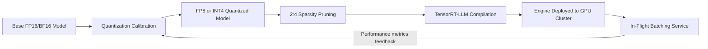

Training a large language model might take weeks, but the real money is spent during years of inference afterward. Every user query spins up GPUs, consumes power, and produces a response. Small efficiency gains at this stage compound into massive cost savings at scale. NVIDIA's recent inference optimization work targets exactly this lever — a coordinated combination of quantization, sparsity, and hardware-aware system design pushing inference efficiency to new limits.

## TL;DR

NVIDIA's latest AI efficiency work combines FP8/INT4 quantization, 2:4 structured sparsity, and TensorRT-LLM system-level improvements to dramatically raise the throughput and energy efficiency of large language model inference on H100/H200 and Blackwell hardware. For engineers, this translates to more concurrent requests on the same hardware, or the same workload on fewer GPUs.

## What Is It

The "efficiency techniques" here aren't a single product — they're a set of cooperating optimizations that NVIDIA has been deepening across successive hardware generations:

**FP8 quantization**
Traditional models store weights and activations in FP16 or BF16 (16-bit). FP8 halves the bit-width of each value, letting the same memory bandwidth carry twice the data. NVIDIA's Transformer Engine dynamically manages per-layer scaling factors to keep accuracy loss within acceptable bounds.

**INT4 / GPTQ quantization**
More aggressive 4-bit integer quantization, suitable for latency-critical applications. Combined with post-training calibration techniques like GPTQ, perplexity degradation on mainstream LLMs typically stays below 1%.

**2:4 structured sparsity**
A hardware-accelerated sparsity pattern introduced in Ampere: exactly 2 of every 4 adjacent weight values are zeroed out. Sparse matrix-multiply kernels skip zero computations, theoretically doubling effective TFLOPS while retaining 50% of the original weights.

**TensorRT-LLM**
NVIDIA's open-source inference framework integrating the above, plus system-level wins: In-Flight Batching (dynamically joining variable-length requests into the same batch), Paged KV Cache (OS-paging-style KV cache management to reduce VRAM fragmentation), and aggressive kernel fusion.

## Why It Matters

The main cost drivers for LLM deployment are:

1. **VRAM footprint** — model weights alone consume large amounts of GPU memory; KV cache grows linearly with sequence length, constraining batch size.
2. **Memory bandwidth bottleneck** — auto-regressive LLM decoding is memory-bandwidth-bound, not compute-bound; the rate of moving data from HBM into the chip sets the throughput ceiling.
3. **Latency requirements** — interactive applications impose tight budgets on time-to-first-token (TTFT) and per-token generation time (TPOT).

Quantization and sparsity attack the first two problems directly:

- FP8 quantization compresses a 70B model's VRAM requirement from roughly 140 GB (BF16) to roughly 70 GB, cutting the required GPU count in half.
- 2:4 sparsity doubles effective compute without a hardware upgrade.
- TensorRT-LLM's batching and cache optimizations push real-world throughput well beyond what static batching achieves on mixed-length workloads.

These savings flow directly into per-API-call cost, which is why inference optimization is a core competitive capability for AI infrastructure providers.

## How It Works

A typical production deployment pipeline for a 70B LLM:

**Quantization calibration** uses a small calibration dataset (typically hundreds to thousands of samples) to estimate per-layer dynamic ranges, letting Transformer Engine set appropriate scaling factors. This is a one-time offline step with no impact on online inference latency.

**Sparse fine-tuning** typically runs before or after quantization calibration — a brief training pass (sparse fine-tuning or sparse distillation) to recover any accuracy loss from the 2:4 pruning step.

**TensorRT-LLM compilation** translates the quantized model into a deeply optimized inference engine for the target GPU (e.g., H100 SXM5), with kernel fusion collapsing multiple small operations into single GPU kernels to minimize memory round-trips.

**In-Flight Batching** allows requests at different decoding steps to enter or exit the same batch dynamically, dramatically improving GPU utilization when output lengths vary significantly across concurrent requests.

## Alternatives Compared

| Approach | Accuracy Loss | Hardware Requirement | Deployment Complexity | Best Fit |
|----------|---------------|---------------------|----------------------|----------|
| Full FP16/BF16 inference | None | Highest VRAM | Low | All scales |
| FP8 quantization | Very low (< 0.5%) | Medium | Medium | 70B+ models |
| INT4/GPTQ quantization | Low (< 1%) | Low | Medium-high | Latency-sensitive |
| 2:4 structured sparsity | Low (needs fine-tuning) | Ampere+ required | High | High-throughput batch |
| Knowledge distillation | Medium | Low (small model) | High (needs training) | Edge deployment |

NVIDIA's advantage is deep integration of all these techniques into a single hardware/software stack (H100/Blackwell + TensorRT-LLM). In contrast, llama.cpp and GGUF quantization enable INT4 inference on consumer GPUs or CPUs, but throughput and latency gap versus TensorRT-LLM on H100 ranges from several times to an order of magnitude.

## Conclusion

Inference efficiency progress isn't just an engineering curiosity — it directly determines the commercial viability of AI products. Each successive NVIDIA architecture, paired with TensorRT-LLM improvements, pushes the "how many GPUs to serve how many users" equation in a more favorable direction.

For engineers evaluating AI infrastructure, the right question isn't "can my model run" but "what is the lowest-cost deployment configuration at acceptable accuracy loss" — the choice among quantization levels, sparsity, and batching strategies offers far more headroom than most assume.

## References

- [NVIDIA New AI Is An Efficiency Monster (YouTube)](https://www.youtube.com/watch?v=4wC8hnQawiA)
- [TensorRT-LLM GitHub](https://github.com/NVIDIA/TensorRT-LLM)
- [NVIDIA Transformer Engine Documentation](https://docs.nvidia.com/deeplearning/transformer-engine/user-guide/index.html)
