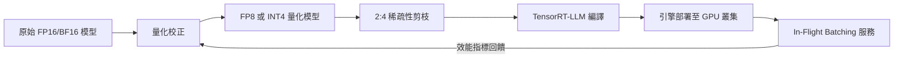

訓練一個大型語言模型需要幾週、幾個月，但真正花錢的往往是之後幾年的推論（inference）成本。每次使用者送出一個查詢，資料中心就要轉動晶片、耗掉電力、吐出結果。在這個維度上，效率的微小進步會被放大成鉅額節省。NVIDIA 近期展示的推論優化技術，正是瞄準這個戰場——用一套量化、稀疏性與專用硬體的協同設計，把推論效率推向新的邊界。

## TL;DR

NVIDIA 最新的 AI 推論優化技術結合了 FP8/INT4 量化、結構化稀疏性（Structured Sparsity）與 TensorRT-LLM 的核心改進，在同一代晶片上大幅提升了大型語言模型的推論吞吐量與能源效率。對工程師而言，這意味著同樣的硬體可以服務更多並發請求，或同樣的請求量可以用更少的晶片完成。

## 是什麼

這裡討論的「效率技術」不是單一產品，而是一組協同運作的最佳化手段，NVIDIA 在 H100/H200 和 Blackwell 架構上持續深化這些能力：

**FP8 量化（8-bit 浮點數推論）**
傳統模型以 FP16（16-bit 半精度浮點數）或 BF16 格式儲存權重與啟動值。FP8 把每個數值的位元寬減半，讓相同的記憶體頻寬能傳輸兩倍的資料，同時 Transformer Engine 會動態調整每層的縮放因子（scaling factor），將精確度損失壓到可接受範圍。

**INT4 / GPTQ 量化**
更激進的 4-bit 整數量化，適合推論延遲要求極高的場景。搭配 GPTQ（Gradient-based Post-Training Quantization）等校正技術，即使在 4-bit 下，主流大型語言模型的困惑度（perplexity）損失通常低於 1%。

**結構化稀疏性（2:4 Sparsity）**
NVIDIA Ampere 架構起支援的硬體加速稀疏性：在每 4 個相鄰的權重值中，恰好保留 2 個非零值，另 2 個清零。稀疏矩陣乘法核心可以跳過零值計算，在保留 50% 權重的情況下，理論算力（TFLOPS）直接翻倍。

**TensorRT-LLM**
NVIDIA 的開源推論框架，整合了上述量化與稀疏性技術，同時提供 In-Flight Batching（動態批次，讓不同長度的請求共用同一批次）、Paged KV Cache（類似作業系統分頁的 KV 快取管理，大幅降低顯示記憶體碎片）等系統級優化。

## 為什麼重要

大型語言模型部署的主要成本驅動因素是：
1. **顯示記憶體（VRAM）佔用**：模型權重本身就佔大量顯示記憶體，KV Cache 隨序列長度線性增長，限制了並發批次大小。
2. **記憶體頻寬瓶頸**：LLM 推論在 auto-regressive 解碼階段是「記憶體頻寬受限（memory-bound）」而非「算力受限（compute-bound）」，把資料從 HBM 搬進晶片的速度決定了吞吐量上限。
3. **延遲**：互動式應用（聊天機器人、程式碼補全）對首個 token 延遲（TTFT）和每個 token 輸出時間（TPOT）都有嚴苛要求。

量化與稀疏性技術直接攻擊前兩個問題：

- FP8 量化把 70B 模型的 VRAM 需求從約 140 GB（BF16）壓縮到約 70 GB，讓原本需要 4 張 A100 才能跑的模型，現在 2 張就夠。
- 2:4 稀疏性讓有效算力翻倍，而不需要更換硬體。
- TensorRT-LLM 的批次與快取優化讓吞吐量在真實負載下（混合長短請求）遠超靜態批次的理論值。

這些節省直接轉化為每個 API 呼叫的成本，也就是為什麼推論優化是 AI 基礎設施公司的核心競爭力。

## 怎麼運作

以一個 70B LLM 的生產部署為例，從模型進廠到服務上線的典型流程：

**量化校正**需要一個小型校正資料集（通常幾百到幾千筆）來估計每層的動態範圍，讓 Transformer Engine 設定合適的縮放因子。這是離線一次性作業，不影響線上推論延遲。

**稀疏性剪枝**通常在量化之前或之後進行，需要短暫的 fine-tuning（稱為 sparse fine-tuning 或 sparse distillation）來恢復稀疏化帶來的精確度損失。

**TensorRT-LLM 編譯**把量化後的模型編譯成針對特定 GPU 型號（例如 H100 SXM5）深度優化的推論引擎，包含 kernel fusion（把多個小運算合併成一個 GPU kernel 以減少記憶體存取）等技術。

**In-Flight Batching** 允許不同請求在不同的解碼步驟上加入或離開同一個批次，極大提升了 GPU 利用率，尤其在輸出長度變化大的場景（例如混合一句話回答和長文生成的請求）下效果顯著。

## 跟常見替代方案的差別

| 技術路線 | 精確度損失 | 硬體要求 | 部署複雜度 | 適用規模 |
|----------|-----------|---------|-----------|---------|
| FP16/BF16 全精度推論 | 無 | 高（VRAM 需求最大） | 低 | 所有規模 |
| FP8 量化 | 極低（< 0.5%） | 中 | 中 | 70B+ 模型 |
| INT4/GPTQ 量化 | 低（< 1%） | 低 | 中高 | 推論延遲敏感場景 |
| 2:4 稀疏性 | 低（需 fine-tuning） | 需要 Ampere+ | 高 | 大批量吞吐場景 |
| 模型蒸餾（Distillation） | 中 | 低（小模型） | 高（需訓練） | 邊緣部署 |
| 模型剪枝（Unstructured Pruning） | 中 | 低 | 高 | 少量學術用途 |

NVIDIA 的優勢在於這些技術全都在一套硬體生態（H100/Blackwell + TensorRT-LLM）中深度整合，不需要使用者自己拼湊工具鏈。相比之下，使用 llama.cpp 或 GGUF 量化在消費級 GPU 或 CPU 上也能跑 INT4 模型，但吞吐量和延遲與 TensorRT-LLM 在 H100 上的表現相差數倍到數十倍。

## 小結

AI 推論效率的進步不只是工程師的玩具，它直接決定了 AI 應用的商業可行性。每一代 NVIDIA 架構配合 TensorRT-LLM 的更新，都在把「需要多少晶片才能服務多少使用者」這道公式往更有利的方向推。

對於正在評估 AI 基礎設施的工程師而言，值得關注的核心問題不是「我的模型能不能跑」，而是「在可接受的精確度損失下，最低成本的部署組合是什麼」——量化等級、稀疏性、批次策略，這些參數的選擇空間比大多數人以為的要大得多。

## 參考資料

- [NVIDIA New AI Is An Efficiency Monster（YouTube）](https://www.youtube.com/watch?v=4wC8hnQawiA)
- [TensorRT-LLM GitHub](https://github.com/NVIDIA/TensorRT-LLM)
- [NVIDIA Transformer Engine 文件](https://docs.nvidia.com/deeplearning/transformer-engine/user-guide/index.html)
