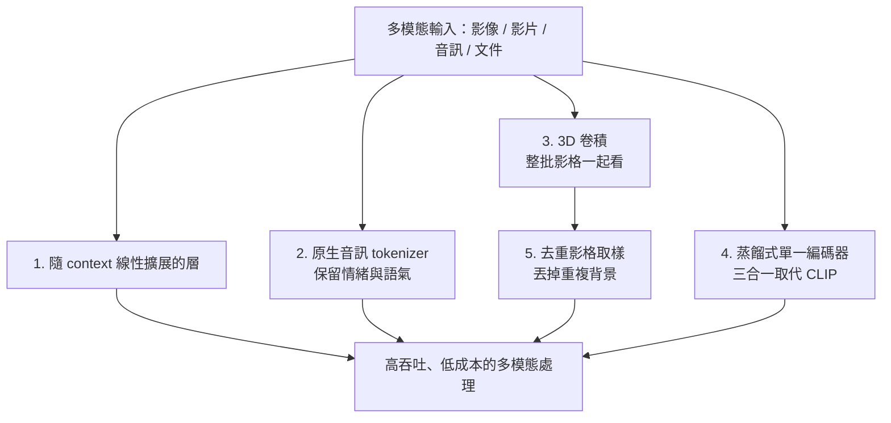

多數人談大型模型時關注的是「誰最聰明」，但這個 NVIDIA 新推出的 30B 參數開源多模態模型，走的是另一條路。它同時吃下影像、影片、音訊，而且免費、可自行擁有、可自行部署。問題來了——市面上已經有不少很強的免費系統（例如 Gemma 4），它憑什麼？

答案只有兩個詞：**吞吐量（throughput）**與**成本效率（cost efficiency）**。

## 快到什麼程度

具體數字是這樣的：

- **影片處理達每小時約 10 小時的影片**，也就是接近 **10 倍實時（real time）**。
- 比 **Qwen 3 Omni 快約 3 倍**。
- 處理文件時，最高可以快到 **7 倍**。

換句話說，如果你要在線上大規模地批次處理影音或文件，速度優勢會非常明顯。

要在本機跑，你需要一張夠力的桌機 GPU——大約 **25 GB 的顯示記憶體**。這不是能塞進手機的規模，但也還在單卡桌機或雲端 GPU 就能處理的範圍。

## 五個讓它變便宜的設計

這個模型的「魔法」不在單一絕招，而在五個彼此配合的效率設計。

### 一、層隨 context 長度「線性」擴展，而非平方

一般 Transformer 的注意力成本會隨著輸入長度呈平方成長。這個模型的層改成**隨 context 長度線性擴展**。實務意義很直接：你手上的文件越多、影片或音訊越長，它相對於別人的優勢就越大。對於要大規模處理長輸入的線上服務，這是關鍵。

### 二、原生的音訊 tokenizer，保留情緒與語氣

當音訊進來時，這個模型**直接把原始聲波轉成 token**，做法跟常見流程不同。一般的做法是在前面掛一個獨立的語音辨識模型——這類模型通常又大又貴，而且會把輸入裡的情緒與語氣全部剝掉。

這個模型自己就把這件事做好，而且**保留了情緒與語氣的資訊**。等於省掉了在上層再跑一個像 Whisper 那樣獨立模型的成本，便宜很多。

### 三、3D 卷積：整批影格一起看，還保留原始比例

給它圖片或影片時，很多上一代技術會先把畫面**硬壓成不同的長寬比**。這個模型保留原始比例。

更關鍵的是它用了 **3D 卷積（convolutions in 3D）**。許多技術是一格一格（frame by frame）地看影片，計算量非常龐大。這裡的 3D 卷積是**一次看一整塊影格**，把整包畫面同時處理，因此能大幅壓縮——更快、更便宜。

### 四、把三個模型蒸餾進一個小編碼器

一般你會預期這裡有一個龐大的獨立 **CLIP** 模型（負責預測哪段文字能對應到圖像）。這個模型不用單一 CLIP，而是把**三個模型蒸餾（distill）**成一個：

1. 圖像與文字的匹配
2. 細節辨識
3. 物件分割（object segmentation）

三者被壓進**同一個小型編碼器神經網路**裡，再次把效率拉高。

### 五、去重的影片取樣

到這一步，假設我們已經把一段有 300 張影格的影片丟進網路。這仍然是很大的資料量，但重點是——**不是每一格都獨一無二**，很多影格其實共用同一個背景。

這個模型最後會把這些**重複資訊丟掉**，讓整體再更便宜、更有效率。

## 它不擅長什麼

該講的限制不迴避：如果你要的是**純文字推理**或**純寫程式**，建議去找別的模型。它不是目前最聰明的開源模型。

但反過來說，如果你需要的是**又快又便宜地處理音訊或影片這類多模態輸入**，這一個就是首選。它的定位很清楚——不是全能冠軍，而是多模態吞吐與成本上的專才。

## 授權：不是 Apache 2.0，但可商用

最理想的情況是 Apache 2.0 這種高度寬鬆的授權，但這個模型用的是**自訂授權**。自訂授權通常不是好消息，不過這次比預期好：

- **允許衍生作品與商業使用**
- 需要一點**署名（attribution）**
- 在**專利授權（patent grant）**上比較嚴格

如果把 Apache 2.0 當作滿分 10 分，這份授權大約是 **7 分**。

## 小結

我們現在有了可以自己擁有、自己部署的免費開源 AI 模型，而這件事只會越來越重要。當模型越來越多，它們也開始**分化與專精**——各自在不同方向變強。

這個 NVIDIA 的 30B 多模態模型就是典型例子：它不追求在所有題目上都最聰明，而是把「多模態影音處理要花多少算力與成本」這道公式，往又快又便宜的方向大幅推進。對要做大規模影音處理的人來說，這樣的專才，價值往往比一個樣樣普通的全能模型更高。

## 參考資料

- [NVIDIA New AI Is An Efficiency Monster（Two Minute Papers, YouTube）](https://www.youtube.com/watch?v=4wC8hnQawiA)
