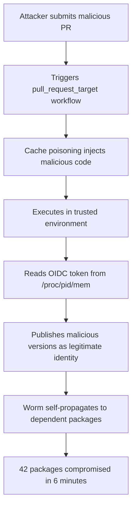

On May 11, 2026, a worm quietly burrowed into the npm ecosystem. Within 6 minutes, 42 TanStack packages were compromised. This wasn't a zero-day exploit — it was a precisely engineered supply chain attack carrying something no malicious package had ever possessed before: a valid SLSA Build Level 3 provenance attestation.

## TL;DR

- **Attack codename**: Mini Shai-Hulud, executed by the TeamPCP group
- **Timeline**: May 11, 2026 — attack completed in under 6 minutes
- **Direct impact**: 42 TanStack npm packages compromised
- **Total scope**: 170+ npm/PyPI packages affected
- **Scale**: Cumulative download count exceeding **518 million**
- **Technical first**: First malicious package cluster with valid SLSA Build Level 3 provenance
- **Attack chain**: GitHub Actions `pull_request_target` cache poisoning → OIDC token extracted from `/proc/<pid>/mem` → self-propagating worm

## What Happened

TeamPCP launched the Mini Shai-Hulud supply chain attack targeting TanStack — the widely-used frontend toolkit family including TanStack Query (formerly React Query), TanStack Router, and TanStack Table.

Rather than directly compromising TanStack's source code, the attackers exploited a structural weakness in GitHub Actions workflow configuration: the `pull_request_target` event trigger. This trigger executes workflows in the context of the base branch with elevated permissions, and through cache poisoning, attackers injected malicious code into a trusted workflow execution environment.

Once inside, the attack read OIDC (OpenID Connect) tokens directly from `/proc/<pid>/mem` — the Linux in-memory filesystem. These tokens are GitHub Actions' credentials for authenticating package publications to registries like npm. With a valid token, the attackers could publish packages as the official TanStack identity.

The worm component then enabled self-propagation: malicious code spread laterally from one package to its dependencies, sweeping through 42 packages in 6 minutes and ultimately affecting 170+ packages across npm and PyPI.

## Why This Matters

### Download counts represent real exposure

518 million cumulative downloads is not a theoretical number. Modern CI/CD pipelines reinstall dependencies on every build. Any project that installed affected packages during the attack window may have executed malicious code in development machines or build environments.

### SLSA provenance weaponized

SLSA (Supply chain Levels for Software Artifacts) is Google's supply chain security framework; Build Level 3 certifies that the build process is auditable and tamper-proof. Many security tools and policies use SLSA provenance as a trust signal.

Mini Shai-Hulud is the **first malicious package cluster with valid SLSA Build Level 3 provenance**. The attackers obtained a legitimate attestation by hijacking a legitimate build process — a fundamental crack in the "trust the signature" assumption.

### Worm behavior changes the threat model

Previous supply chain attacks were largely passive: plant the malicious package and wait for downloads. Mini Shai-Hulud's worm behavior made the attack **actively propagate**, compressing the defensive response window to minutes. No human monitoring system can react at that speed.

## Technical Perspective

### Attack flow

### The `pull_request_target` trap

`pull_request_target` was designed to let external PRs trigger limited workflows (such as applying labels), but it executes in the base branch context with access to secrets and tokens. Many projects combined this trigger with build steps for convenience, inadvertently opening a backdoor.

The fix: strictly limit `pull_request_target` workflows to lightweight tasks that require no secrets. Build and publish pipelines should be triggered by `push` to protected branches only.

### In-memory token extraction

Linux's `/proc` virtual filesystem allows processes with sufficient permissions to read the memory of other processes. In GitHub Actions' shared execution environment, this provides a channel to bypass environment variable protections and extract tokens directly from memory — a known technique with demonstrated real-world destructive impact in CI/CD environments.

## Points to Watch

1. **Platform-level defenses from npm and GitHub**: Will npm introduce stricter publish rate limits or anomaly detection? Will GitHub modify the default behavior of `pull_request_target`?

2. **SLSA framework revision**: After provenance was weaponized, the SLSA community needs to reconsider its trust model. A signature proving "the build process was legitimate" is not enough — we also need to verify "was the person who triggered the build authorized to do so?"

3. **Worm-based supply chain attacks becoming normalized**: Mini Shai-Hulud's successful demonstration may spawn imitators. Self-propagation capability significantly raises the threat level of supply chain attacks.

4. **Damage assessment for affected packages**: What did the malicious versions actually execute in active CI environments? Data exfiltration, backdoor implantation, or proof-of-concept only? Full post-incident reports are worth tracking.

## References

- [A worm just ate its way through the NPM registry... (YouTube)](https://www.youtube.com/watch?v=gwTQLZSIlsU)
- [SLSA Supply Chain Security Framework](https://slsa.dev/)
- [GitHub Actions: Security hardening for GitHub Actions](https://docs.github.com/en/actions/security-for-github-actions/security-guides/security-hardening-for-github-actions)
