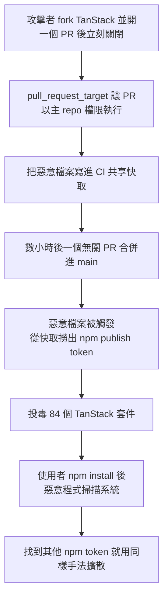

幾天前，開源維護者最大的惡夢成真了。在短短 6 分鐘內，一批每週合計下載量超過 5,000 萬次的套件被供應鏈攻擊攻陷——而且過程中沒有人被釣魚、沒有密碼外洩、也沒有 token 被直接偷走。更糟的是，這些被投毒的套件是經過**簽署、驗證，並透過 npm 的 trusted publishing 機制發布的**。而 trusted publishing 這套機制，正是為了防範這類攻擊而設計、被官方推薦了將近兩年的做法。

這次事件被稱為 mini Shai-Hulud。它劫持了 React 生態系中最大的專案之一——TanStack——的發布管線，接著像蠕蟲一樣擴散到數百個套件。本文以 The Code Report（2026 年 5 月 14 日）的說明為事實依據，拆解這個「沒人料到」的攻擊鏈。

## TanStack 原本的發布流程

要理解攻擊，得先看 TanStack 正常怎麼發套件：

- 每當一個 pull request 被合併，就會啟動一個 GitHub Actions workflow，負責把新版本發布到 npm registry。
- 為了發布，CI server 得先向 npm 拿一個 publish token。
- 為了證明請求是合法的，**GitHub 本身會簽署一份聲明**，說明「是哪個 workflow、在哪個 repo、哪個 branch 上執行」。
- npm 拿到這份簽署聲明後，比對組織的 allow list，只有全部吻合才會發出 token。
- 這個 token 只會在 CI 的快取裡存活幾分鐘就失效。

這套設計看起來滴水不漏：token 短命、又不經過人手，傳統釣魚攻擊根本沒有東西可偷。

## 攻擊怎麼繞過這一切

問題出在觸發條件的設定，而不是 token 本身。攻擊步驟如下：

1. 攻擊者 **fork 了 TanStack 的 repo**，建立一個 pull request，然後**立刻把它關掉**。
2. 儘管這只是個 fork、而且這個 PR 從頭到尾沒有任何人看過——**光是「建立 PR」這個動作，就足以啟動發布 workflow**。
3. TanStack 在設定觸發條件時用了 `pull_request_target`。這個選項的關鍵在於：**任何進來的 PR 都會在「主 repo 的上下文」中、帶著「主 repo 的權限」執行，即使這個 PR 是從 fork 建立的。**
4. 這些權限，足以讓攻擊者的程式碼把一個**被投毒的檔案寫進 CI server 的共享快取**——這個快取是 GitHub Actions 用來在不同 job 之間重複使用相依套件的。
5. 幾個小時後，一個**完全無關的 PR** 被合併進 main，觸發了那個被投毒的檔案。它從快取裡撈出 npm publish token，用它一口氣投毒了 **84 個全新的 TanStack 套件版本**。

換句話說，攻擊者從未真的碰到 token，也沒有攻破簽署機制。他們是讓自己的程式碼「住進」合法流程會經過的快取，再等合法流程自己來執行它。

## 從 TanStack 問題變成「所有人的問題」

真正讓它成為蠕蟲的，是感染後的行為。只要你不幸 `npm install` 了其中一個被投毒的套件：

- 惡意程式就會執行，掃描你的系統，搜刮任何值錢的東西。
- 一旦它找到任何 npm publishing token，就用這些 token、以同樣的手法發布新的中毒版本。

於是攻擊自我複製、跳到下一個維護者身上。第一波受害者包括 Mister AI、UiPath、OpenSearch、Guardrails AI 與 Squawk 的維護者；幾小時內，這些公司也把中毒的套件推上了 npm。而透過它們的 **Python SDK，這隻蠕蟲甚至跳到了 PyPI**。

到隔天早上，資安公司 **Aikido 已追蹤到 169 個套件、共 373 個中毒版本**。

## 蠕蟲還在變聰明

這次攻擊有兩個特別值得注意的「進化」細節：

- **偽造 Claude Code 的簽章**：蠕蟲開始偽造由 Claude Code GitHub app 簽署的 commit，讓自己的惡意活動混進維護者早已習慣看到的「AI 生成 commit」裡，更難被一眼識破。
- **鑽進開發工具**：在被感染的機器上，它會把自己直接嵌進 Claude Code 與 VS Code。

### Dead man's switch

最陰險的是它埋了一個「dead man's switch」：在每一台被感染的機器上，**只要你一嘗試清理它，它就會把你的 home 資料夾清空**。這讓事後的補救變得格外危險——照直覺去移除惡意程式，反而可能觸發破壞。

## 值得記住的重點

- **trusted publishing 不是萬靈丹**：token 短命、免人手、經過簽署驗證，這些都擋不住「攻擊者讓程式碼住進 CI 快取、再借合法流程之手執行」的路徑。
- **`pull_request_target` 是這次的根因**：它讓來自 fork 的、甚至沒人看過的 PR，帶著主 repo 的權限與可寫入的共享快取執行。把發布這類敏感流程綁在這個觸發條件上，等於開了一道後門。
- **蠕蟲化改變了時間尺度**：從 fork 一個 PR 到 84 個套件中毒只花 6 分鐘，並在一夜之間擴散到跨生態系（npm → PyPI）的 169 個套件——遠超過人工監控能反應的速度。
- **清理要格外小心**：由於 dead man's switch 的存在，受影響的機器不該貿然「手動移除」，而應在隔離環境中處理。

## 參考資料

- [A worm just ate its way through the NPM registry…（The Code Report, YouTube）](https://www.youtube.com/watch?v=gwTQLZSIlsU)
- [GitHub Actions: Security hardening for GitHub Actions](https://docs.github.com/en/actions/security-for-github-actions/security-guides/security-hardening-for-github-actions)
- [npm trusted publishing 官方文件](https://docs.npmjs.com/trusted-publishers)
