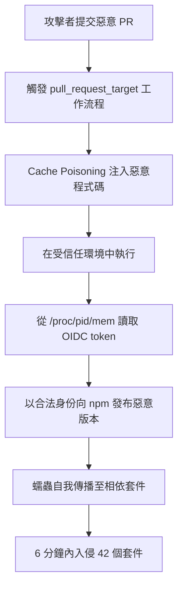

2026 年 5 月 11 日，一隻蠕蟲悄悄爬進了 npm 生態系。6 分鐘之內，42 個屬於 TanStack 的套件全數遭到入侵。這不是鑽研已久的 0-day 漏洞利用，而是一場精心設計的供應鏈攻擊，甚至帶著一張從未有惡意套件擁有過的「通關憑證」——有效的 SLSA Build Level 3 provenance。

## TL;DR

- **攻擊代號**：Mini Shai-Hulud，執行者為 TeamPCP 組織
- **時間軸**：2026 年 5 月 11 日，攻擊在 6 分鐘內完成
- **範圍**：42 個 TanStack npm 套件直接受害；整體波及超過 170 個 npm/PyPI 套件
- **規模**：受影響套件累計下載量超過 **5.18 億次**
- **技術亮點**：首個同時具備有效 SLSA Build Level 3 provenance 的惡意套件群
- **攻擊鏈核心**：GitHub Actions `pull_request_target` cache poisoning → OIDC token 從 `/proc/<pid>/mem` 記憶體提取 → 蠕蟲自我傳播

## 發生了什麼

TeamPCP 針對 TanStack 發動了代號 Mini Shai-Hulud 的供應鏈攻擊。TanStack 是一系列廣受使用的前端工具套件，包括 TanStack Query（前 React Query）、TanStack Router、TanStack Table 等，在現代前端開發中幾乎無所不在。

攻擊者並非直接入侵 TanStack 的程式碼儲存庫，而是利用 GitHub Actions 工作流程設定上的一個結構性弱點：`pull_request_target` 事件。這個觸發條件允許工作流程在特定情況下以較高的權限執行，而攻擊者透過 cache poisoning（快取投毒）的手法，讓惡意程式碼在受信任的工作流程環境中執行。

一旦進入工作流程，攻擊者便從 `/proc/<pid>/mem` 這個 Linux 記憶體檔案系統中直接讀取 OIDC（OpenID Connect）token——這個 token 是 GitHub Actions 用來向 npm 等套件倉庫證明身份的憑證。持有這個 token，等同於取得了以 TanStack 官方身份發布套件的能力。

接下來是蠕蟲的精髓：惡意程式碼設計了自我傳播機制，讓攻擊能夠從一個套件跳躍到相關依賴套件，6 分鐘內橫掃 42 個套件。最終波及範圍擴大至 170 個以上的 npm 與 PyPI 套件。

## 為什麼值得關注

### 下載量代表真實曝險

5.18 億次的累計下載量不是虛數。現代 CI/CD 流程每次建置都會重新安裝依賴套件，企業環境的每日下載量可以輕易達到數百萬次。這意味著受攻擊期間安裝了相關套件的專案，都有可能在開發機或建置環境中執行了惡意程式碼。

### SLSA provenance 作為偽裝工具

SLSA（Supply chain Levels for Software Artifacts）是 Google 領導設計的供應鏈安全框架，Build Level 3 代表建置過程可稽核、不可竄改。許多安全工具與政策會以「是否有 SLSA provenance」作為信任判斷依據。

Mini Shai-Hulud 是**首個具備有效 SLSA Build Level 3 provenance 的惡意套件群**，這代表光靠 provenance 簽章並不足以保護你。攻擊者透過劫持合法的建置流程取得了合法的簽章——這讓傳統的「信任鏈」假設出現了根本性裂縫。

### 蠕蟲特性改變威脅模型

過去的供應鏈攻擊通常是「靜態」的：攻擊者植入惡意套件後等待下載。Mini Shai-Hulud 的蠕蟲特性讓攻擊**主動擴散**，大幅壓縮了防禦反應時間。6 分鐘的橫掃速度，遠超過任何人工監控的反應能力。

## 技術角度怎麼看

### 攻擊流程

### `pull_request_target` 的設計陷阱

GitHub Actions 的 `pull_request_target` 事件本意是讓外部 PR 能夠觸發有限度的工作流程（例如加標籤），但它在 base branch 的上下文中執行，可以存取機密與 token。許多專案為了方便將這個觸發條件與實際的建置步驟結合，無意間開了一道後門。

正確的作法是把 `pull_request_target` 工作流程嚴格限制在無需機密的輕量任務，建置與發布流程應改用 `push` 到受保護分支作為觸發條件。

### `/proc/<pid>/mem` 記憶體讀取

Linux 核心的 `/proc` 虛擬檔案系統允許有足夠權限的程序讀取其他程序的記憶體空間。在 GitHub Actions 的共享執行環境中，這提供了一個繞過環境變數保護、直接從記憶體抓取 token 的管道。這個技術並不新奇，但在 CI/CD 環境中的實際運用展示了其破壞力。

## 後續值得觀察的點

1. **npm 與 GitHub 的平台層防禦**：npm 是否會引入更嚴格的發布頻率限制或異常偵測？GitHub 是否會修改 `pull_request_target` 的預設行為或加入警告？

2. **SLSA 框架的修訂**：provenance 被惡意利用後，SLSA 社群需要重新思考信任模型。單靠簽章證明「建置過程合法」是不夠的——我們還需要驗證「觸發建置的人是否被授權」。

3. **蠕蟲化供應鏈攻擊的普及**：Mini Shai-Hulud 的成功示範效應可能催生更多模仿者。自我傳播能力的加入，讓供應鏈攻擊的威脅等級大幅提升。

4. **受影響套件的實際損害評估**：惡意版本在活躍的 CI 環境中到底執行了什麼？資料外洩、後門植入、還是單純的概念驗證？完整的事後分析報告值得持續追蹤。

## 參考資料

- [A worm just ate its way through the NPM registry...（YouTube）](https://www.youtube.com/watch?v=gwTQLZSIlsU)
- [SLSA Supply Chain Security Framework](https://slsa.dev/)
- [GitHub Actions: Security hardening for GitHub Actions](https://docs.github.com/en/actions/security-for-github-actions/security-guides/security-hardening-for-github-actions)
