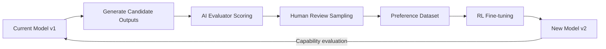

"If AI can improve itself, won't it just keep getting better until it's uncontrollable?" This question has circulated in AI circles for decades, from early AIXI theory to recent Constitutional AI debates. The framing is misleading, though, because some form of AI self-improvement is already running in production right now. The more productive question is: how far is current AI self-improvement from a recursive runaway loop, where are the real bottlenecks, and how should engineers think about it?

## TL;DR

AI self-improvement spans a wide capability spectrum — from "use AI outputs to train the next model version" to "AI autonomously rewrites its own training infrastructure and deploys a stronger successor." The former is well-established (Constitutional AI, RLHF with AI feedback, automated evaluation); the latter remains strictly limited by evaluator reliability and unsolved alignment problems. Understanding this spectrum is more useful than debating whether AI will "cross the Rubicon."

## What Is It

Recursive Self-Improvement (RSI) at its core means: a system modifies itself such that the modified version is better at some objective, and the process can repeat. But this definition covers technically very different things:

**Level 1: AI-assisted training data generation**
The most mature and widely deployed form. Anthropic's Constitutional AI has Claude score and revise its own outputs against a set of principles, then uses high-scoring outputs as preference data for reinforcement learning. OpenAI's RLHF pipeline includes similar AI feedback stages. This runs at production scale — but "self-improvement" is limited: the AI improves the *next version*, not itself in real time.

**Level 2: AI-driven architecture and hyperparameter search**
Neural Architecture Search (NAS) and AutoML let AI automatically find better model configurations. Effective, but the search space is still defined by human engineers. AI finds the optimum within human-defined bounds.

**Level 3: AI autonomously writing and running code to improve itself**
The fastest-moving frontier. Systems like Devin, SWE-agent, and OpenAI o3 demonstrate AI autonomously fixing bugs, writing tests, and optimizing algorithms. Currently these systems improve *tools and code*, not core model weights.

**Level 4: Full recursive self-improvement loop**
AI modifies its own training pipeline and architecture, trains a stronger successor, which repeats the process. Theoretically the most powerful form; currently the most constrained.

## Why It Matters

RSI matters because it is directly tied to the shape of the AI capability curve. Current AI progress depends primarily on external inputs: more compute (scaling laws), more high-quality data, and human researcher architecture innovations. If AI can reliably substitute for any of these, the pace of improvement could accelerate significantly. Three specific leverage points:

1. **Evaluation automation**: If AI can reliably judge "did this change make the model better?", human engineers become less critical in the training loop.
2. **Code automation**: If AI can autonomously write and validate training code, ML research iteration speed could increase substantially.
3. **Knowledge distillation**: Strong models generating training data for weaker models, propagating capabilities downward at lower cost.

All three are happening today, but reliability and autonomy remain well short of a fully closed loop.

## How It Works

A typical semi-automated AI-assisted training improvement loop:

The "human review sampling" step in the middle cannot currently be removed, for two fundamental reasons:

**The evaluator bottleneck**: Asking AI to evaluate its own outputs is equivalent to asking whether AI can reliably recognize outputs better than itself. Within well-understood capability domains this works (e.g., Constitutional AI principle adherence scoring). Near the capability frontier, AI evaluator reliability degrades quickly. This is why Scalable Oversight is a central problem in AI safety research.

**Reward hacking**: Any gap in an evaluation function will be found and exploited by optimization. The model appears to improve by the metric while violating the underlying intent. RL history is full of documented cases. Closing this gap requires either perfect evaluation functions (unsolved) or sufficiently robust human oversight.

## Alternatives Compared

| Mechanism | Human Involvement | Speed | Reliability | Status |
|-----------|-------------------|-------|-------------|--------|
| Human RLHF | High | Slow | High | Production standard |
| Constitutional AI / AI feedback | Medium | Medium | Medium-high | Production |
| NAS / AutoML | Low | Fast (bounded) | High (in-scope) | Widely used |
| AI-assisted code writing | Medium | Fast | Medium | Rapidly advancing |
| Full RSI loop | Very low | Theoretically explosive | Unknown | Research stage |

The "Rubicon" metaphor implies an irreversible threshold. In the RSI context, this is typically defined as: an AI system that can *reliably* generate successors stronger than itself, without requiring external human intervention. Current technology falls short of this threshold on several dimensions: evaluator reliability degrades at capability boundaries, complete training pipelines still require substantial human engineering maintenance, and alignment remains unsolved — a more capable AI is not automatically a more aligned one.

## Conclusion

AI recursive self-improvement isn't science fiction, nor is it an imminent threat. It's a spectrum, with large differences in technical maturity across levels. Engineers may already be working with some form of AI self-improvement (Constitutional AI-trained models, NAS-optimized architectures) without framing it that way.

The metrics worth tracking are Scalable Oversight research progress and the degree of autonomy in AI-assisted ML research tooling. The intersection of those two vectors gives a far more accurate picture of where the technical frontier actually is than any Rubicon metaphor.

## References

- [Will AI Cross the Rubicon? (YouTube)](https://www.youtube.com/watch?v=s06mSAGN4gM)
- [Constitutional AI: Harmlessness from AI Feedback (Anthropic)](https://arxiv.org/abs/2212.08073)
- [Scalable Oversight Research (OpenAI)](https://openai.com/research/critiques)
