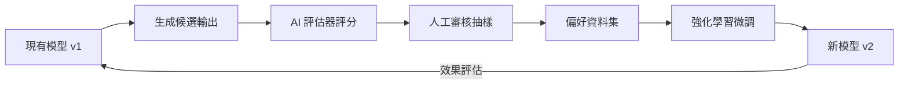

「如果 AI 能夠改進自己，那豈不是會一直進步到人類無法控制的地步？」這個問題在 AI 社群裡已經討論了幾十年，從早期的 AIXI 理論到近年的 Constitutional AI，每隔一段時間就會因為某個新里程碑而再度成為焦點。問題的癥結從來不在於「自我改進是否可能」——某種形式的自我改進早就已經在生產環境中運作了。真正值得討論的是：**現有的自我改進機制離「遞迴爆炸式改進」還有多遠，瓶頸在哪，以及我們該如何思考這件事。**

## TL;DR

AI 自我改進有多個層次，從「用自己的輸出訓練下一個版本」到「自行重寫基礎架構並部署更強的繼承者」，技術成熟度差異極大。目前已實用化的主要是前者（Constitutional AI、RLHF with AI feedback、自動化評估器），後者仍受評估可靠性與對齊問題嚴格限制。理解這個光譜，遠比討論「AI 會不會毀滅世界」更有建設性。

## 是什麼

「AI 遞迴自我改進（Recursive Self-Improvement, RSI）」的核心概念是：AI 系統能夠修改自身，使修改後的版本在某個目標上優於原版，且這個過程可以重複進行。

但這個定義涵蓋了差異極大的技術形態：

**層次一：用 AI 輸出輔助訓練資料生成**
最成熟、最廣泛使用的形式。Anthropic 的 Constitutional AI 讓 Claude 依據一套原則對自己的輸出評分、修正，再把高分輸出用作強化學習的偏好資料。OpenAI 的 RLHF 也有類似的 AI feedback 環節。這種方式已在生產環境大規模運作，但「自我改進」的程度是有限的：AI 改進的是下一個版本，不是即時修改自身。

**層次二：AI 驅動的超參數與架構搜索**
讓 AI 自動搜索更好的模型架構（Neural Architecture Search, NAS）或訓練超參數。Google 的 AutoML 系列研究屬於此類。效果真實，但搜索空間仍由人類工程師定義，AI 找到的是人類劃定範圍內的最優解。

**層次三：AI 自動撰寫並執行程式碼以改善自身**
近年進展最快、也最令研究者關注的方向。Devin、SWE-agent、OpenAI o3 等系統已展示了 AI 自主修復程式碼缺陷、撰寫測試、優化演算法的能力。但目前這些系統改善的是「工具和程式碼」，而非核心模型參數本身。

**層次四：完整的遞迴自我改進迴圈**
AI 修改自身的訓練流程、架構，然後訓練出更強的繼承版本，再由繼承版本重複同樣過程。這是理論上最有力的形式，也是目前最受限的形式。

## 為什麼重要

遞迴自我改進之所以值得嚴肅對待，原因在於它與 AI 能力曲線的形狀直接相關。

目前 AI 的進步主要依賴以下外部因素：
- 更多算力（Scaling Law）
- 更多高品質訓練資料
- 人類研究員的架構創新

如果 AI 能夠可靠地替代其中任何一個環節，進步速度理論上就能顯著加快。具體而言：

1. **評估自動化**：如果 AI 能可靠地判斷「這個修改讓模型變好了嗎」，人類工程師在訓練迴圈中的角色就會大幅縮減。
2. **程式碼自動化**：如果 AI 能自主撰寫並驗證訓練程式碼，ML 研究的反覆運算速度理論上可以大幅提升。
3. **知識蒸餾與壓縮**：強模型自動生成弱模型的訓練資料，讓能力以較低成本向下傳遞。

現在這三件事都在發生，但可靠性和自主程度離完全閉環還有一段距離。

## 怎麼運作

以目前最接近「可用」的 AI 輔助 AI 訓練為例，一個典型的半自動化改進迴圈：

關鍵在於中間的「人工審核抽樣」環節。目前這個環節無法完全移除，原因是：

**評估瓶頸（Evaluator Bottleneck）**：讓 AI 評估自己輸出好壞，本質上是在問「AI 能否可靠地識別比自己更好的輸出」。在 AI 已知的能力範圍內這是可行的（Constitutional AI 的原則遵守評估），但在能力邊界附近，AI 評估器的可靠性迅速下降。這就是為什麼 Scalable Oversight 是 AI 安全研究中的核心問題之一。

**獎勵黑客（Reward Hacking）**：如果評估函數有任何漏洞，最佳化過程會找到並利用它，讓模型表面上「更好」但實際上違背了設計者的意圖。這在強化學習歷史上已有大量案例記錄。

## 跟常見替代方案的差別

| 機制 | 人類介入程度 | 改進速度 | 可靠性 | 目前狀態 |
|------|------------|---------|--------|---------|
| 人工 RLHF | 高 | 慢 | 高 | 生產環境標準 |
| Constitutional AI / AI feedback | 中 | 中 | 中高 | 生產環境使用中 |
| NAS / AutoML | 低 | 快（但範圍有限） | 高（範圍內） | 廣泛使用 |
| AI 輔助程式碼撰寫 | 中 | 快 | 中 | 快速發展中 |
| 完整 RSI 迴圈 | 極低 | 理論上爆炸式 | 未知 | 研究階段 |

「盧比孔河」的比喻意指一個不可逆的門檻。在 AI 自我改進的語境下，這個門檻通常被定義為：**AI 系統能夠可靠地生成比自身更強的繼承者，且這個過程不再需要外部人類干預**。

目前的技術距離這個門檻還有幾個關鍵缺口：
- 評估可靠性在能力邊界附近顯著下降
- 完整的訓練迴圈仍需大量人工工程維護
- 對齊問題尚未解決：更強的 AI 不一定是更符合人類價值觀的 AI

## 小結

AI 遞迴自我改進不是科幻小說，也不是迫在眉睫的威脅——它是一個技術光譜，不同位置的實現程度差異懸殊。工程師在工作中可能已經在使用某種形式的 AI 自我改進工具（Constitutional AI 訓練的模型、NAS 搜索出的架構），而不自知。

真正值得追蹤的是：評估可靠性技術（Scalable Oversight）的進展，以及 AI 輔助 ML 研究工具的自主程度。這兩個向量的交點，比「什麼時候越過盧比孔河」這個問題，更能準確描述技術邊界在哪裡。

## 參考資料

- [AI 要跨越盧比孔河了嗎？自我成長的 AI 離我們多遠？（YouTube）](https://www.youtube.com/watch?v=s06mSAGN4gM)
- [Constitutional AI: Harmlessness from AI Feedback（Anthropic）](https://arxiv.org/abs/2212.08073)
- [Scalable Oversight: Supervising AI Systems That Surpass Human Ability（OpenAI）](https://openai.com/research/critiques)
