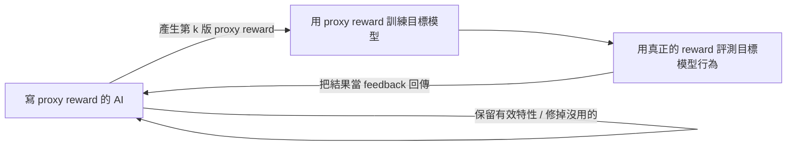

## 為什麼這個題目又被推上風口浪尖

「AI 能不能創造出比自己更厲害的 AI？」這不是新問題。早在 1965 年，統計學家 John Good 就提出過一個他稱為「人類最後的發明」的想法：假設有一天人類造出一個 AI，這個 AI 厲害到能再造出比它自己更厲害的 AI，那麼接下來人類就會進入技術爆炸——因為後面的事，AI 自己就能接手了。這台「能創造更強 AI 的 AI」，就是人類需要動手的最後一個發明。

最近這個話題重新被炒熱，是因為 Anthropic 一位共同創辦人寫的一篇文章。他說自己收集了很多資料後，很不情願地承認：他認為到 **2028 年底，有 60% 的機率 AI 的研發不再需要人類**，AI 會自己開發出更厲害的 AI。如果這件事真的發生，我們就「跨越了盧比孔河」。

盧比孔河是義大利北部的一條小河。古羅馬規定在外的將領不能帶兵跨越它，跨越就代表要掀起內戰——凱撒正是帶兵渡河，走上了回不了頭的路。所以「跨越盧比孔河」的意思是：**有些事你一旦做了，就收不回來。** 放到 AI 上，就是問現在的 AI 是不是已經強到能造出更強的 AI；一旦跨過去，它就不再需要人類了。

這篇文章不談科幻式的推測，而是回到工程現場問一個更務實的問題：**今天 AI 自主成長的能力，到底能做到什麼地步？**

## 先講清楚：「自我成長」沒有明確定義

要留意一件事：**AI 的「自我成長」並沒有一個明確定義。** 你能找到滿坑滿谷的論文宣稱自己提出了讓 AI self-improving 的新方法，ICLR 2026 甚至有一個專門討論 self-improving 的 workshop。但仔細看這些文獻會發現，所謂「AI 自我成長」，其實是**人類漸漸放手的過程**。

很多宣稱達成自我成長的研究，過程裡仍然有人類介入，只是介入得比過去更少一點，於是就宣稱「自我成長」了。所以下面談的每一種做法，多半仍需要人類——真正的差別在於：**人類的介入可以少到什麼地步。**

## 回到機器學習的本質：那個「我」是誰

機器學習可以拆成三步：(1) 我要找什麼樣的函式、(2) 我有哪些候選函式、(3) 從候選裡挑出最好的。第三步基本上是自動的（gradient descent）。有意思的是前兩步都有一個「我」，過去這個「我」指的是人類。自我成長的討論，其實就是在問：**這個「我」有多大成分可以是 AI 自己？**

本文聚焦第一步。我們要找一個函式，輸入 $x$、輸出 $y$、帶一組參數 $\theta$（類神經網路的 weights / bias）。我們定一個 loss，想找到讓 loss 越小越好的 $\theta$。

在一般 supervised learning 裡，這個 loss 是這樣算的：準備一堆輸入 $x_1 \dots x_N$，丟進函式得到 $y_1 \dots y_N$，每個輸出根據好壞算出一個小 loss，加起來就是要 minimize 的大 $L$。而每個小 loss 怎麼來？你得先有一個標準答案 $\hat{y}$（ground truth），拿模型輸出的 $y$ 跟 $\hat{y}$ 比距離：差越大 loss 越大，越接近 loss 越小。

問題就在這裡：**這些 ground truth 是人標出來的。** supervised learning 需要大量人工介入。所以第一個可以讓 AI 接手的地方就是——能不能不要人來標答案？

## 第一種放手：讓 AI 自己產生「標準答案」

一個直覺的想法是：拿一個更厲害的 AI 產生答案，當作標準答案來教一個較弱的 AI。這能很快強化弱 AI，也就是大家熟悉的 **Knowledge Distillation**。但這**不是**本文要談的重點——因為它引入了一個「比目標模型更強的老師」。既然你已經有那個更強的 AI 了，就不算是「AI 造出比自己更強的 AI」。

真正該問的是：這個由 AI 產生的、不一定正確的 pseudo answer，**有沒有可能是模型用自己產生的？** 拿同一個模型的輸出來教它自己，怎麼可能變更好？

關鍵在**自我修正**。前面的課程談過，模型有很多自我修正的手段：透過生成時 representation 的變化偵測自己可能答錯、加一句「你再好好想想」的 prompt、或是用大量 token 做長時間 reasoning——這些都可能把錯的答案改對。

但要注意：**單純的自我修正並不會強化模型本身。** 修正時模型參數沒變，所以你再問它同一個問題，它還是會先答錯、再修正一遍。突破點是這一步：**把「修正後的答案」當成標準答案，回頭去 fine-tune 模型的參數。** 這樣新模型看到同樣的輸入，就更傾向直接輸出修正後的正確答案，能力真的被留了下來。Anthropic 早期的 Constitutional AI 就是用這個思路來強化模型。

## 第二種放手：RL 也需要人類，只是藏在 reward 裡

有人會說，很多場景根本不需要標準答案，例如 reinforcement learning。RL 裡沒有 ground truth，只有一個 reward function 幫模型的輸出打分。（為了跟 supervised learning 放在同一個框架討論，本文把 reward 當成「越小越好的 loss」來看——兩者其實一法通萬法通。）

所以 RL 也常被算作一種「AI 自我成長」。但**人類的介入並沒有消失，而是躲進了 reward function 的制定**：得由人把各種情況都考慮過，設計出一個 reward function，才能引導 AI 學習。

RL 的一個痛點是：真實世界的 reward 往往很 **sparse**。以訓練機器手臂開門為例，只有真的把門打開才有 reward，碰到門板什麼的都是零——這讓機器人幾乎學不起來。常用的解法是 **reward shaping**：保留「開門才算成功」的真實 reward，但額外加一些 proxy reward 引導學習，例如靠近門板給一點分、碰到門板給更多分。

而 reward shaping 這件事，**可以交給 AI 來做**：人類只定真正的 loss（唯有開門才有分），讓另一個 AI 去設計 proxy reward function，幫目標模型學得更好。它怎麼知道哪種 proxy reward 好用？靠一個回饋迴圈：

第一版 proxy reward 訓練出的結果若在真正 reward 上表現不好，寫 proxy reward 的 AI 就知道這版沒用、該改；若表現好，就保留其中的好特性放進下一版。這類研究不少——早期有 2023 年的論文，之後有 24 年的 Revolve、以及近幾個月的 RF Agent 等。負責寫 proxy reward 的通常是語言模型，而被訓練的目標則不一定，常常就是一支機械手臂。有一篇 26 年論文的實例是讓機械手臂做傳接球：原本的 reward 只有一行式子，語言模型訓練後寫出的 proxy reward 卻涵蓋了許多面向——球離手很近也給分、手臂擺成某種姿勢也給分——藉此更有效率地引導學習。

> **題外話：多巴胺就是 reward shaping。** 對基因來說，真正的 reward 只有「成功傳宗接代」，這訊號太 sparse——原始人得先打獵、取得食物、活下來，才有繁衍機會。於是大腦演化出以多巴胺驅動的獎勵系統，讓你每達成一個小目標（獵到、吃到）就開心一下，這正是 reward shaping。更精確地說，多巴胺給的是「追逐目標時的慾望」，而非「達成後的滿足」——這也是為什麼有些東西你渴望時覺得會很快樂，真的得到後卻沒那麼快樂。當然，不是基因「為了讓人活下去」才設計出這套系統，而是沒演化出這套系統的生物活不下去。

## 第三種放手：當 loss 根本寫不出來

reward shaping 至少還假設人類能把「真正的 loss」寫成函式。可是很多事情根本寫不出明確規則。下圍棋還好（贏 +1、輸 −1），但你叫語言模型寫一篇文章，這篇文章該得幾分？你很難寫出這個 reward function。

解法是**把另一個 AI 當成 reward function**：輸入 $x$ 和某個 $y$，讓它輸出這個 $y$ 有多好。可是 AI 又怎麼知道好壞？這裡通常還是需要人類——你或許寫不出評分函式，但你看到一篇文章，多半能判斷它好不好、給個分數。於是人類提供分數 $\hat{L}$，訓練一個模型讓它輸出的分數盡量貼近人類，再用這個模型提供 loss 去訓練目標模型。這就是 **RLHF**，那個負責打分的模型就是 **Reward Model**。

如果連打分都改用一個很強的語言模型（LLM as Judge）來做，就成了 **RLAIF**。但別忘了本文設下的規則：**過程中不該引入一個比目標模型更強的 AI。** 於是真正的問題變成——如果打分的 AI 就是目標模型自己，它**能不能用自己產生的 loss 把自己變強？**

這還真不是不可能。讓 AI 自己產生 loss 有幾種做法：

- **Verbalize（直接口頭評分）**：給它 $x$、$y$，直接問「這個輸出打幾分」，通常會吐個分數，正不正確看模型本身的能力。
- **Token 機率**：問它「這個答案對嗎」，看下一個 token 的機率分布；把「對」的機率乘上 $-1$，就能當 loss 用。
- **Ensemble（多數決）**：對同一個 $x$ 讓模型 sample 很多次得到各種 $y$，取多數決當成 pseudo answer $y^\Delta$（例如三次答 3 就用 3），再拿 $y^\Delta$ 與待評 $y$ 的距離當 loss。
- **Certainty（信心 / entropy）**：看模型對輸出有沒有信心。分布越集中越有信心，答案越可能對、loss 越低。常用 entropy 來衡量：$H = -\sum_y P(y\mid x)\log P(y\mid x)$，也可寫成 $\mathbb{E}[-\log P(y\mid x)]$。亂度越大代表越沒信心、loss 越高。（$y$ 幾乎無法窮舉，這一項到底怎麼算，是另一個技術細節。）

**用 entropy 當學習訊號其實很早就被發現有用，而且跨模態。** 2020 年在影像上就有一個叫 **TENT** 的方法，指出模型輸出的 entropy 越大、錯誤率越高，兩者高度相關，可以用它來反過來微調模型。本課實驗室的林冠廷同學在 2022 年提出的 **SUTA**，也用類似思路在不需要額外標註的情況下強化語音辨識。反倒是 NLP 上引入得比較晚——直到去年才有一篇標題直白的論文《Unreasonable Effectiveness of Entropy Minimization in LLM Reasoning》，發現光是把 minimize entropy 當學習目標，竟然真的有用。

## 那到底能走多遠？

讓 AI 自己定 loss 再訓練自己，效果如何？最近一篇《How Far Can Unsupervised RLVR Scale LLM Training》做了相當完整的實驗（這裡的 unsupervised 指 reward 由 LLM 自己定義、不需要人類）。兩個值得記住的結果：

- **訓練初期，AI 自己定的 reward 跟人類定的 reward 表現差不多。** 在三個資料集上，代表 AI 自定 reward 的線與代表正確 reward 的線，前期幾乎並駕齊驅。
- **但長期而言人類 reward 仍勝出。** 正確的 reward 能較長時間引導模型走到更好的結果；而 AI 不斷拿自己定的 loss 訓練自己，**最終有可能把自己越訓練越壞。**

論文還比較了五種不同的「AI 自己定 reward」方法，細節可再參考原文。重點是：這條路確實走得動一段，但目前還撐不起「完全不需要人類、無限自我強化」的敘事。

## 小結：盧比孔河還沒渡過，但人類的腳一直在退

把整條光譜攤開來看，「AI 自我成長」不是一個開關，而是一條人類逐步放手的路：

| 放手的環節 | 誰定義學習訊號 | 人類還在哪裡 |
|---|---|---|
| Supervised ground truth | 人類標註 $\hat{y}$ | 直接標答案 |
| 自我修正 + fine-tune | 模型修正自己的輸出 | 仍需人設定修正機制 |
| RL / reward shaping | 人定真 reward、AI 定 proxy reward | 藏在 reward function 裡 |
| RLHF / Reward Model | 人打分 → 模型學會打分 | 提供偏好分數 |
| AI 自己定 loss（entropy / 多數決） | 模型用自身信心當訊號 | 幾乎退場，但可能把自己訓壞 |

每往下一格，人類的介入就少一點，但**到目前為止，那隻手始終沒有完全離開**。真正值得追蹤的，不是「哪一天忽然跨過盧比孔河」，而是這隻手還能退到多後面——以及在它完全放開之前，AI 用自己的訊號自我訓練時，會不會先把自己帶偏。這，才是技術邊界真正所在的位置。

## 參考資料

- [AI 要跨越盧比孔河了嗎？自我成長的 AI 離我們多遠？（YouTube）](https://www.youtube.com/watch?v=s06mSAGN4gM)
- Constitutional AI: Harmlessness from AI Feedback（Anthropic）— [arxiv.org/abs/2212.08073](https://arxiv.org/abs/2212.08073)
- TENT: Fully Test-Time Adaptation by Entropy Minimization（2020，影像 test-time adaptation 的 entropy 方法）
- SUTA: Single-Utterance Test-time Adaptation for Speech Recognition（2022，語音辨識）
- The Unreasonable Effectiveness of Entropy Minimization in LLM Reasoning（近期，NLP entropy minimization）
- How Far Can Unsupervised RLVR Scale LLM Training（近期，AI 自定 reward 的規模化實驗）
- Revolve（2024）、RF Agent（近期）等以 LLM 產生 proxy reward function 的研究
