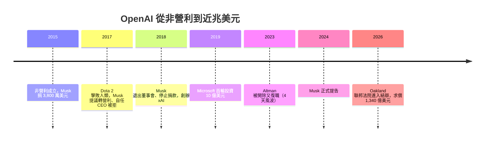

「我做這件事，是因為我熱愛它。」被告 Sam Altman 在證人席上這麼說。而原告 Elon Musk 的說法是：他們偷走了一個本該拯救人類的開源慈善組織，把它變成了一台閉源印鈔機。

2026 年 5 月 15 日，在加州 Oakland 的一間聯邦法院裡，被稱為「世紀審判」的 **Musk v. Altman** 進入結辯階段。這篇整理自 The Code Report 的內容，帶你看懂這場官司到底在吵什麼、揭露了哪些荒謬到不像真的的內幕。

> 注意：這篇文章的主題是 Musk 與 OpenAI 的訴訟，跟「社群媒體讓兒童成癮」無關——那是另一回事。

## TL;DR

- **原告**：Elon Musk（後來創辦 xAI）
- **被告**：Sam Altman、Greg Brockman、OpenAI，以及協助的 Microsoft
- **求償**：最高達 **1,340 億美元**（134 billion）的 disgorgement（不當得利返還）
- **附帶訴求**：撤銷 OpenAI 的營利化改組（unwind the for-profit conversion），並拔除 Altman 與 Brockman
- **核心指控**：Altman 與 Brockman 偷走一個慈善機構、違反慈善信託（breached a charitable trust），Microsoft 從旁協助教唆（aided and abetted）
- **戲劇性**：訴訟 discovery 幾乎變成一場高層群組私訊大外流——郵件、簡訊、私人日記全被列為證據

## 官司的起點：一個非營利組織

這場官司雖然在 2024 年才正式提告，但恩怨可以追溯超過十年。

**2015 年**，Elon Musk、Sam Altman、Greg Brockman 與 Ilya Sutskever 共同創辦 OpenAI，定位是一個「拯救人類免於（AI）邪惡」的非營利組織（nonprofit）。Musk 捐了 **3,800 萬美元**（$38 million）。

有趣的是，根據呈堂的郵件（Exhibit A），OpenAI 差點不叫這個名字：Elon 本來想叫它 **Freethink**，Sam 想叫 **Axon**。事後看來，最貼切的名字大概是 ClosedAI。

## 轉折點：Dota 2 之後的權力鬥爭

真正的裂痕出現在 **2017 年**。當時 OpenAI 的技術剛在 Dota 2 上擊敗地表最強的人類玩家，Musk 大受激勵，發郵件給團隊說「是時候踏出下一步了」——而他所謂的下一步，是把 OpenAI 從非營利轉為**營利**，由 Elon 本人擔任 CEO 兼多數股東（majority shareholder）。

根據 Brockman 的宣誓證詞，這場關鍵會議的地點是 Musk 的原話：「我剛在舊金山附近買的那棟鬧鬼豪宅（The haunted mansion I just bought）。」而且屋子裡還散落著前一晚派對的彩帶和紅色塑膠杯，Amber Heard 在現場倒威士忌。會議前幾週，Musk 還送了每位共同創辦人一台全新的 **Tesla Model 3**。

但這些籠絡沒有奏效。其他共同創辦人反過來提議「平均股權」（equal equity）。Ilya Sutskever 甚至委託畫了一幅特斯拉的畫，想當作和平獻禮送給 Musk。

根據 Brockman 的說法，這個提案讓 Musk 勃然大怒：他站起來繞著桌子踱步，Brockman「以為他要動手打人」。Musk 抓起那幅畫、作勢奪門而出，然後回過頭問了一句：「你們打算什麼時候離開 OpenAI？」

六個月後，Musk 停止捐款、退出董事會，並在 2018 年另起爐灶創辦了 **xAI**。

## Microsoft 進場與營利化改組

Musk 走後，OpenAI 玩了一手關鍵操作：在非營利母體上「栓」了一個營利子公司（for-profit subsidiary）。

- **2019–2021 年**：Microsoft 先以 **10 億美元**（$1 billion）入股。CEO Satya Nadella 起初對這筆投資的實際價值抱持懷疑，但後來越加碼越重。
- **2022 年**，Nadella 說了一句後來被反覆引用的話：他不希望 Microsoft 變成下一個 IBM，而 OpenAI 變成下一個 Microsoft。
- 累計下來，這個營利子公司總共從 Microsoft 手上兌現了一張約 **130 億美元**（$13 billion）的支票。

如今，OpenAI 的估值正逼近 **1 兆美元**（nearly $1 trillion）。這正是 Musk 訴訟的核心矛盾：一個以「拯救人類」名義成立、拿了他 3,800 萬美元捐款的慈善組織，最後變成了一台估值近兆的印鈔機。

## 荒謬的證據：一場高層私訊大外流

這場審判最「精彩」的部分，是它的 discovery 幾乎變成整個高層群組聊天的公開處刑。每個關鍵人物的簡訊、郵件與私人日記都被列為證據。The Code Report 給這些角色下了幾個標籤：

- **Sam Altman**：宣稱自己在 OpenAI **沒有任何股權**（no equity），做這件事純粹出於熱愛。
- **Greg Brockman**：不知怎麼地，持有價值約 **300 億美元**（$30 billion）的股份——正是「Sam 說他沒有」的那個東西。
- **Ilya Sutskever**：被形容為「憑感覺（vibes-based）的 AI 安全神父」。
- **Mira Murati**：被稱為「Sam 的 Brutus（背叛者）」。
- **Satya Nadella**：唯一的「房裡的大人」。

還有一位意外亂入的角色 **Shivon Zilis**：她是 Musk 十四個孩子中四個的母親，曾任 OpenAI 董事，會向 Musk 通報 OpenAI 的近況——這在他創辦 xAI 之後，構成了明顯的利益衝突。

## 2023 年的四天政變

證據裡最複雜的一段，是 **2023 年 11 月** Altman 被 OpenAI 開除、四天後又復職的著名風波。

導火線是一份指控他「不誠實、不坦率」（honesty and candor）的行為模式報告。Ilya Sutskever 寫了一份備忘錄，指控 Altman 「持續說謊、並刻意讓高階主管彼此對立」。與此同時，Mira Murati 則被形容為「從內部捅了他一刀」。

## 這場官司真正重要的地方

撇開那些鬧鬼豪宅、特斯拉油畫和紅色塑膠杯的鬧劇，Musk v. Altman 的真正意義，在於它把一個從沒被正面回答過的問題搬上法庭：

**一個以非營利、開源、公益名義募得資金與人才的組織，能不能在數年後合法地把自己改造成一家估值近兆美元的營利公司？**

Musk 的法律主張——違反慈善信託、要求撤銷營利化改組——如果成立，衝擊的不只是 OpenAI 一家，而是整個「非營利起家、營利收尾」的 AI 產業結構。原始影片以「我不敢相信這場審判是真的」為題，某種程度上，這也是很多技術從業者看著這場官司時的心情。

## 參考資料

- [I can't believe this trial is real...（The Code Report, YouTube）](https://www.youtube.com/watch?v=3tbB2dffx0s)
